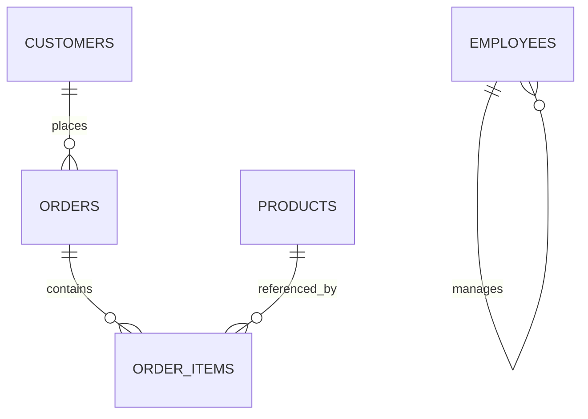

---
aliases:
  - DE SQL Week 3
  - SQL Joins Week 3
tags:
  - data-engineering
  - sql
  - sql-joins
  - set-operations
  - reconciliation
  - interview-preparation
  - week-3
status: active
difficulty: beginner-intermediate
study_time: 6 days
created: 2026-08-16
previous: '[[Data-Engineer-SQL-Week-2-Obsidian]]'
---

# Data Engineer SQL — Week 3 Detailed Notes

> [!info] Week 3 goal
> Combine related datasets without losing rows, multiplying metrics, or hiding data-quality problems. Learn to choose the correct join or set operation from the required output grain.

## Obsidian navigation

- [[#Day 1 — Keys, relationships, and INNER JOIN|Day 1 — INNER JOIN]]
- [[#Day 2 — LEFT JOIN and missing-record detection|Day 2 — LEFT JOIN]]
- [[#Day 3 — RIGHT, FULL OUTER, and CROSS JOIN|Day 3 — Other join types]]
- [[#Day 4 — Self joins and non-equality joins|Day 4 — Self and non-equality joins]]
- [[#Day 5 — Join grain, row multiplication, and safe aggregation|Day 5 — Join multiplication]]
- [[#Day 6 — Set operations and reconciliation|Day 6 — Set operations]]
- [[#Week 3 mini-project — Source-to-target reconciliation|Mini-project]]
- [[#Week 3 interview questions|Interview questions]]
- [[#Week 3 final practice set|Final practice]]
- [[#Week 3 one-page cheat sheet|Cheat sheet]]

## Progress tracker

- [ ] Day 1 completed
- [ ] Day 2 completed
- [ ] Day 3 completed
- [ ] Day 4 completed
- [ ] Day 5 completed
- [ ] Day 6 completed
- [ ] Reconciliation mini-project completed
- [ ] Week 3 completion test passed

> [!tip] Join habit
> Before every join, write the grain and expected uniqueness of both inputs. After the join, compare row count and distinct business keys with your expectation.

**Level:** Beginner to intermediate  
**Duration:** 6 study days plus 1 revision/rest day  
**Daily time:** 60–90 minutes  
**Primary dialect:** PostgreSQL-style SQL  
**Prerequisite:** [[Data-Engineer-SQL-Week-2-Obsidian|Week 2 — Aggregation and quality metrics]]

## Week 3 learning outcomes

By the end of this week, you should be able to:

- Explain primary keys, foreign keys, natural keys, and surrogate keys.
- Identify one-to-one, one-to-many, and many-to-many relationships.
- Use `INNER JOIN` and `LEFT JOIN` correctly.
- Detect missing parent and child records.
- Explain and use `RIGHT JOIN`, `FULL OUTER JOIN`, and `CROSS JOIN`.
- Build employee-manager relationships with a self join.
- Match values to ranges with a non-equality join.
- Predict how a join changes row count and grain.
- Prevent revenue inflation caused by one-to-many joins.
- Use `UNION`, `UNION ALL`, `INTERSECT`, and `EXCEPT`.
- Align schemas safely before unioning data.
- Reconcile source and target records using a full outer join.

---

# Practice setup

Continue using the `customers`, `products`, and `orders` tables from Weeks 1 and 2.

## Relationship map



The diagram shows expected business relationships. Raw data may violate them, which is why Data Engineers run orphan and duplicate checks.

## Create order items

The practice table intentionally has no foreign-key constraints so it can contain orphan records for quality exercises.

```sql
CREATE TABLE order_items (
    order_id       INTEGER NOT NULL,
    product_id     INTEGER NOT NULL,
    quantity       INTEGER NOT NULL,
    unit_price     DECIMAL(12,2) NOT NULL,
    PRIMARY KEY (order_id, product_id)
);

INSERT INTO order_items VALUES
(1001, 102, 2,  1200.00),
(1002, 101, 1, 85000.00),
(1003, 107, 1,  3500.00),
(1004, 103, 1, 15000.00),
(1006, 104, 1, 28000.00),
(1007, 106, 1,  1299.00),
(1008, 102, 1,  1200.00),
(1008, 107, 1,  3500.00),
(1010, 103, 1, 15000.00),
(1011, 105, 1,   799.00),
(1012, 999, 1,  3500.00),
(9999, 102, 1,  1200.00);
```

Quality conditions intentionally included:

- Product `999` does not exist in `products`.
- Order `9999` does not exist in `orders`.
- Order `1008` contains two items, demonstrating one-to-many row expansion.

## Create employees for self joins

```sql
CREATE TABLE employees (
    employee_id      INTEGER PRIMARY KEY,
    employee_name    VARCHAR(100) NOT NULL,
    manager_id       INTEGER,
    department       VARCHAR(100) NOT NULL,
    salary           DECIMAL(12,2) NOT NULL,
    hire_date        DATE NOT NULL
);

INSERT INTO employees VALUES
(1, 'Priya Nair',   NULL, 'Executive',   250000.00, '2018-01-10'),
(2, 'Rahul Mehta',  1,    'Engineering', 180000.00, '2019-03-15'),
(3, 'Neha Kulkarni',1,    'Analytics',   175000.00, '2019-05-20'),
(4, 'Amit Joshi',   2,    'Engineering', 110000.00, '2021-07-01'),
(5, 'Kavya Shah',   2,    'Engineering', 105000.00, '2022-02-14'),
(6, 'Arjun Roy',    99,   'Analytics',    95000.00, '2023-04-10');
```

Employee `6` references missing manager `99` to support orphan detection.

## Create price bands for non-equality joins

```sql
CREATE TABLE price_bands (
    band_name       VARCHAR(30) PRIMARY KEY,
    minimum_price   DECIMAL(12,2) NOT NULL,
    maximum_price   DECIMAL(12,2) NOT NULL
);

INSERT INTO price_bands VALUES
('Budget',   0.00,     999.99),
('Standard', 1000.00,  9999.99),
('Premium',  10000.00, 999999.99);
```

## Create source and target snapshots

```sql
CREATE TABLE source_order_snapshot (
    order_id       INTEGER,
    order_status   VARCHAR(30),
    order_total    DECIMAL(14,2),
    updated_at     TIMESTAMP
);

CREATE TABLE target_order_snapshot (
    order_id       INTEGER,
    order_status   VARCHAR(30),
    order_total    DECIMAL(14,2),
    updated_at     TIMESTAMP
);

INSERT INTO source_order_snapshot VALUES
(1001, 'COMPLETED', 2400.00,  '2026-07-01 11:00:00'),
(1002, 'SHIPPED',   85000.00, '2026-07-03 08:00:00'),
(1003, 'CANCELLED', 3500.00,  '2026-07-04 13:00:00'),
(1004, 'COMPLETED', 15000.00, '2026-07-05 17:00:00'),
(1005, 'PENDING',   NULL,     '2026-07-07 10:00:00');

INSERT INTO target_order_snapshot VALUES
(1001, 'COMPLETED', 2400.00,  '2026-07-01 11:00:00'),
(1002, 'COMPLETED', 85000.00, '2026-07-03 09:00:00'),
(1004, 'COMPLETED', 14500.00, '2026-07-05 16:00:00'),
(1005, 'PENDING',   NULL,     '2026-07-07 10:00:00'),
(1006, 'COMPLETED', 28000.00, '2026-07-10 20:00:00');
```

> [!warning] Run setup once
> These tables use fixed keys and sample rows. If they already exist, recreate them in a separate practice schema or skip the setup.

---

# Day 1 — Keys, relationships, and INNER JOIN

## 1.1 Why joins exist

Relational design stores different subjects in separate tables:

- Customer attributes in `customers`
- Order events in `orders`
- Product attributes in `products`
- Order line details in `order_items`

A join combines related rows using a condition.

## 1.2 Key terminology

### Primary key

A primary key uniquely identifies each row and does not allow NULL.

Examples:

- `customers.customer_id`
- `orders.order_id`
- `products.product_id`

### Foreign key

A foreign key stores a reference to a key in another table.

Conceptually:

- `orders.customer_id` refers to `customers.customer_id`.
- `order_items.order_id` refers to `orders.order_id`.
- `order_items.product_id` refers to `products.product_id`.

Raw landing tables often do not enforce foreign keys because data arrives before validation. The pipeline must still check referential integrity.

### Natural key

A natural key comes from business data, such as an account number or source customer ID.

### Surrogate key

A surrogate key is generated by the warehouse, often an integer. It is independent of source business meaning and is useful for historical dimension versions.

### Composite key

A composite key uses multiple columns. The practice `order_items` primary key is `(order_id, product_id)`.

## 1.3 Relationship types

| Relationship | Meaning | Example |
|---|---|---|
| One-to-one | One row matches at most one row | Customer to one current profile |
| One-to-many | One parent can have many child rows | Customer to orders |
| Many-to-many | Many rows on both sides can match | Students to courses through enrollments |

Many-to-many relationships are normally represented with a bridge table.

## 1.4 INNER JOIN

`INNER JOIN` returns rows whose join condition matches on both sides.

```sql
SELECT o.order_id,
       o.order_date,
       o.order_total,
       c.customer_name,
       c.city
FROM orders AS o
INNER JOIN customers AS c
    ON o.customer_id = c.customer_id;
```

`INNER` is optional:

```sql
FROM orders AS o
JOIN customers AS c
  ON o.customer_id = c.customer_id
```

Orders with NULL or unknown customer IDs are excluded.

## 1.5 Use qualified columns

Both `orders` and `customers` contain `customer_id` and `updated_at`. Qualify them with table aliases:

```sql
SELECT o.customer_id,
       o.updated_at AS order_updated_at,
       c.updated_at AS customer_updated_at
FROM orders AS o
JOIN customers AS c
  ON o.customer_id = c.customer_id;
```

This avoids ambiguous-column errors and makes lineage clear.

## 1.6 Select only required columns

Avoid this in stable pipelines:

```sql
SELECT *
FROM orders AS o
JOIN customers AS c
  ON o.customer_id = c.customer_id;
```

Problems:

- Repeated column names
- Unneeded data movement
- Output schema changes when either input changes
- Unclear ownership and lineage

## 1.7 Join with additional row filters

```sql
SELECT o.order_id,
       c.customer_name,
       o.order_total
FROM orders AS o
JOIN customers AS c
  ON o.customer_id = c.customer_id
WHERE o.order_status = 'COMPLETED'
  AND c.is_active = TRUE;
```

The `ON` clause defines row matching; `WHERE` filters the joined result for this inner join.

## 1.8 Multi-column join

Some relationships require more than one key:

```sql
SELECT ...
FROM source_a AS a
JOIN source_b AS b
  ON a.account_id = b.account_id
 AND a.business_date = b.business_date;
```

Omitting part of a composite key can create false matches and duplicate multiplication.

## 1.9 Joining three tables

```sql
SELECT o.order_id,
       o.order_date,
       c.customer_name,
       oi.product_id,
       oi.quantity,
       oi.unit_price
FROM orders AS o
JOIN customers AS c
  ON o.customer_id = c.customer_id
JOIN order_items AS oi
  ON o.order_id = oi.order_id;
```

Output grain is one matched order item, not one order. Order `1008` appears twice because it has two item rows.

## 1.10 Joining product attributes

```sql
SELECT o.order_id,
       c.customer_name,
       p.product_name,
       p.category,
       oi.quantity,
       oi.unit_price,
       oi.quantity * oi.unit_price AS line_amount
FROM orders AS o
JOIN customers AS c
  ON o.customer_id = c.customer_id
JOIN order_items AS oi
  ON o.order_id = oi.order_id
JOIN products AS p
  ON oi.product_id = p.product_id;
```

The item with product `999` is excluded by the final inner join.

## 1.11 Old comma-join syntax

Avoid this style:

```sql
SELECT ...
FROM orders AS o, customers AS c
WHERE o.customer_id = c.customer_id;
```

Explicit `JOIN ... ON` is clearer and reduces the risk of accidentally omitting a join condition.

## Day 1 common mistakes

- Joining on columns with the same name but different meaning.
- Omitting part of a composite key.
- Using `SELECT *` across several tables.
- Forgetting table aliases on ambiguous columns.
- Assuming an inner join preserves all left rows.
- Forgetting that output grain can change.
- Using a comma join and accidentally creating a Cartesian product.

## Day 1 exercises

1. Join orders to customers and return order ID, date, customer name, and total.
2. Return completed orders with customer city.
3. Return orders for active customers only.
4. Join order items to products and calculate line amount.
5. Return item rows for Electronics products.
6. Join orders, items, and products.
7. Join orders, customers, items, and products.
8. Count matched orders after joining to customers.
9. Compare that count with total order count.
10. State the grain of exercises 1, 4, and 7.
11. Explain why order `1012` disappears when items join to products.
12. Explain why order `1008` appears twice after joining to items.

## Day 1 solutions

```sql
-- 1
SELECT o.order_id,
       o.order_date,
       c.customer_name,
       o.order_total
FROM orders AS o
JOIN customers AS c
  ON o.customer_id = c.customer_id;

-- 2
SELECT o.order_id,
       o.order_date,
       c.customer_name,
       c.city,
       o.order_total
FROM orders AS o
JOIN customers AS c
  ON o.customer_id = c.customer_id
WHERE o.order_status = 'COMPLETED';

-- 3
SELECT o.order_id,
       c.customer_name,
       o.order_total
FROM orders AS o
JOIN customers AS c
  ON o.customer_id = c.customer_id
WHERE c.is_active = TRUE;

-- 4
SELECT oi.order_id,
       oi.product_id,
       p.product_name,
       oi.quantity,
       oi.unit_price,
       oi.quantity * oi.unit_price AS line_amount
FROM order_items AS oi
JOIN products AS p
  ON oi.product_id = p.product_id;

-- 5
SELECT oi.order_id,
       p.product_name,
       oi.quantity,
       oi.unit_price
FROM order_items AS oi
JOIN products AS p
  ON oi.product_id = p.product_id
WHERE p.category = 'Electronics';

-- 6
SELECT o.order_id,
       o.order_date,
       p.product_name,
       oi.quantity,
       oi.unit_price
FROM orders AS o
JOIN order_items AS oi
  ON o.order_id = oi.order_id
JOIN products AS p
  ON oi.product_id = p.product_id;

-- 7
SELECT o.order_id,
       c.customer_name,
       p.product_name,
       oi.quantity,
       oi.unit_price,
       oi.quantity * oi.unit_price AS line_amount
FROM orders AS o
JOIN customers AS c
  ON o.customer_id = c.customer_id
JOIN order_items AS oi
  ON o.order_id = oi.order_id
JOIN products AS p
  ON oi.product_id = p.product_id;

-- 8
SELECT COUNT(*) AS matched_order_count
FROM orders AS o
JOIN customers AS c
  ON o.customer_id = c.customer_id;

-- 9
SELECT COUNT(*) AS total_order_count
FROM orders;
```

Grain answers:

- Exercise 1: one matched order per row.
- Exercise 4: one matched order item per row.
- Exercise 7: one order item whose order, customer, and product all match.

---

# Day 2 — LEFT JOIN and missing-record detection

## 2.1 LEFT JOIN behavior

`LEFT JOIN` preserves every row from the left table. When no right-side match exists, right-side columns become NULL.

```sql
SELECT c.customer_id,
       c.customer_name,
       o.order_id,
       o.order_date
FROM customers AS c
LEFT JOIN orders AS o
  ON c.customer_id = o.customer_id;
```

Customers with no orders still appear once with NULL order columns. Customers with several orders appear several times.

## 2.2 Choosing the left table

The business requirement determines which table must be preserved.

- All customers, even without orders: `customers LEFT JOIN orders`
- All orders, even without valid customers: `orders LEFT JOIN customers`
- All items, even without valid products: `order_items LEFT JOIN products`

## 2.3 Find customers with no orders

```sql
SELECT c.customer_id,
       c.customer_name
FROM customers AS c
LEFT JOIN orders AS o
  ON c.customer_id = o.customer_id
WHERE o.order_id IS NULL;
```

This is a left anti-join pattern.

Choose a right-side column that is guaranteed non-NULL for matched records, normally the right primary key.

## 2.4 Find orphan orders

```sql
SELECT o.order_id,
       o.customer_id,
       o.order_date
FROM orders AS o
LEFT JOIN customers AS c
  ON o.customer_id = c.customer_id
WHERE c.customer_id IS NULL;
```

This includes orders whose customer ID is NULL or references a missing customer. If you need those categories separately, classify them with `CASE`.

```sql
SELECT o.order_id,
       o.customer_id,
       CASE
           WHEN o.customer_id IS NULL THEN 'NULL_CUSTOMER_KEY'
           WHEN c.customer_id IS NULL THEN 'UNKNOWN_CUSTOMER_KEY'
           ELSE 'VALID'
       END AS customer_key_status
FROM orders AS o
LEFT JOIN customers AS c
  ON o.customer_id = c.customer_id;
```

## 2.5 Find missing products

```sql
SELECT oi.order_id,
       oi.product_id,
       oi.quantity
FROM order_items AS oi
LEFT JOIN products AS p
  ON oi.product_id = p.product_id
WHERE p.product_id IS NULL;
```

This finds product `999`.

## 2.6 Find order items without orders

```sql
SELECT oi.order_id,
       oi.product_id
FROM order_items AS oi
LEFT JOIN orders AS o
  ON oi.order_id = o.order_id
WHERE o.order_id IS NULL;
```

This finds order `9999`.

## 2.7 Filter placement changes outer-join behavior

Requirement: return all customers, plus only their completed orders.

Correct filter in `ON`:

```sql
SELECT c.customer_id,
       c.customer_name,
       o.order_id,
       o.order_total
FROM customers AS c
LEFT JOIN orders AS o
  ON c.customer_id = o.customer_id
 AND o.order_status = 'COMPLETED';
```

Every customer remains.

Different result when filter is in `WHERE`:

```sql
SELECT c.customer_id,
       c.customer_name,
       o.order_id,
       o.order_total
FROM customers AS c
LEFT JOIN orders AS o
  ON c.customer_id = o.customer_id
WHERE o.order_status = 'COMPLETED';
```

Rows without a completed order have NULL status and are removed by `WHERE`. For this requirement, the left join effectively behaves like an inner join.

## 2.8 Count child rows while preserving parents

```sql
SELECT c.customer_id,
       c.customer_name,
       COUNT(o.order_id) AS order_count
FROM customers AS c
LEFT JOIN orders AS o
  ON c.customer_id = o.customer_id
GROUP BY c.customer_id, c.customer_name
ORDER BY c.customer_id;
```

Use `COUNT(o.order_id)`, not `COUNT(*)`.

For a customer with no orders:

- `COUNT(o.order_id)` returns `0`.
- `COUNT(*)` counts the preserved customer row and returns `1`.

## 2.9 Sum child values while preserving parents

```sql
SELECT c.customer_id,
       c.customer_name,
       COUNT(o.order_id) AS completed_order_count,
       COALESCE(SUM(o.order_total), 0) AS completed_revenue
FROM customers AS c
LEFT JOIN orders AS o
  ON c.customer_id = o.customer_id
 AND o.order_status = 'COMPLETED'
GROUP BY c.customer_id, c.customer_name;
```

`COALESCE` displays zero for customers with no completed orders. This is reasonable because the defined metric is completed revenue over the available order table, not an unknown source value.

## 2.10 LEFT JOIN versus inner join

Use an inner join when unmatched left rows should be excluded. Use a left join when the complete left population must be retained.

Ask:

```text
Which population defines the report?
```

That population normally belongs on the left.

## Day 2 common mistakes

- Choosing the wrong preserved table.
- Filtering right-side columns in `WHERE` and removing unmatched rows.
- Checking a nullable right-side attribute instead of the right key for anti-join logic.
- Using `COUNT(*)` after a left join to count children.
- Assuming one left row produces exactly one output row.
- Combining NULL foreign keys and unknown keys when they need separate classifications.

## Day 2 exercises

1. Return all customers and any orders.
2. Return all customers and only completed orders without removing customers.
3. Find customers with no orders.
4. Find orders with no valid customer.
5. Separate NULL customer keys from unknown non-NULL customer keys.
6. Find products that have never appeared in an order item.
7. Find order items with missing products.
8. Find order items with missing orders.
9. Count orders per customer, including zero.
10. Calculate completed revenue per customer, including zero.
11. Count items per order while preserving orders with no items.
12. Explain why a right-side status filter often belongs in `ON` for a left join.

## Day 2 solutions

```sql
-- 1
SELECT c.customer_id,
       c.customer_name,
       o.order_id,
       o.order_date
FROM customers AS c
LEFT JOIN orders AS o
  ON c.customer_id = o.customer_id;

-- 2
SELECT c.customer_id,
       c.customer_name,
       o.order_id,
       o.order_total
FROM customers AS c
LEFT JOIN orders AS o
  ON c.customer_id = o.customer_id
 AND o.order_status = 'COMPLETED';

-- 3
SELECT c.customer_id, c.customer_name
FROM customers AS c
LEFT JOIN orders AS o
  ON c.customer_id = o.customer_id
WHERE o.order_id IS NULL;

-- 4
SELECT o.order_id, o.customer_id
FROM orders AS o
LEFT JOIN customers AS c
  ON o.customer_id = c.customer_id
WHERE c.customer_id IS NULL;

-- 5
SELECT o.order_id,
       o.customer_id,
       CASE
           WHEN o.customer_id IS NULL THEN 'NULL_CUSTOMER_KEY'
           WHEN c.customer_id IS NULL THEN 'UNKNOWN_CUSTOMER_KEY'
           ELSE 'VALID'
       END AS customer_key_status
FROM orders AS o
LEFT JOIN customers AS c
  ON o.customer_id = c.customer_id;

-- 6
SELECT p.product_id, p.product_name
FROM products AS p
LEFT JOIN order_items AS oi
  ON p.product_id = oi.product_id
WHERE oi.product_id IS NULL;

-- 7
SELECT oi.order_id, oi.product_id
FROM order_items AS oi
LEFT JOIN products AS p
  ON oi.product_id = p.product_id
WHERE p.product_id IS NULL;

-- 8
SELECT oi.order_id, oi.product_id
FROM order_items AS oi
LEFT JOIN orders AS o
  ON oi.order_id = o.order_id
WHERE o.order_id IS NULL;

-- 9
SELECT c.customer_id,
       c.customer_name,
       COUNT(o.order_id) AS order_count
FROM customers AS c
LEFT JOIN orders AS o
  ON c.customer_id = o.customer_id
GROUP BY c.customer_id, c.customer_name;

-- 10
SELECT c.customer_id,
       c.customer_name,
       COALESCE(SUM(o.order_total), 0) AS completed_revenue
FROM customers AS c
LEFT JOIN orders AS o
  ON c.customer_id = o.customer_id
 AND o.order_status = 'COMPLETED'
GROUP BY c.customer_id, c.customer_name;

-- 11
SELECT o.order_id,
       COUNT(oi.product_id) AS item_count
FROM orders AS o
LEFT JOIN order_items AS oi
  ON o.order_id = oi.order_id
GROUP BY o.order_id
ORDER BY o.order_id;
```

---

# Day 3 — RIGHT, FULL OUTER, and CROSS JOIN

## 3.1 RIGHT JOIN

`RIGHT JOIN` preserves every row from the right table.

```sql
SELECT c.customer_id,
       c.customer_name,
       o.order_id
FROM orders AS o
RIGHT JOIN customers AS c
  ON o.customer_id = c.customer_id;
```

This is logically equivalent to swapping table order and using a left join:

```sql
SELECT c.customer_id,
       c.customer_name,
       o.order_id
FROM customers AS c
LEFT JOIN orders AS o
  ON c.customer_id = o.customer_id;
```

Many teams prefer `LEFT JOIN` for readability because the preserved population appears first.

## 3.2 FULL OUTER JOIN

`FULL OUTER JOIN` returns:

- matched rows,
- unmatched left rows, and
- unmatched right rows.

```sql
SELECT s.order_id AS source_order_id,
       t.order_id AS target_order_id,
       s.order_status AS source_status,
       t.order_status AS target_status
FROM source_order_snapshot AS s
FULL OUTER JOIN target_order_snapshot AS t
  ON s.order_id = t.order_id;
```

This is ideal for source-to-target reconciliation.

## 3.3 Classify reconciliation results

```sql
SELECT COALESCE(s.order_id, t.order_id) AS order_id,
       CASE
           WHEN s.order_id IS NULL THEN 'TARGET_ONLY'
           WHEN t.order_id IS NULL THEN 'SOURCE_ONLY'
           ELSE 'BOTH'
       END AS presence_status,
       s.order_status AS source_status,
       t.order_status AS target_status
FROM source_order_snapshot AS s
FULL OUTER JOIN target_order_snapshot AS t
  ON s.order_id = t.order_id;
```

`COALESCE` returns the known key from either side.

## 3.4 Detect value mismatches

PostgreSQL NULL-safe comparison:

```sql
SELECT COALESCE(s.order_id, t.order_id) AS order_id,
       CASE
           WHEN s.order_id IS NULL THEN 'TARGET_ONLY'
           WHEN t.order_id IS NULL THEN 'SOURCE_ONLY'
           WHEN s.order_status IS NOT DISTINCT FROM t.order_status
            AND s.order_total  IS NOT DISTINCT FROM t.order_total
           THEN 'MATCHED'
           ELSE 'CHANGED'
       END AS comparison_status
FROM source_order_snapshot AS s
FULL OUTER JOIN target_order_snapshot AS t
  ON s.order_id = t.order_id;
```

Other engines use different NULL-safe equality syntax. Portable explicit form for one column:

```sql
(s.order_total = t.order_total)
OR (s.order_total IS NULL AND t.order_total IS NULL)
```

## 3.5 FULL OUTER JOIN support

Some databases do not support full outer joins directly. A common emulation combines a left join with unmatched right rows using `UNION ALL`. Use the native full join when available because it expresses intent clearly.

## 3.6 CROSS JOIN

`CROSS JOIN` returns every possible pair of rows.

If table A has 4 rows and table B has 3 rows, the result has 12 rows.

```sql
SELECT c.customer_id,
       p.category
FROM customers AS c
CROSS JOIN (
    SELECT DISTINCT category
    FROM products
) AS p;
```

This generates every customer-category combination.

Subqueries are introduced formally in Week 4; this example only illustrates the output.

## 3.7 Useful cross-join cases

- Generate every date-product combination for a reporting grid.
- Create scenario combinations.
- Build test datasets.
- Combine a one-row parameter table with facts.

Use carefully: large inputs create enormous outputs.

## 3.8 Accidental Cartesian product

Incorrect join without a condition:

```sql
SELECT *
FROM orders AS o
JOIN customers AS c
  ON 1 = 1;
```

This pairs every order with every customer. Unless explicitly required, it is a serious bug.

## 3.9 Estimate cross-join size first

```sql
SELECT
    (SELECT COUNT(*) FROM customers)
  * (SELECT COUNT(*) FROM products) AS expected_cross_join_rows;
```

For distributed systems, estimate size and cost before materializing combinations.

## Day 3 common mistakes

- Using right join when a left join would be easier to read.
- Treating NULL equals NULL during reconciliation without NULL-safe logic.
- Filtering away unmatched full-join rows in `WHERE` accidentally.
- Using `COALESCE` on values before comparing and hiding a real NULL difference.
- Creating an accidental Cartesian product.
- Cross joining large datasets without estimating output size.

## Day 3 exercises

1. Rewrite a right join as an equivalent left join.
2. Full join source and target snapshots by order ID.
3. Classify rows as source-only, target-only, or both.
4. Classify rows as inserted, deleted, matched, or changed from the target perspective.
5. Return only source-only records.
6. Return only target-only records.
7. Return records whose status differs.
8. Return records whose total differs with NULL-safe logic.
9. Generate every product-category and sales-channel combination.
10. Calculate expected row count before a customers-products cross join.
11. Explain when a full outer join is useful.
12. Explain why `s.amount <> t.amount` misses NULL-versus-value differences.

## Day 3 solutions

```sql
-- 1: preferred left-join form
SELECT c.customer_id, c.customer_name, o.order_id
FROM customers AS c
LEFT JOIN orders AS o
  ON c.customer_id = o.customer_id;

-- 2
SELECT s.order_id AS source_order_id,
       t.order_id AS target_order_id,
       s.order_status AS source_status,
       t.order_status AS target_status,
       s.order_total AS source_total,
       t.order_total AS target_total
FROM source_order_snapshot AS s
FULL OUTER JOIN target_order_snapshot AS t
  ON s.order_id = t.order_id;

-- 3
SELECT COALESCE(s.order_id, t.order_id) AS order_id,
       CASE
           WHEN s.order_id IS NULL THEN 'TARGET_ONLY'
           WHEN t.order_id IS NULL THEN 'SOURCE_ONLY'
           ELSE 'BOTH'
       END AS presence_status
FROM source_order_snapshot AS s
FULL OUTER JOIN target_order_snapshot AS t
  ON s.order_id = t.order_id;

-- 4: target perspective
SELECT COALESCE(s.order_id, t.order_id) AS order_id,
       CASE
           WHEN t.order_id IS NULL THEN 'INSERT_REQUIRED'
           WHEN s.order_id IS NULL THEN 'DELETE_OR_EXPIRE_REQUIRED'
           WHEN s.order_status IS NOT DISTINCT FROM t.order_status
            AND s.order_total IS NOT DISTINCT FROM t.order_total
           THEN 'MATCHED'
           ELSE 'UPDATE_REQUIRED'
       END AS action_status
FROM source_order_snapshot AS s
FULL OUTER JOIN target_order_snapshot AS t
  ON s.order_id = t.order_id;

-- 5
SELECT s.*
FROM source_order_snapshot AS s
LEFT JOIN target_order_snapshot AS t
  ON s.order_id = t.order_id
WHERE t.order_id IS NULL;

-- 6
SELECT t.*
FROM target_order_snapshot AS t
LEFT JOIN source_order_snapshot AS s
  ON t.order_id = s.order_id
WHERE s.order_id IS NULL;

-- 7
SELECT s.order_id,
       s.order_status AS source_status,
       t.order_status AS target_status
FROM source_order_snapshot AS s
JOIN target_order_snapshot AS t
  ON s.order_id = t.order_id
WHERE s.order_status IS DISTINCT FROM t.order_status;

-- 8
SELECT s.order_id,
       s.order_total AS source_total,
       t.order_total AS target_total
FROM source_order_snapshot AS s
JOIN target_order_snapshot AS t
  ON s.order_id = t.order_id
WHERE s.order_total IS DISTINCT FROM t.order_total;

-- 9
SELECT pc.category,
       sc.sales_channel
FROM (SELECT DISTINCT category FROM products) AS pc
CROSS JOIN (
    SELECT DISTINCT sales_channel
    FROM orders
    WHERE sales_channel IS NOT NULL
) AS sc;

-- 10
SELECT
    (SELECT COUNT(*) FROM customers)
  * (SELECT COUNT(*) FROM products) AS expected_rows;
```

---

# Day 4 — Self joins and non-equality joins

## 4.1 Self join

A self join joins a table to itself using different aliases.

Employee and manager:

```sql
SELECT e.employee_id,
       e.employee_name,
       m.employee_name AS manager_name
FROM employees AS e
LEFT JOIN employees AS m
  ON e.manager_id = m.employee_id;
```

Aliases represent roles:

- `e` is the employee role.
- `m` is the manager role.

A left join keeps top-level employees whose `manager_id` is NULL.

## 4.2 Find employees without a valid manager

```sql
SELECT e.employee_id,
       e.employee_name,
       e.manager_id,
       CASE
           WHEN e.manager_id IS NULL THEN 'TOP_LEVEL'
           WHEN m.employee_id IS NULL THEN 'MISSING_MANAGER'
           ELSE 'VALID_MANAGER'
       END AS manager_status
FROM employees AS e
LEFT JOIN employees AS m
  ON e.manager_id = m.employee_id;
```

## 4.3 Count direct reports

```sql
SELECT m.employee_id AS manager_id,
       m.employee_name AS manager_name,
       COUNT(e.employee_id) AS direct_report_count
FROM employees AS m
LEFT JOIN employees AS e
  ON e.manager_id = m.employee_id
GROUP BY m.employee_id, m.employee_name
ORDER BY m.employee_id;
```

## 4.4 Compare employees within a department

```sql
SELECT a.employee_name AS employee_1,
       b.employee_name AS employee_2,
       a.department
FROM employees AS a
JOIN employees AS b
  ON a.department = b.department
 AND a.employee_id < b.employee_id;
```

The inequality prevents pairing an employee with themselves and removes mirrored duplicates such as A-B and B-A.

## 4.5 Non-equality join

A join condition can use ranges rather than equality.

Assign products to price bands:

```sql
SELECT p.product_id,
       p.product_name,
       p.unit_price,
       b.band_name
FROM products AS p
LEFT JOIN price_bands AS b
  ON p.unit_price >= b.minimum_price
 AND p.unit_price <= b.maximum_price;
```

This is also called a range join or theta join.

## 4.6 Boundary design

Closed intervals using both `>=` and `<=` require non-overlapping boundaries. A safer design for continuous ranges is often half-open:

```text
minimum inclusive, maximum exclusive
```

```sql
ON p.unit_price >= b.minimum_price
AND p.unit_price <  b.maximum_price
```

The final band then needs a sufficiently high upper bound or a NULL upper boundary handled explicitly.

## 4.7 Detect overlapping bands

Overlapping ranges can create multiple matches for one product.

```sql
SELECT a.band_name AS band_1,
       b.band_name AS band_2
FROM price_bands AS a
JOIN price_bands AS b
  ON a.band_name < b.band_name
 AND a.minimum_price <= b.maximum_price
 AND b.minimum_price <= a.maximum_price;
```

If this returns rows, the ranges overlap.

## 4.8 Effective-date joins

Data warehouses often join a fact to the dimension version valid at the event time:

```sql
SELECT f.order_id,
       d.customer_sk
FROM fact_orders AS f
JOIN dim_customer AS d
  ON f.customer_id = d.customer_id
 AND f.order_timestamp >= d.effective_from
 AND f.order_timestamp <  d.effective_to;
```

This is a range join used with SCD Type 2. If dimension effective ranges overlap, one fact can match several versions.

## 4.9 Performance considerations

Non-equality joins can be more expensive than equality joins. Consider:

- Input size
- Range overlap
- Partition filters
- Broadcast strategy on distributed engines
- Precomputed band keys
- Engine-specific range-join optimization

## Day 4 common mistakes

- Reusing the same alias for both self-join roles.
- Using an inner self join and losing top-level employees.
- Producing mirrored pairs and self-pairs.
- Creating overlapping range boundaries.
- Forgetting the upper or lower range condition.
- Allowing overlapping SCD effective periods.
- Assuming a range join always produces one match.

## Day 4 exercises

1. Return each employee and manager name.
2. Preserve top-level employees.
3. Classify missing-manager and top-level records separately.
4. Count direct reports for every employee.
5. Return only employees who manage someone.
6. Return employee pairs within the same department without mirrors.
7. Find employees earning more than their managers.
8. Assign every product to a price band.
9. Find products that match no price band.
10. Check whether price bands overlap.
11. Explain why a self join needs aliases.
12. Explain how overlapping SCD ranges affect fact joins.

## Day 4 solutions

```sql
-- 1 and 2
SELECT e.employee_id,
       e.employee_name,
       m.employee_name AS manager_name
FROM employees AS e
LEFT JOIN employees AS m
  ON e.manager_id = m.employee_id;

-- 3
SELECT e.employee_id,
       e.employee_name,
       CASE
           WHEN e.manager_id IS NULL THEN 'TOP_LEVEL'
           WHEN m.employee_id IS NULL THEN 'MISSING_MANAGER'
           ELSE 'VALID_MANAGER'
       END AS manager_status
FROM employees AS e
LEFT JOIN employees AS m
  ON e.manager_id = m.employee_id;

-- 4
SELECT m.employee_id,
       m.employee_name,
       COUNT(e.employee_id) AS direct_reports
FROM employees AS m
LEFT JOIN employees AS e
  ON e.manager_id = m.employee_id
GROUP BY m.employee_id, m.employee_name;

-- 5
SELECT m.employee_id,
       m.employee_name,
       COUNT(e.employee_id) AS direct_reports
FROM employees AS m
JOIN employees AS e
  ON e.manager_id = m.employee_id
GROUP BY m.employee_id, m.employee_name;

-- 6
SELECT a.employee_name AS employee_1,
       b.employee_name AS employee_2,
       a.department
FROM employees AS a
JOIN employees AS b
  ON a.department = b.department
 AND a.employee_id < b.employee_id;

-- 7
SELECT e.employee_name,
       e.salary AS employee_salary,
       m.employee_name AS manager_name,
       m.salary AS manager_salary
FROM employees AS e
JOIN employees AS m
  ON e.manager_id = m.employee_id
WHERE e.salary > m.salary;

-- 8
SELECT p.product_id,
       p.product_name,
       p.unit_price,
       b.band_name
FROM products AS p
LEFT JOIN price_bands AS b
  ON p.unit_price >= b.minimum_price
 AND p.unit_price <= b.maximum_price;

-- 9
SELECT p.product_id,
       p.product_name,
       p.unit_price
FROM products AS p
LEFT JOIN price_bands AS b
  ON p.unit_price >= b.minimum_price
 AND p.unit_price <= b.maximum_price
WHERE b.band_name IS NULL;

-- 10
SELECT a.band_name AS band_1,
       b.band_name AS band_2
FROM price_bands AS a
JOIN price_bands AS b
  ON a.band_name < b.band_name
 AND a.minimum_price <= b.maximum_price
 AND b.minimum_price <= a.maximum_price;
```

---

# Day 5 — Join grain, row multiplication, and safe aggregation

## 5.1 Predict cardinality before joining

Cardinality describes how many rows can match a key.

For each join, ask:

- Is the join key unique on the left?
- Is it unique on the right?
- Can it contain NULL?
- Can one input contain duplicates?
- Is the relationship one-to-one, one-to-many, or many-to-many?

## 5.2 One-to-many row expansion

`orders` has one row per order. `order_items` has one row per order-product line. Joining them changes grain:

```sql
SELECT o.order_id,
       o.order_total,
       oi.product_id,
       oi.quantity
FROM orders AS o
JOIN order_items AS oi
  ON o.order_id = oi.order_id;
```

Order `1008` appears twice because it has two items.

## 5.3 Revenue inflation bug

Incorrect:

```sql
SELECT SUM(o.order_total) AS revenue
FROM orders AS o
JOIN order_items AS oi
  ON o.order_id = oi.order_id;
```

An order total is repeated once per item. Summing it at item grain inflates revenue.

## 5.4 Correct strategies

### Strategy A: Sum order totals without item join

```sql
SELECT SUM(order_total) AS completed_revenue
FROM orders
WHERE order_status = 'COMPLETED';
```

### Strategy B: Calculate revenue from item grain

```sql
SELECT SUM(oi.quantity * oi.unit_price) AS item_revenue
FROM order_items AS oi
JOIN orders AS o
  ON oi.order_id = o.order_id
WHERE o.order_status = 'COMPLETED';
```

### Strategy C: Pre-aggregate items to order grain

```sql
SELECT o.order_id,
       o.order_total,
       i.item_value
FROM orders AS o
JOIN (
    SELECT order_id,
           SUM(quantity * unit_price) AS item_value
    FROM order_items
    GROUP BY order_id
) AS i
  ON o.order_id = i.order_id;
```

Subqueries are covered in Week 4, but the principle is essential: align both inputs to the required grain before combining metrics.

## 5.5 DISTINCT is not the default fix

This may hide symptoms without fixing logic:

```sql
SELECT SUM(DISTINCT o.order_total)
FROM orders AS o
JOIN order_items AS oi
  ON o.order_id = oi.order_id;
```

Two different orders can have the same total. `SUM(DISTINCT order_total)` counts that amount only once and gives the wrong result.

Never use distinct numeric values to repair join duplication.

## 5.6 Detect key duplication

```sql
SELECT customer_id,
       COUNT(*) AS occurrences
FROM customers
GROUP BY customer_id
HAVING COUNT(*) > 1;
```

Run uniqueness checks on expected keys before joining.

## 5.7 Row-count validation

```sql
SELECT COUNT(*) AS order_rows,
       COUNT(DISTINCT order_id) AS distinct_orders
FROM orders;
```

After joining:

```sql
SELECT COUNT(*) AS joined_rows,
       COUNT(DISTINCT o.order_id) AS distinct_orders
FROM orders AS o
JOIN order_items AS oi
  ON o.order_id = oi.order_id;
```

The row count can rise while distinct order count stays the same.

## 5.8 Many-to-many multiplication

If both sides contain duplicate join keys, every left match pairs with every right match.

Example:

- Three rows for key A on the left
- Four rows for key A on the right
- Twelve joined rows for key A

This is sometimes correct, but often indicates incomplete keys or wrong grain.

## 5.9 Compare order and item totals

```sql
SELECT o.order_id,
       o.order_total,
       SUM(oi.quantity * oi.unit_price) AS calculated_item_total,
       o.order_total - SUM(oi.quantity * oi.unit_price) AS difference
FROM orders AS o
JOIN order_items AS oi
  ON o.order_id = oi.order_id
GROUP BY o.order_id, o.order_total
ORDER BY o.order_id;
```

This reconciles header total with line totals for orders that have items.

Preserve orders without items:

```sql
SELECT o.order_id,
       o.order_total,
       SUM(oi.quantity * oi.unit_price) AS calculated_item_total,
       o.order_total - SUM(oi.quantity * oi.unit_price) AS difference
FROM orders AS o
LEFT JOIN order_items AS oi
  ON o.order_id = oi.order_id
GROUP BY o.order_id, o.order_total
ORDER BY o.order_id;
```

## 5.10 Join checklist for production

Before:

1. Declare grain of both inputs.
2. Check uniqueness of join keys.
3. Check NULL-key counts.
4. Confirm data types and normalization.
5. Estimate match cardinality.

After:

1. Check output row count.
2. Check distinct business-key count.
3. Count unmatched records.
4. Reconcile important totals.
5. Sample one-to-many and many-to-many keys.
6. Confirm output grain.

## Day 5 common mistakes

- Summing an order-level metric at item grain.
- Assuming same-named columns form a complete key.
- Using `DISTINCT` to hide duplicate multiplication.
- Failing to inspect key uniqueness before joining.
- Mixing facts at different grains in one aggregation.
- Counting child rows with `COUNT(*)` after a left join.
- Ignoring unmatched records after an inner join.

## Day 5 exercises

1. Count rows and distinct orders after joining orders to items.
2. Find orders having more than one item row.
3. Calculate item total per order.
4. Compare order total with item total.
5. Return only mismatched order totals.
6. Preserve orders having no item rows.
7. Count item rows per order, including zero.
8. Calculate completed revenue correctly from order grain.
9. Calculate completed revenue from item grain.
10. Explain why `SUM(DISTINCT order_total)` is unsafe.
11. Check uniqueness of every expected key in the practice tables.
12. Write a five-step validation plan for a new join.

## Day 5 solutions

```sql
-- 1
SELECT COUNT(*) AS joined_rows,
       COUNT(DISTINCT o.order_id) AS distinct_orders
FROM orders AS o
JOIN order_items AS oi
  ON o.order_id = oi.order_id;

-- 2
SELECT order_id, COUNT(*) AS item_rows
FROM order_items
GROUP BY order_id
HAVING COUNT(*) > 1;

-- 3
SELECT order_id,
       SUM(quantity * unit_price) AS item_total
FROM order_items
GROUP BY order_id;

-- 4
SELECT o.order_id,
       o.order_total,
       SUM(oi.quantity * oi.unit_price) AS item_total,
       o.order_total - SUM(oi.quantity * oi.unit_price) AS difference
FROM orders AS o
JOIN order_items AS oi
  ON o.order_id = oi.order_id
GROUP BY o.order_id, o.order_total;

-- 5
SELECT o.order_id,
       o.order_total,
       SUM(oi.quantity * oi.unit_price) AS item_total
FROM orders AS o
JOIN order_items AS oi
  ON o.order_id = oi.order_id
GROUP BY o.order_id, o.order_total
HAVING o.order_total IS DISTINCT FROM SUM(oi.quantity * oi.unit_price);

-- 6 and 7
SELECT o.order_id,
       COUNT(oi.product_id) AS item_count,
       SUM(oi.quantity * oi.unit_price) AS item_total
FROM orders AS o
LEFT JOIN order_items AS oi
  ON o.order_id = oi.order_id
GROUP BY o.order_id;

-- 8
SELECT SUM(order_total) AS completed_revenue
FROM orders
WHERE order_status = 'COMPLETED';

-- 9
SELECT SUM(oi.quantity * oi.unit_price) AS completed_item_revenue
FROM order_items AS oi
JOIN orders AS o
  ON oi.order_id = o.order_id
WHERE o.order_status = 'COMPLETED';

-- 11: examples
SELECT order_id, COUNT(*) AS occurrences
FROM orders
GROUP BY order_id
HAVING COUNT(*) > 1;

SELECT customer_id, COUNT(*) AS occurrences
FROM customers
GROUP BY customer_id
HAVING COUNT(*) > 1;

SELECT product_id, COUNT(*) AS occurrences
FROM products
GROUP BY product_id
HAVING COUNT(*) > 1;

SELECT order_id, product_id, COUNT(*) AS occurrences
FROM order_items
GROUP BY order_id, product_id
HAVING COUNT(*) > 1;
```

---

# Day 6 — Set operations and reconciliation

## 6.1 Join versus set operation

- A join combines columns horizontally by matching rows.
- A set operation combines or compares result rows vertically.

## 6.2 UNION ALL

`UNION ALL` appends every row from both queries and preserves duplicates.

```sql
SELECT order_id, order_date, order_total, 'WEB' AS source_channel
FROM orders
WHERE sales_channel = 'WEB'

UNION ALL

SELECT order_id, order_date, order_total, 'APP' AS source_channel
FROM orders
WHERE sales_channel = 'APP';
```

Use `UNION ALL` for ingestion when each source row should be preserved.

## 6.3 UNION

`UNION` appends results and removes duplicate rows across the complete selected column combination.

```sql
SELECT customer_id
FROM orders
WHERE order_status = 'COMPLETED'

UNION

SELECT customer_id
FROM orders
WHERE order_status = 'SHIPPED';
```

This returns unique customer IDs present in either set.

Duplicate removal usually requires extra work such as hashing or sorting. Prefer `UNION ALL` when deduplication is not required.

## 6.4 Compatibility rules

Each query should return:

- the same number of columns,
- in the same logical order,
- with compatible data types.

Column names in the final result usually come from the first query.

Correct schema alignment:

```sql
SELECT order_id,
       order_date,
       order_total,
       sales_channel
FROM orders
WHERE sales_channel = 'WEB'

UNION ALL

SELECT order_id,
       order_date,
       order_total,
       sales_channel
FROM orders
WHERE sales_channel = 'APP';
```

## 6.5 Align different source schemas

Suppose one source lacks channel:

```sql
SELECT order_id,
       order_date,
       order_total,
       sales_channel
FROM current_orders

UNION ALL

SELECT legacy_order_id AS order_id,
       legacy_date AS order_date,
       amount AS order_total,
       CAST(NULL AS VARCHAR(30)) AS sales_channel
FROM legacy_orders;
```

Explicit casts prevent ambiguous or incompatible NULL types.

## 6.6 Add lineage columns

```sql
SELECT order_id,
       order_date,
       order_total,
       'CURRENT' AS source_system
FROM current_orders

UNION ALL

SELECT legacy_order_id,
       legacy_date,
       amount,
       'LEGACY' AS source_system
FROM legacy_orders;
```

Lineage helps trace data-quality issues and deduplication decisions.

## 6.7 INTERSECT

`INTERSECT` returns rows present in both query results.

```sql
SELECT order_id, order_status, order_total
FROM source_order_snapshot

INTERSECT

SELECT order_id, order_status, order_total
FROM target_order_snapshot;
```

This finds exact matching row combinations. NULL and duplicate handling follows engine set-operation rules.

## 6.8 EXCEPT

`EXCEPT` returns rows from the first query that are not present in the second.

```sql
SELECT order_id, order_status, order_total
FROM source_order_snapshot

EXCEPT

SELECT order_id, order_status, order_total
FROM target_order_snapshot;
```

This finds source rows without an exact target equivalent.

Reverse the order to find target rows absent or different from source.

Some engines use `MINUS` instead of `EXCEPT`.

## 6.9 Distinct versus ALL variants

Standard set operations remove duplicate result rows unless `ALL` is specified. Availability of `INTERSECT ALL` and `EXCEPT ALL` varies by engine.

Check the target platform before relying on duplicate-sensitive set semantics.

## 6.10 ORDER BY with set operations

Apply a single final `ORDER BY` to the combined result:

```sql
SELECT order_id, order_total
FROM source_order_snapshot

UNION ALL

SELECT order_id, order_total
FROM target_order_snapshot

ORDER BY order_id;
```

To order or limit each input separately, wrap each input in a subquery and understand why that ordering matters.

## 6.11 Set operations for testing

Useful validation patterns:

- Source `EXCEPT` target
- Target `EXCEPT` source
- Source `INTERSECT` target
- `UNION ALL` with source label for comparison
- Compare counts before and after union

Set operations compare selected row values. If you exclude a column from the comparison, differences in that column are ignored.

## 6.12 UNION versus FULL OUTER JOIN for reconciliation

Use `EXCEPT` when you need whole-row set differences. Use `FULL OUTER JOIN` when you need:

- one output row per business key,
- side-by-side source and target values,
- detailed change classification, or
- column-level difference flags.

## Day 6 common mistakes

- Using `UNION` when duplicates should be preserved.
- Using `UNION ALL` and assuming duplicates are removed.
- Misaligning columns by position.
- Allowing implicit casts to change values.
- Omitting source lineage.
- Applying `ORDER BY` incorrectly inside set branches.
- Comparing incomplete columns with `EXCEPT` and missing changes.

## Day 6 exercises

1. Append web and app orders with `UNION ALL`.
2. Return unique customers who have completed or shipped orders.
3. Demonstrate the duplicate difference between `UNION` and `UNION ALL`.
4. Find exact source rows also present in target.
5. Find source rows not exactly present in target.
6. Find target rows not exactly present in source.
7. Compare source and target key sets with `EXCEPT`.
8. Add a source label before unioning snapshots.
9. Order a unioned result by order ID.
10. Explain how column order affects a union.
11. Explain when `UNION ALL` is preferred in a pipeline.
12. Explain when a full outer join is better than `EXCEPT`.

## Day 6 solutions

```sql
-- 1
SELECT order_id, order_date, order_total, sales_channel
FROM orders
WHERE sales_channel = 'WEB'
UNION ALL
SELECT order_id, order_date, order_total, sales_channel
FROM orders
WHERE sales_channel = 'APP';

-- 2
SELECT customer_id
FROM orders
WHERE order_status = 'COMPLETED'
UNION
SELECT customer_id
FROM orders
WHERE order_status = 'SHIPPED';

-- 3: run both and compare counts/rows
SELECT sales_channel FROM orders
UNION
SELECT sales_channel FROM orders;

SELECT sales_channel FROM orders
UNION ALL
SELECT sales_channel FROM orders;

-- 4
SELECT order_id, order_status, order_total
FROM source_order_snapshot
INTERSECT
SELECT order_id, order_status, order_total
FROM target_order_snapshot;

-- 5
SELECT order_id, order_status, order_total
FROM source_order_snapshot
EXCEPT
SELECT order_id, order_status, order_total
FROM target_order_snapshot;

-- 6
SELECT order_id, order_status, order_total
FROM target_order_snapshot
EXCEPT
SELECT order_id, order_status, order_total
FROM source_order_snapshot;

-- 7: source-only keys
SELECT order_id FROM source_order_snapshot
EXCEPT
SELECT order_id FROM target_order_snapshot;

-- 8
SELECT order_id,
       order_status,
       order_total,
       'SOURCE' AS record_source
FROM source_order_snapshot
UNION ALL
SELECT order_id,
       order_status,
       order_total,
       'TARGET' AS record_source
FROM target_order_snapshot;

-- 9
SELECT order_id, order_status, 'SOURCE' AS record_source
FROM source_order_snapshot
UNION ALL
SELECT order_id, order_status, 'TARGET' AS record_source
FROM target_order_snapshot
ORDER BY order_id, record_source;
```

---

# Week 3 mini-project — Source-to-target reconciliation

## Requirement

Build a reconciliation result at one row per order ID containing:

1. Unified order ID
2. Source presence flag
3. Target presence flag
4. Source status
5. Target status
6. Source total
7. Target total
8. Status-difference flag
9. Total-difference flag
10. Overall classification:
   - `INSERT_REQUIRED`
   - `DELETE_OR_EXPIRE_REQUIRED`
   - `UPDATE_REQUIRED`
   - `MATCHED`

Then build a summary count by classification.

## Detailed reconciliation query

```sql
SELECT COALESCE(s.order_id, t.order_id) AS order_id,
       CASE WHEN s.order_id IS NOT NULL THEN 1 ELSE 0 END AS exists_in_source,
       CASE WHEN t.order_id IS NOT NULL THEN 1 ELSE 0 END AS exists_in_target,
       s.order_status AS source_status,
       t.order_status AS target_status,
       s.order_total AS source_total,
       t.order_total AS target_total,
       CASE
           WHEN s.order_status IS DISTINCT FROM t.order_status THEN 1
           ELSE 0
       END AS status_difference_flag,
       CASE
           WHEN s.order_total IS DISTINCT FROM t.order_total THEN 1
           ELSE 0
       END AS total_difference_flag,
       CASE
           WHEN t.order_id IS NULL THEN 'INSERT_REQUIRED'
           WHEN s.order_id IS NULL THEN 'DELETE_OR_EXPIRE_REQUIRED'
           WHEN s.order_status IS DISTINCT FROM t.order_status
             OR s.order_total IS DISTINCT FROM t.order_total
           THEN 'UPDATE_REQUIRED'
           ELSE 'MATCHED'
       END AS reconciliation_status
FROM source_order_snapshot AS s
FULL OUTER JOIN target_order_snapshot AS t
  ON s.order_id = t.order_id
ORDER BY order_id;
```

## Summary query without a CTE

```sql
SELECT CASE
           WHEN t.order_id IS NULL THEN 'INSERT_REQUIRED'
           WHEN s.order_id IS NULL THEN 'DELETE_OR_EXPIRE_REQUIRED'
           WHEN s.order_status IS DISTINCT FROM t.order_status
             OR s.order_total IS DISTINCT FROM t.order_total
           THEN 'UPDATE_REQUIRED'
           ELSE 'MATCHED'
       END AS reconciliation_status,
       COUNT(*) AS record_count
FROM source_order_snapshot AS s
FULL OUTER JOIN target_order_snapshot AS t
  ON s.order_id = t.order_id
GROUP BY CASE
             WHEN t.order_id IS NULL THEN 'INSERT_REQUIRED'
             WHEN s.order_id IS NULL THEN 'DELETE_OR_EXPIRE_REQUIRED'
             WHEN s.order_status IS DISTINCT FROM t.order_status
               OR s.order_total IS DISTINCT FROM t.order_total
             THEN 'UPDATE_REQUIRED'
             ELSE 'MATCHED'
         END
ORDER BY reconciliation_status;
```

Week 4 CTEs will remove the repeated classification expression and improve readability.

## Validation checks

```sql
-- Keys must be unique before one-to-one reconciliation
SELECT order_id, COUNT(*)
FROM source_order_snapshot
GROUP BY order_id
HAVING COUNT(*) > 1;

SELECT order_id, COUNT(*)
FROM target_order_snapshot
GROUP BY order_id
HAVING COUNT(*) > 1;

-- Total reconciled keys should equal the union of key sets
SELECT order_id FROM source_order_snapshot
UNION
SELECT order_id FROM target_order_snapshot;
```

> [!danger] Duplicate key risk
> If either snapshot contains duplicate order IDs, the full join can become many-to-many and produce false change counts. Deduplicate or aggregate to one row per key before reconciliation.

---

# Week 3 interview questions

## Fundamentals

### 1. What is a join?

A join combines rows from two inputs using a matching condition.

### 2. What does an inner join return?

Only row combinations satisfying the join condition on both sides.

### 3. What does a left join return?

Every left row plus matching right rows. Right columns are NULL when no match exists.

### 4. How do you find left rows with no match?

Left join and filter where a non-NULL right key is NULL, or use `NOT EXISTS`.

### 5. What is the difference between a primary and foreign key?

A primary key uniquely identifies a row. A foreign key references a parent key and represents a relationship.

### 6. What is a composite key?

A key made from two or more columns whose combination is unique.

### 7. What is a surrogate key?

A warehouse-generated identifier independent of the source business key.

### 8. One-to-many relationship example?

One customer can place many orders; each order belongs to at most one customer.

### 9. Why qualify column names with aliases?

To avoid ambiguity, improve readability, and make source lineage explicit.

### 10. Does an inner join always reduce row count?

No. Duplicate matches can increase row count even though unmatched rows are removed.

## Outer joins

### 11. Filter in ON versus WHERE for a left join?

A right-side filter in `ON` controls which right rows match while preserving left rows. The same filter in `WHERE` can remove unmatched left rows.

### 12. Why use COUNT of the right key after a left join?

It returns zero for a left row with no child matches. `COUNT(*)` counts the preserved left row as one.

### 13. RIGHT JOIN versus LEFT JOIN?

They are mirror operations. Swapping input order converts one to the other. Many teams prefer left joins for readability.

### 14. What does FULL OUTER JOIN return?

Matched rows and unmatched rows from both inputs.

### 15. Common full-join use case?

Source-to-target reconciliation where missing and changed records from both sides must be reported.

### 16. What is a cross join?

Every row from the first input paired with every row from the second.

### 17. What is a Cartesian-product bug?

An unintended cross join, often caused by a missing or incomplete join condition.

## Advanced join behavior

### 18. What is a self join?

A table joined to itself using aliases for different roles, such as employee and manager.

### 19. What is a non-equality join?

A join using conditions such as ranges rather than simple equality.

### 20. How does an SCD Type 2 fact join work?

Match the business key and ensure the fact event timestamp falls within the dimension version effective range.

### 21. Why can range overlaps be dangerous?

One input row can match multiple ranges, multiplying rows and producing ambiguous classifications.

### 22. What is join cardinality?

The number of matches possible per key and the relationship shape between inputs.

### 23. Why does revenue double after adding a join?

An order-level total may be repeated across several item or dimension matches and then summed at the expanded grain.

### 24. Is DISTINCT a safe fix for join duplication?

Usually no. It can hide an incorrect relationship, remove legitimate rows, or produce wrong numeric results.

### 25. How do you validate a join?

Check input key uniqueness, NULL keys, output rows, distinct business keys, unmatched rows, sample matches, and metric reconciliation.

## Set operations

### 26. UNION versus UNION ALL?

`UNION` removes duplicate result rows. `UNION ALL` preserves all rows and is normally cheaper.

### 27. What must UNION inputs have in common?

The same number of columns in compatible positions and data types.

### 28. What does INTERSECT return?

Rows present in both query results.

### 29. What does EXCEPT return?

Rows in the first result that are absent from the second. Some engines call it `MINUS`.

### 30. Join versus UNION?

A join combines columns based on row matches. A union appends compatible rows vertically.

### 31. Why add a lineage column before UNION ALL?

It records the source of each row for debugging, quality analysis, and deterministic deduplication.

### 32. EXCEPT versus FULL OUTER JOIN for reconciliation?

`EXCEPT` is concise for whole-row differences. Full join is better for one-row-per-key classification and side-by-side column comparisons.

## Data Engineer scenarios

### 33. A left join returns fewer rows than the left input. What likely happened?

A filter on right-side columns in `WHERE` removed unmatched rows, or another later inner join/filter removed them.

### 34. A one-to-one reconciliation returns many rows per key. What should you check?

Check duplicate keys on both inputs and whether the complete business key is used.

### 35. How should you join columns with different data types?

Standardize types during ingestion when possible. Explicit casts in joins can be expensive and may hide invalid values or prevent optimization.

---

# Week 3 final practice set

## Keys and inner joins

1. Join orders to customers.
2. Return completed order details with customer names.
3. Join items to products and calculate line amounts.
4. Return Furniture item lines.
5. Join orders, customers, items, and products.
6. Count matched and unmatched orders by customer validity.
7. Count item rows by product category.
8. Calculate item revenue by product category.

## Left joins and quality

9. Return all customers and order counts.
10. Return all products and item counts.
11. Find customers without orders.
12. Find products without item rows.
13. Find orders without customers.
14. Find items without products.
15. Find items without orders.
16. Return every order and only completed item details while preserving orders.
17. Calculate completed revenue per customer including zero.
18. Count orders without items.

## Full, self, and range joins

19. Full join source and target snapshots.
20. Classify source-only and target-only keys.
21. Find matched keys with different status.
22. Find matched keys with different totals.
23. Return employee-manager pairs.
24. Find missing manager references.
25. Count direct reports.
26. Find employee pairs in the same department.
27. Assign products to price bands.
28. Find range overlaps.

## Grain and multiplication

29. Compare order rows with joined item rows.
30. Find orders having multiple item rows.
31. Calculate item totals per order.
32. Reconcile header and item totals.
33. Return only total mismatches.
34. Calculate order-grain completed revenue.
35. Calculate item-grain completed revenue.
36. Explain any difference between exercises 34 and 35.
37. Check expected key uniqueness.
38. Build a post-join row-count validation report.

## Set operations and reconciliation

39. Append web and store orders with `UNION ALL`.
40. Return unique customers from completed and shipped orders.
41. Find exact rows common to source and target.
42. Find source rows different from target.
43. Find target rows different from source.
44. Find source-only keys with `EXCEPT`.
45. Find target-only keys with `EXCEPT`.
46. Union snapshots with a source label.
47. Build a detailed reconciliation classification.
48. Summarize reconciliation status counts.
49. Validate that classified distinct keys equal the union of source and target keys.
50. Explain why duplicates must be resolved before one-to-one reconciliation.

## Selected final solutions

```sql
-- 7
SELECT p.category,
       COUNT(*) AS item_row_count
FROM order_items AS oi
JOIN products AS p
  ON oi.product_id = p.product_id
GROUP BY p.category;

-- 8
SELECT p.category,
       SUM(oi.quantity * oi.unit_price) AS item_revenue
FROM order_items AS oi
JOIN products AS p
  ON oi.product_id = p.product_id
GROUP BY p.category;

-- 10
SELECT p.product_id,
       p.product_name,
       COUNT(oi.order_id) AS item_row_count
FROM products AS p
LEFT JOIN order_items AS oi
  ON p.product_id = oi.product_id
GROUP BY p.product_id, p.product_name;

-- 16: all orders, matched item rows only where order is completed
SELECT o.order_id,
       o.order_status,
       oi.product_id,
       oi.quantity
FROM orders AS o
LEFT JOIN order_items AS oi
  ON o.order_id = oi.order_id
 AND o.order_status = 'COMPLETED';

-- 18
SELECT COUNT(*) AS orders_without_items
FROM orders AS o
LEFT JOIN order_items AS oi
  ON o.order_id = oi.order_id
WHERE oi.order_id IS NULL;

-- 20
SELECT COALESCE(s.order_id, t.order_id) AS order_id,
       CASE
           WHEN s.order_id IS NULL THEN 'TARGET_ONLY'
           WHEN t.order_id IS NULL THEN 'SOURCE_ONLY'
           ELSE 'BOTH'
       END AS presence_status
FROM source_order_snapshot AS s
FULL OUTER JOIN target_order_snapshot AS t
  ON s.order_id = t.order_id;

-- 24
SELECT e.employee_id,
       e.employee_name,
       e.manager_id
FROM employees AS e
LEFT JOIN employees AS m
  ON e.manager_id = m.employee_id
WHERE e.manager_id IS NOT NULL
  AND m.employee_id IS NULL;

-- 29
SELECT
    (SELECT COUNT(*) FROM orders) AS order_rows,
    (SELECT COUNT(*)
     FROM orders AS o
     JOIN order_items AS oi
       ON o.order_id = oi.order_id) AS joined_item_rows;

-- 32
SELECT o.order_id,
       o.order_total,
       SUM(oi.quantity * oi.unit_price) AS item_total,
       o.order_total - SUM(oi.quantity * oi.unit_price) AS difference
FROM orders AS o
LEFT JOIN order_items AS oi
  ON o.order_id = oi.order_id
GROUP BY o.order_id, o.order_total;

-- 38
SELECT COUNT(*) AS joined_rows,
       COUNT(DISTINCT o.order_id) AS distinct_orders,
       COUNT(DISTINCT oi.product_id) AS distinct_products,
       SUM(oi.quantity * oi.unit_price) AS item_value
FROM orders AS o
JOIN order_items AS oi
  ON o.order_id = oi.order_id;

-- 39
SELECT order_id, order_date, order_total, sales_channel
FROM orders
WHERE sales_channel = 'WEB'
UNION ALL
SELECT order_id, order_date, order_total, sales_channel
FROM orders
WHERE sales_channel = 'STORE';

-- 47
SELECT COALESCE(s.order_id, t.order_id) AS order_id,
       s.order_status AS source_status,
       t.order_status AS target_status,
       s.order_total AS source_total,
       t.order_total AS target_total,
       CASE
           WHEN t.order_id IS NULL THEN 'INSERT_REQUIRED'
           WHEN s.order_id IS NULL THEN 'DELETE_OR_EXPIRE_REQUIRED'
           WHEN s.order_status IS DISTINCT FROM t.order_status
             OR s.order_total IS DISTINCT FROM t.order_total
           THEN 'UPDATE_REQUIRED'
           ELSE 'MATCHED'
       END AS reconciliation_status
FROM source_order_snapshot AS s
FULL OUTER JOIN target_order_snapshot AS t
  ON s.order_id = t.order_id;

-- 49
SELECT COUNT(*) AS union_key_count
FROM (
    SELECT order_id FROM source_order_snapshot
    UNION
    SELECT order_id FROM target_order_snapshot
) AS all_keys;
```

---

# Week 3 one-page cheat sheet

## Inner join

```sql
SELECT a.required_column,
       b.required_attribute
FROM table_a AS a
JOIN table_b AS b
  ON a.business_key = b.business_key;
```

## Left join preserving all left rows

```sql
SELECT a.business_key,
       b.attribute
FROM table_a AS a
LEFT JOIN table_b AS b
  ON a.business_key = b.business_key;
```

## Left anti-join pattern

```sql
SELECT a.*
FROM table_a AS a
LEFT JOIN table_b AS b
  ON a.business_key = b.business_key
WHERE b.business_key IS NULL;
```

## Child count including zero

```sql
SELECT a.business_key,
       COUNT(b.child_key) AS child_count
FROM parent AS a
LEFT JOIN child AS b
  ON a.business_key = b.business_key
GROUP BY a.business_key;
```

## Full reconciliation

```sql
SELECT COALESCE(s.business_key, t.business_key) AS business_key,
       CASE
           WHEN t.business_key IS NULL THEN 'SOURCE_ONLY'
           WHEN s.business_key IS NULL THEN 'TARGET_ONLY'
           WHEN s.value IS DISTINCT FROM t.value THEN 'CHANGED'
           ELSE 'MATCHED'
       END AS status
FROM source AS s
FULL OUTER JOIN target AS t
  ON s.business_key = t.business_key;
```

## Self join

```sql
SELECT e.employee_name,
       m.employee_name AS manager_name
FROM employees AS e
LEFT JOIN employees AS m
  ON e.manager_id = m.employee_id;
```

## Range join

```sql
SELECT f.business_key,
       d.version_key
FROM fact AS f
JOIN dimension AS d
  ON f.natural_key = d.natural_key
 AND f.event_time >= d.effective_from
 AND f.event_time <  d.effective_to;
```

## Set operations

```sql
-- Preserve every row
SELECT columns FROM source_a
UNION ALL
SELECT columns FROM source_b;

-- Remove duplicate result rows
SELECT columns FROM source_a
UNION
SELECT columns FROM source_b;

-- Common rows
SELECT columns FROM source_a
INTERSECT
SELECT columns FROM source_b;

-- Rows in A but not B
SELECT columns FROM source_a
EXCEPT
SELECT columns FROM source_b;
```

## Join validation checklist

- [ ] Grain of each input documented
- [ ] Complete join key confirmed
- [ ] Key uniqueness measured
- [ ] NULL keys measured
- [ ] Expected cardinality stated
- [ ] Output row count checked
- [ ] Distinct business keys checked
- [ ] Unmatched rows counted
- [ ] Important totals reconciled
- [ ] Many-to-many keys sampled

## Week 3 completion test

You have completed Week 3 when you can:

- Choose inner or left join from a business requirement.
- Explain how `ON` and `WHERE` differ for outer joins.
- Find parentless and childless records.
- Count children including zero correctly.
- Build employee-manager and range joins.
- Predict one-to-many row expansion.
- Prevent aggregate inflation after joins.
- Explain `UNION` versus `UNION ALL`.
- Use `INTERSECT` and `EXCEPT` for testing.
- Build and validate a full source-target reconciliation.

## Next week preview

Week 4 covers:

- Scalar and multi-row subqueries
- `EXISTS` and `NOT EXISTS`
- Correlated subqueries
- Common Table Expressions
- Multi-stage SQL transformations
- Views and temporary tables
- Rewriting reconciliation queries for clarity
