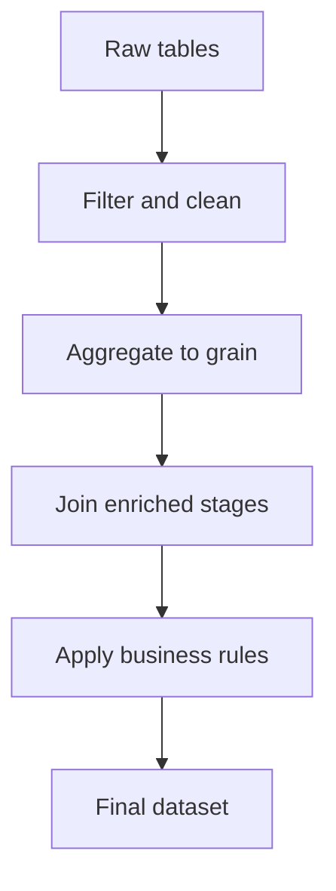
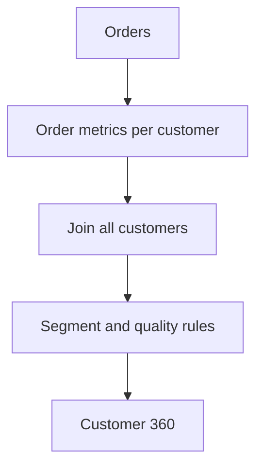

---
aliases:
  - DE SQL Week 4
  - SQL Subqueries and CTEs Week 4
tags:
  - data-engineering
  - sql
  - subqueries
  - cte
  - views
  - interview-preparation
  - week-4
status: active
difficulty: beginner-intermediate
study_time: 6 days
created: 2026-08-16
previous: '[[Data-Engineer-SQL-Week-3-Obsidian]]'
---

# Data Engineer SQL — Week 4 Detailed Notes

> [!info] Week 4 goal
> Break complex transformations into understandable stages. Learn when to use scalar subqueries, `EXISTS`, correlated subqueries, CTEs, views, temporary tables, and materialized results.

## Obsidian navigation

- [[#Day 1 — Scalar, multi-row, and derived-table subqueries|Day 1 — Subqueries]]
- [[#Day 2 — EXISTS and NOT EXISTS|Day 2 — EXISTS]]
- [[#Day 3 — Correlated subqueries|Day 3 — Correlated subqueries]]
- [[#Day 4 — Common Table Expressions|Day 4 — CTEs]]
- [[#Day 5 — Multi-stage Data Engineering transformations|Day 5 — Multi-stage transformations]]
- [[#Day 6 — Views, temporary tables, and materialized results|Day 6 — Views and temporary tables]]
- [[#Week 4 mini-project — Customer 360 dataset|Mini-project]]
- [[#Week 4 interview questions|Interview questions]]
- [[#Week 4 final practice set|Final practice]]
- [[#Week 4 one-page cheat sheet|Cheat sheet]]

## Progress tracker

- [ ] Day 1 completed
- [ ] Day 2 completed
- [ ] Day 3 completed
- [ ] Day 4 completed
- [ ] Day 5 completed
- [ ] Day 6 completed
- [ ] Customer 360 mini-project completed
- [ ] Week 4 completion test passed

> [!tip] Readability test
> If you cannot explain each transformation stage in one sentence, split the SQL into named CTEs and verify the grain of every stage.

**Level:** Beginner to intermediate  
**Duration:** 6 study days plus 1 revision/rest day  
**Daily time:** 60–90 minutes  
**Primary dialect:** PostgreSQL-style SQL  
**Prerequisite:** [[Data-Engineer-SQL-Week-3-Obsidian|Week 3 — Joins and set operations]]

## Week 4 learning outcomes

By the end of this week, you should be able to:

- Distinguish scalar, multi-row, correlated, and derived-table subqueries.
- Use subqueries in `WHERE`, `SELECT`, and `FROM`.
- Use `EXISTS` and `NOT EXISTS` for semi-join and anti-join logic.
- Avoid the `NOT IN` and NULL trap.
- Recognize and rewrite expensive correlated subqueries.
- Create single and multi-stage CTEs.
- Explain CTE scope and materialization behavior.
- Understand the recursive CTE anchor and recursive members.
- Build readable Data Engineering transformations with declared stage grains.
- Choose among CTEs, subqueries, views, temporary tables, and materialized views.
- Create a reusable Customer 360 dataset.

---

# Practice setup and mental model

Continue using the following tables from Weeks 1–3:

- `customers`
- `products`
- `orders`
- `order_items`
- `employees`
- `price_bands`
- `source_order_snapshot`
- `target_order_snapshot`

## Query nesting map



Subqueries and CTEs are tools for representing these stages. They do not replace grain, key, NULL, and reconciliation thinking.

## Important vocabulary

| Term | Meaning |
|---|---|
| Outer query | Query containing another query |
| Subquery | Query nested within another SQL statement |
| Scalar subquery | Returns one value: one row and one column |
| Multi-row subquery | Returns several rows, often one column |
| Derived table | Subquery in `FROM` treated as a table |
| Correlated subquery | References columns from the outer query |
| CTE | Named query expression scoped to one statement |
| Recursive CTE | CTE that references itself to traverse hierarchy or sequence |

---

# Day 1 — Scalar, multi-row, and derived-table subqueries

## 1.1 What is a subquery?

A subquery is a `SELECT` statement nested inside another SQL statement.

General pattern:

```sql
SELECT ...
FROM ...
WHERE column_operator (
    SELECT ...
    FROM ...
);
```

The inner query produces a value or row set used by the outer query.

## 1.2 Scalar subquery

A scalar subquery must return at most one row and one column.

Products priced above the overall average:

```sql
SELECT product_id,
       product_name,
       unit_price
FROM products
WHERE unit_price > (
    SELECT AVG(unit_price)
    FROM products
);
```

The inner query returns one average value. The outer query compares each product with it.

## 1.3 Scalar subquery returning no row or several rows

- A scalar subquery returning no row normally behaves like NULL.
- A scalar subquery returning more than one row raises an error.

Incorrect:

```sql
SELECT product_name
FROM products
WHERE unit_price = (
    SELECT unit_price
    FROM products
    WHERE category = 'Electronics'
);
```

The inner query can return several prices. Use an appropriate multi-row operator or aggregate.

## 1.4 Scalar subquery in SELECT

```sql
SELECT order_id,
       order_total,
       (SELECT AVG(order_total) FROM orders) AS overall_average
FROM orders;
```

The same scalar value appears on every output row.

Difference from the overall average:

```sql
SELECT order_id,
       order_total,
       order_total - (SELECT AVG(order_total) FROM orders) AS difference_from_average
FROM orders
WHERE order_total IS NOT NULL;
```

## 1.5 Multi-row subquery with IN

Return customers who placed a completed order:

```sql
SELECT customer_id,
       customer_name
FROM customers
WHERE customer_id IN (
    SELECT customer_id
    FROM orders
    WHERE order_status = 'COMPLETED'
      AND customer_id IS NOT NULL
);
```

The subquery may return duplicate IDs. `IN` tests membership, so duplicates do not change the truth result.

## 1.6 ANY and ALL concept

Operator support and syntax vary by engine.

Greater than at least one Electronics price:

```sql
SELECT product_name, unit_price
FROM products
WHERE unit_price > ANY (
    SELECT unit_price
    FROM products
    WHERE category = 'Electronics'
);
```

Greater than every Electronics price:

```sql
SELECT product_name, unit_price
FROM products
WHERE unit_price > ALL (
    SELECT unit_price
    FROM products
    WHERE category = 'Electronics'
);
```

For readability, `> ALL` can often be expressed using `> (SELECT MAX(...))`, but empty-set and NULL behavior should be considered.

## 1.7 Subquery in FROM: derived table

A subquery in `FROM` produces a temporary relational result used by the outer query.

```sql
SELECT s.customer_id,
       s.order_count,
       s.completed_revenue
FROM (
    SELECT customer_id,
           COUNT(*) AS order_count,
           SUM(CASE
                   WHEN order_status = 'COMPLETED' THEN order_total
                   ELSE 0
               END) AS completed_revenue
    FROM orders
    WHERE customer_id IS NOT NULL
    GROUP BY customer_id
) AS s
WHERE s.completed_revenue > 10000;
```

The derived table has one row per customer. PostgreSQL requires an alias such as `s`.

## 1.8 Aggregate first, then join

This solves join-grain problems from Week 3:

```sql
SELECT o.order_id,
       o.order_total,
       i.item_total,
       o.order_total - i.item_total AS difference
FROM orders AS o
JOIN (
    SELECT order_id,
           SUM(quantity * unit_price) AS item_total
    FROM order_items
    GROUP BY order_id
) AS i
  ON o.order_id = i.order_id;
```

The inner result is one row per order, matching the grain of `orders`.

## 1.9 Nested subqueries

Subqueries can be nested, but excessive nesting becomes hard to read.

```sql
SELECT customer_id, customer_name
FROM customers
WHERE customer_id IN (
    SELECT customer_id
    FROM orders
    WHERE order_total > (
        SELECT AVG(order_total)
        FROM orders
    )
);
```

CTEs introduced on Day 4 make multi-stage logic clearer.

## 1.10 Subquery versus join

Many queries can be expressed either way.

Subquery membership:

```sql
SELECT customer_id, customer_name
FROM customers
WHERE customer_id IN (
    SELECT customer_id
    FROM orders
);
```

Join equivalent:

```sql
SELECT DISTINCT c.customer_id,
       c.customer_name
FROM customers AS c
JOIN orders AS o
  ON c.customer_id = o.customer_id;
```

The join produces one row per matching order, so `DISTINCT` is needed to return one customer. `EXISTS` is often clearer for existence questions.

## 1.11 Performance is optimizer-dependent

Modern optimizers can transform subqueries into joins and vice versa. Do not assume one form is always faster.

Choose a form that:

- expresses the required relationship,
- preserves the correct grain,
- handles NULL safely,
- is readable,
- and has an acceptable execution plan on realistic data.

## Day 1 common mistakes

- Using `=` with a subquery that returns multiple rows.
- Returning several columns where one is expected.
- Forgetting an alias for a derived table.
- Ignoring NULL values returned by a subquery.
- Nesting many levels instead of using named stages.
- Assuming a subquery is automatically slower than a join.
- Aggregating at the wrong grain inside a derived table.

## Day 1 exercises

1. Return products priced above average.
2. Return products priced at the maximum product price.
3. Return orders larger than average known order total.
4. Display each order and the overall maximum total.
5. Return customers whose IDs appear in completed orders.
6. Return products whose category appears in products priced above 20,000.
7. Aggregate order count per customer in a derived table.
8. Filter the derived table to customers with at least two orders.
9. Aggregate item total per order, then join to orders.
10. Return orders whose header total differs from aggregated item total.
11. Explain why a scalar subquery must return at most one row.
12. State the grain of each derived table you wrote.

## Day 1 solutions

```sql
-- 1
SELECT product_id, product_name, unit_price
FROM products
WHERE unit_price > (
    SELECT AVG(unit_price)
    FROM products
);

-- 2
SELECT product_id, product_name, unit_price
FROM products
WHERE unit_price = (
    SELECT MAX(unit_price)
    FROM products
);

-- 3
SELECT order_id, order_total
FROM orders
WHERE order_total > (
    SELECT AVG(order_total)
    FROM orders
);

-- 4
SELECT order_id,
       order_total,
       (SELECT MAX(order_total) FROM orders) AS maximum_order_total
FROM orders;

-- 5
SELECT customer_id, customer_name
FROM customers
WHERE customer_id IN (
    SELECT customer_id
    FROM orders
    WHERE order_status = 'COMPLETED'
      AND customer_id IS NOT NULL
);

-- 6
SELECT product_id, product_name, category
FROM products
WHERE category IN (
    SELECT category
    FROM products
    WHERE unit_price > 20000
);

-- 7 and 8
SELECT s.customer_id, s.order_count
FROM (
    SELECT customer_id, COUNT(*) AS order_count
    FROM orders
    WHERE customer_id IS NOT NULL
    GROUP BY customer_id
) AS s
WHERE s.order_count >= 2;

-- 9
SELECT o.order_id,
       o.order_total,
       i.item_total
FROM orders AS o
JOIN (
    SELECT order_id,
           SUM(quantity * unit_price) AS item_total
    FROM order_items
    GROUP BY order_id
) AS i
  ON o.order_id = i.order_id;

-- 10
SELECT o.order_id,
       o.order_total,
       i.item_total
FROM orders AS o
JOIN (
    SELECT order_id,
           SUM(quantity * unit_price) AS item_total
    FROM order_items
    GROUP BY order_id
) AS i
  ON o.order_id = i.order_id
WHERE o.order_total IS DISTINCT FROM i.item_total;
```

---

# Day 2 — EXISTS and NOT EXISTS

## 2.1 EXISTS answers an existence question

`EXISTS` is true when its subquery returns at least one row.

Customers with at least one order:

```sql
SELECT c.customer_id,
       c.customer_name
FROM customers AS c
WHERE EXISTS (
    SELECT 1
    FROM orders AS o
    WHERE o.customer_id = c.customer_id
);
```

The subquery references `c.customer_id`, so it is correlated.

## 2.2 Why SELECT 1?

The selected value inside `EXISTS` is not used. Only row existence matters.

These are logically equivalent:

```sql
EXISTS (SELECT 1 FROM ...)
EXISTS (SELECT * FROM ...)
```

`SELECT 1` communicates intent clearly.

## 2.3 EXISTS as a semi join

A semi join returns left rows that have a match without duplicating them for multiple right matches.

```sql
SELECT c.customer_id,
       c.customer_name
FROM customers AS c
WHERE EXISTS (
    SELECT 1
    FROM orders AS o
    WHERE o.customer_id = c.customer_id
      AND o.order_status = 'COMPLETED'
);
```

Even if a customer has five completed orders, the customer appears once.

Some distributed SQL engines support explicit `LEFT SEMI JOIN` syntax. `EXISTS` is broadly understood and portable.

## 2.4 NOT EXISTS as an anti join

Customers with no orders:

```sql
SELECT c.customer_id,
       c.customer_name
FROM customers AS c
WHERE NOT EXISTS (
    SELECT 1
    FROM orders AS o
    WHERE o.customer_id = c.customer_id
);
```

`NOT EXISTS` is a safe and clear anti-matching pattern.

## 2.5 Find orphan records

Orders without a valid customer:

```sql
SELECT o.order_id,
       o.customer_id
FROM orders AS o
WHERE NOT EXISTS (
    SELECT 1
    FROM customers AS c
    WHERE c.customer_id = o.customer_id
);
```

Orders with NULL customer ID also satisfy `NOT EXISTS` because no customer equals NULL.

Separate quality categories:

```sql
SELECT o.order_id,
       o.customer_id,
       CASE
           WHEN o.customer_id IS NULL THEN 'NULL_KEY'
           WHEN NOT EXISTS (
               SELECT 1
               FROM customers AS c
               WHERE c.customer_id = o.customer_id
           ) THEN 'UNKNOWN_KEY'
           ELSE 'VALID'
       END AS key_status
FROM orders AS o;
```

## 2.6 NOT IN and NULL trap

Risky:

```sql
SELECT customer_id, customer_name
FROM customers
WHERE customer_id NOT IN (
    SELECT customer_id
    FROM orders
);
```

The orders table contains a NULL customer ID. `NOT IN` comparisons can become unknown and return no customers.

Safer:

```sql
SELECT c.customer_id,
       c.customer_name
FROM customers AS c
WHERE NOT EXISTS (
    SELECT 1
    FROM orders AS o
    WHERE o.customer_id = c.customer_id
);
```

If using `NOT IN`, explicitly exclude NULL and confirm semantics:

```sql
WHERE customer_id NOT IN (
    SELECT customer_id
    FROM orders
    WHERE customer_id IS NOT NULL
)
```

## 2.7 EXISTS with multiple conditions

Active customers with a completed web order above 5,000:

```sql
SELECT c.customer_id,
       c.customer_name
FROM customers AS c
WHERE c.is_active = TRUE
  AND EXISTS (
      SELECT 1
      FROM orders AS o
      WHERE o.customer_id = c.customer_id
        AND o.order_status = 'COMPLETED'
        AND o.sales_channel = 'WEB'
        AND o.order_total > 5000
  );
```

## 2.8 Double NOT EXISTS for relational division

Advanced pattern: find customers who ordered every required category. This can be expressed as there is no required category for which the customer has no matching order.

```sql
SELECT c.customer_id,
       c.customer_name
FROM customers AS c
WHERE NOT EXISTS (
    SELECT 1
    FROM required_categories AS r
    WHERE NOT EXISTS (
        SELECT 1
        FROM orders AS o
        JOIN order_items AS oi
          ON o.order_id = oi.order_id
        JOIN products AS p
          ON oi.product_id = p.product_id
        WHERE o.customer_id = c.customer_id
          AND p.category = r.category
    )
);
```

You do not need to memorize this in Week 4, but recognize the logical pattern.

## 2.9 EXISTS performance concept

Conceptually, existence can stop after the first match. The optimizer may implement it using a semi join, index lookup, hash structure, or another strategy.

Helpful factors:

- Correct correlated key
- Compatible data types
- Selective filters
- Useful indexes on relational systems
- Partition pruning in distributed systems

Always inspect the actual plan for performance decisions.

## Day 2 common mistakes

- Using `NOT IN` when the subquery can return NULL.
- Selecting many unused columns inside `EXISTS`.
- Forgetting the correlation condition and making `EXISTS` true for every outer row.
- Adding unrelated filters outside instead of inside the existence rule.
- Using a join plus `DISTINCT` when existence is the real requirement.
- Combining NULL foreign keys with invalid non-NULL keys unintentionally.

## Day 2 exercises

1. Return customers who placed any order.
2. Return customers with a completed order.
3. Return customers with a completed app order.
4. Return customers with no orders.
5. Return products used in at least one order item.
6. Return products never used in order items.
7. Return order items whose product does not exist.
8. Return order items whose order does not exist.
9. Return employees who manage at least one employee.
10. Return employees who manage nobody.
11. Demonstrate why `NOT IN` is unsafe when the subquery includes NULL.
12. Explain why `EXISTS` does not duplicate outer rows.

## Day 2 solutions

```sql
-- 1
SELECT c.customer_id, c.customer_name
FROM customers AS c
WHERE EXISTS (
    SELECT 1
    FROM orders AS o
    WHERE o.customer_id = c.customer_id
);

-- 2
SELECT c.customer_id, c.customer_name
FROM customers AS c
WHERE EXISTS (
    SELECT 1
    FROM orders AS o
    WHERE o.customer_id = c.customer_id
      AND o.order_status = 'COMPLETED'
);

-- 3
SELECT c.customer_id, c.customer_name
FROM customers AS c
WHERE EXISTS (
    SELECT 1
    FROM orders AS o
    WHERE o.customer_id = c.customer_id
      AND o.order_status = 'COMPLETED'
      AND o.sales_channel = 'APP'
);

-- 4
SELECT c.customer_id, c.customer_name
FROM customers AS c
WHERE NOT EXISTS (
    SELECT 1
    FROM orders AS o
    WHERE o.customer_id = c.customer_id
);

-- 5
SELECT p.product_id, p.product_name
FROM products AS p
WHERE EXISTS (
    SELECT 1
    FROM order_items AS oi
    WHERE oi.product_id = p.product_id
);

-- 6
SELECT p.product_id, p.product_name
FROM products AS p
WHERE NOT EXISTS (
    SELECT 1
    FROM order_items AS oi
    WHERE oi.product_id = p.product_id
);

-- 7
SELECT oi.order_id, oi.product_id
FROM order_items AS oi
WHERE NOT EXISTS (
    SELECT 1
    FROM products AS p
    WHERE p.product_id = oi.product_id
);

-- 8
SELECT oi.order_id, oi.product_id
FROM order_items AS oi
WHERE NOT EXISTS (
    SELECT 1
    FROM orders AS o
    WHERE o.order_id = oi.order_id
);

-- 9
SELECT m.employee_id, m.employee_name
FROM employees AS m
WHERE EXISTS (
    SELECT 1
    FROM employees AS e
    WHERE e.manager_id = m.employee_id
);

-- 10
SELECT m.employee_id, m.employee_name
FROM employees AS m
WHERE NOT EXISTS (
    SELECT 1
    FROM employees AS e
    WHERE e.manager_id = m.employee_id
);
```

---

# Day 3 — Correlated subqueries

## 3.1 What makes a subquery correlated?

A correlated subquery references a column from the outer query.

```sql
SELECT c.customer_id,
       c.customer_name,
       (
           SELECT COUNT(*)
           FROM orders AS o
           WHERE o.customer_id = c.customer_id
       ) AS order_count
FROM customers AS c;
```

The inner query depends on the current customer.

## 3.2 Correlated scalar subquery in SELECT

Customer order metrics:

```sql
SELECT c.customer_id,
       c.customer_name,
       (
           SELECT COUNT(*)
           FROM orders AS o
           WHERE o.customer_id = c.customer_id
       ) AS order_count,
       (
           SELECT SUM(o.order_total)
           FROM orders AS o
           WHERE o.customer_id = c.customer_id
             AND o.order_status = 'COMPLETED'
       ) AS completed_revenue
FROM customers AS c;
```

Readable for a small number of metrics, but repeated correlated scans can be expensive. A single aggregate plus join is usually clearer for many metrics.

## 3.3 Above group average

Products priced above their category average:

```sql
SELECT p.product_id,
       p.product_name,
       p.category,
       p.unit_price
FROM products AS p
WHERE p.unit_price > (
    SELECT AVG(p2.unit_price)
    FROM products AS p2
    WHERE p2.category = p.category
);
```

The average is calculated for the current product category.

## 3.4 Orders above customer average

```sql
SELECT o.order_id,
       o.customer_id,
       o.order_total
FROM orders AS o
WHERE o.order_total > (
    SELECT AVG(o2.order_total)
    FROM orders AS o2
    WHERE o2.customer_id = o.customer_id
);
```

Rows with NULL customer ID or total require explicit business decisions.

## 3.5 Latest row per group using NOT EXISTS

```sql
SELECT o.order_id,
       o.customer_id,
       o.order_date,
       o.updated_at
FROM orders AS o
WHERE o.customer_id IS NOT NULL
  AND NOT EXISTS (
      SELECT 1
      FROM orders AS newer
      WHERE newer.customer_id = o.customer_id
        AND (
               newer.order_date > o.order_date
            OR (newer.order_date = o.order_date AND newer.order_id > o.order_id)
        )
  );
```

The tiebreaker makes the result deterministic. Week 5 window functions provide a clearer pattern using `ROW_NUMBER`.

## 3.6 Maximum-per-group correlated pattern

```sql
SELECT p.product_id,
       p.product_name,
       p.category,
       p.unit_price
FROM products AS p
WHERE p.unit_price = (
    SELECT MAX(p2.unit_price)
    FROM products AS p2
    WHERE p2.category = p.category
);
```

This returns every tied maximum in a category.

## 3.7 Rewrite with aggregate and join

```sql
SELECT p.product_id,
       p.product_name,
       p.category,
       p.unit_price
FROM products AS p
JOIN (
    SELECT category,
           MAX(unit_price) AS maximum_price
    FROM products
    GROUP BY category
) AS m
  ON p.category = m.category
 AND p.unit_price = m.maximum_price;
```

The optimizer may produce a similar plan, but the aggregate stage and grain are explicit.

## 3.8 Correlated UPDATE or DELETE warning

Correlated subqueries can appear in data-changing statements, but test carefully, use transactions, and verify row counts before committing.

Read-only pattern first:

```sql
SELECT ...
FROM target AS t
WHERE EXISTS (...);
```

Confirm the exact target population before converting to `UPDATE` or `DELETE`.

## 3.9 Common performance issue

The naive mental model is one inner execution per outer row. Optimizers can decorrelate some queries, but not all.

Warning signs:

- Large outer input
- Complex inner logic
- Non-equality correlation
- Several correlated metrics
- Functions or casts on correlated keys
- Poor statistics or missing indexes

Use `EXPLAIN` and compare a grouped-join or CTE rewrite.

## Day 3 common mistakes

- Forgetting the outer reference and producing a global result.
- Using a correlated subquery that can return several rows as a scalar value.
- Missing deterministic tie logic for latest-row queries.
- Repeating several correlated scans of the same table.
- Assuming the optimizer always decorrelates the query.
- Ignoring NULL correlation keys.

## Day 3 exercises

1. Display each customer with order count using a correlated scalar subquery.
2. Display each customer with completed revenue.
3. Return products above category average.
4. Return highest-priced products in each category.
5. Return orders above their customer average.
6. Return customers whose completed revenue exceeds 10,000.
7. Return the latest order per customer using `NOT EXISTS`.
8. Return employees earning above their department average.
9. Rewrite exercise 4 using aggregate plus join.
10. Rewrite exercises 1 and 2 using one aggregated derived table and a left join.
11. Explain the tie behavior of maximum-per-group queries.
12. Identify when a correlated subquery might be expensive.

## Day 3 solutions

```sql
-- 1
SELECT c.customer_id,
       c.customer_name,
       (
           SELECT COUNT(*)
           FROM orders AS o
           WHERE o.customer_id = c.customer_id
       ) AS order_count
FROM customers AS c;

-- 2
SELECT c.customer_id,
       c.customer_name,
       (
           SELECT SUM(o.order_total)
           FROM orders AS o
           WHERE o.customer_id = c.customer_id
             AND o.order_status = 'COMPLETED'
       ) AS completed_revenue
FROM customers AS c;

-- 3
SELECT p.*
FROM products AS p
WHERE p.unit_price > (
    SELECT AVG(p2.unit_price)
    FROM products AS p2
    WHERE p2.category = p.category
);

-- 4
SELECT p.*
FROM products AS p
WHERE p.unit_price = (
    SELECT MAX(p2.unit_price)
    FROM products AS p2
    WHERE p2.category = p.category
);

-- 5
SELECT o.order_id, o.customer_id, o.order_total
FROM orders AS o
WHERE o.order_total > (
    SELECT AVG(o2.order_total)
    FROM orders AS o2
    WHERE o2.customer_id = o.customer_id
);

-- 6
SELECT c.customer_id, c.customer_name
FROM customers AS c
WHERE 10000 < (
    SELECT SUM(o.order_total)
    FROM orders AS o
    WHERE o.customer_id = c.customer_id
      AND o.order_status = 'COMPLETED'
);

-- 7
SELECT o.*
FROM orders AS o
WHERE o.customer_id IS NOT NULL
  AND NOT EXISTS (
      SELECT 1
      FROM orders AS newer
      WHERE newer.customer_id = o.customer_id
        AND (
               newer.order_date > o.order_date
            OR (newer.order_date = o.order_date AND newer.order_id > o.order_id)
        )
  );

-- 8
SELECT e.employee_id,
       e.employee_name,
       e.department,
       e.salary
FROM employees AS e
WHERE e.salary > (
    SELECT AVG(e2.salary)
    FROM employees AS e2
    WHERE e2.department = e.department
);

-- 9
SELECT p.*
FROM products AS p
JOIN (
    SELECT category, MAX(unit_price) AS maximum_price
    FROM products
    GROUP BY category
) AS m
  ON p.category = m.category
 AND p.unit_price = m.maximum_price;

-- 10
SELECT c.customer_id,
       c.customer_name,
       COALESCE(m.order_count, 0) AS order_count,
       COALESCE(m.completed_revenue, 0) AS completed_revenue
FROM customers AS c
LEFT JOIN (
    SELECT customer_id,
           COUNT(*) AS order_count,
           SUM(CASE
                   WHEN order_status = 'COMPLETED' THEN order_total
                   ELSE 0
               END) AS completed_revenue
    FROM orders
    WHERE customer_id IS NOT NULL
    GROUP BY customer_id
) AS m
  ON c.customer_id = m.customer_id;
```

---

# Day 4 — Common Table Expressions

## 4.1 CTE syntax

A Common Table Expression is a named query expression scoped to one statement.

```sql
WITH completed_orders AS (
    SELECT order_id,
           customer_id,
           order_date,
           order_total
    FROM orders
    WHERE order_status = 'COMPLETED'
)
SELECT *
FROM completed_orders;
```

The name `completed_orders` can be referenced by the main statement.

## 4.2 Why use CTEs?

- Name transformation stages.
- Reduce nesting.
- Reuse a stage within one statement.
- Make grain visible.
- Simplify testing and review.
- Support recursion.

## 4.3 Multiple CTEs

Separate CTEs with commas:

```sql
WITH completed_orders AS (
    SELECT customer_id,
           order_total
    FROM orders
    WHERE order_status = 'COMPLETED'
      AND customer_id IS NOT NULL
),
customer_metrics AS (
    SELECT customer_id,
           COUNT(*) AS completed_order_count,
           SUM(order_total) AS completed_revenue
    FROM completed_orders
    GROUP BY customer_id
)
SELECT c.customer_id,
       c.customer_name,
       COALESCE(m.completed_order_count, 0) AS completed_order_count,
       COALESCE(m.completed_revenue, 0) AS completed_revenue
FROM customers AS c
LEFT JOIN customer_metrics AS m
  ON c.customer_id = m.customer_id;
```

Stage grains:

- `completed_orders`: one row per completed order.
- `customer_metrics`: one row per customer with a completed order.
- final result: one row per customer.

## 4.4 CTE column names

Optional explicit names:

```sql
WITH status_counts (status_name, order_count) AS (
    SELECT order_status, COUNT(*)
    FROM orders
    GROUP BY order_status
)
SELECT *
FROM status_counts;
```

Aliases inside the CTE are usually more readable for large transformations.

## 4.5 CTE scope

A CTE normally exists only for the single statement immediately following `WITH`.

```sql
WITH x AS (...)
SELECT * FROM x;

-- x is no longer available here
SELECT * FROM x;
```

Use a view or temporary table when a named result must survive beyond one statement.

## 4.6 CTE does not guarantee materialization

A CTE is primarily a query-organization construct. Depending on engine, version, query, and hints, it may be:

- inlined into the surrounding query,
- evaluated once and reused,
- or materialized.

Do not assume it improves performance. Inspect the execution plan.

PostgreSQL offers materialization controls in some versions and contexts. Other platforms use different behavior.

## 4.7 Reusing a CTE

```sql
WITH customer_totals AS (
    SELECT customer_id,
           SUM(order_total) AS total_value
    FROM orders
    WHERE customer_id IS NOT NULL
    GROUP BY customer_id
)
SELECT a.customer_id AS customer_1,
       b.customer_id AS customer_2,
       a.total_value
FROM customer_totals AS a
JOIN customer_totals AS b
  ON a.total_value = b.total_value
 AND a.customer_id < b.customer_id;
```

Whether the shared CTE is physically computed once is engine-dependent.

## 4.8 CTE for reconciliation

```sql
WITH reconciled AS (
    SELECT COALESCE(s.order_id, t.order_id) AS order_id,
           CASE
               WHEN t.order_id IS NULL THEN 'INSERT_REQUIRED'
               WHEN s.order_id IS NULL THEN 'DELETE_OR_EXPIRE_REQUIRED'
               WHEN s.order_status IS DISTINCT FROM t.order_status
                 OR s.order_total IS DISTINCT FROM t.order_total
               THEN 'UPDATE_REQUIRED'
               ELSE 'MATCHED'
           END AS reconciliation_status
    FROM source_order_snapshot AS s
    FULL OUTER JOIN target_order_snapshot AS t
      ON s.order_id = t.order_id
)
SELECT reconciliation_status,
       COUNT(*) AS record_count
FROM reconciled
GROUP BY reconciliation_status
ORDER BY reconciliation_status;
```

The classification logic is written once.

## 4.9 Recursive CTE concept

A recursive CTE contains:

1. Anchor query: starting rows.
2. `UNION ALL`.
3. Recursive query: joins the CTE to new rows.
4. Termination: recursion stops when no new rows are returned or an engine limit is reached.

Employee hierarchy in PostgreSQL:

```sql
WITH RECURSIVE organization AS (
    -- Anchor: top-level employee
    SELECT employee_id,
           employee_name,
           manager_id,
           1 AS hierarchy_level,
           employee_name::TEXT AS hierarchy_path
    FROM employees
    WHERE manager_id IS NULL

    UNION ALL

    -- Recursive member: direct reports
    SELECT e.employee_id,
           e.employee_name,
           e.manager_id,
           o.hierarchy_level + 1,
           o.hierarchy_path || ' > ' || e.employee_name
    FROM employees AS e
    JOIN organization AS o
      ON e.manager_id = o.employee_id
)
SELECT *
FROM organization
ORDER BY hierarchy_path;
```

The invalid manager record is unreachable from the top-level anchor.

## 4.10 Recursive safety

Cycles can cause repeated recursion. Production approaches include:

- Enforce acyclic hierarchy constraints where possible.
- Track visited IDs in a path.
- Add a maximum depth.
- Use engine recursion limits.
- Run cycle-detection quality checks.

Recursive syntax and capabilities vary substantially by engine.

## Day 4 common mistakes

- Forgetting the comma between CTE definitions.
- Referencing a later CTE before it is defined when the engine disallows it.
- Assuming a CTE persists after the statement.
- Assuming every CTE is materialized.
- Hiding an unclear grain inside a CTE name.
- Using recursion without termination or cycle protection.
- Naming stages `cte1`, `cte2` instead of business meanings.

## Day 4 exercises

1. Create a CTE containing completed orders.
2. Aggregate completed revenue by customer in a second CTE.
3. Join the metrics to all customers.
4. Create a CTE of item totals per order.
5. Reconcile item totals with header totals.
6. Create a CTE of daily order metrics.
7. Filter the daily CTE for revenue above 10,000.
8. Rewrite the Week 3 reconciliation summary using a CTE.
9. Create an employee hierarchy recursive CTE.
10. Return hierarchy level and path.
11. Explain CTE scope.
12. Explain why a CTE is not automatically faster.

## Day 4 solutions

```sql
-- 1, 2, and 3
WITH completed_orders AS (
    SELECT customer_id, order_total
    FROM orders
    WHERE order_status = 'COMPLETED'
      AND customer_id IS NOT NULL
),
customer_completed_metrics AS (
    SELECT customer_id,
           COUNT(*) AS completed_order_count,
           SUM(order_total) AS completed_revenue
    FROM completed_orders
    GROUP BY customer_id
)
SELECT c.customer_id,
       c.customer_name,
       COALESCE(m.completed_order_count, 0) AS completed_order_count,
       COALESCE(m.completed_revenue, 0) AS completed_revenue
FROM customers AS c
LEFT JOIN customer_completed_metrics AS m
  ON c.customer_id = m.customer_id;

-- 4 and 5
WITH item_totals AS (
    SELECT order_id,
           SUM(quantity * unit_price) AS item_total
    FROM order_items
    GROUP BY order_id
)
SELECT o.order_id,
       o.order_total,
       i.item_total,
       o.order_total - i.item_total AS difference
FROM orders AS o
LEFT JOIN item_totals AS i
  ON o.order_id = i.order_id;

-- 6 and 7
WITH daily_metrics AS (
    SELECT order_date,
           COUNT(*) AS order_count,
           SUM(CASE
                   WHEN order_status = 'COMPLETED' THEN order_total
                   ELSE 0
               END) AS completed_revenue
    FROM orders
    GROUP BY order_date
)
SELECT *
FROM daily_metrics
WHERE completed_revenue > 10000
ORDER BY order_date;

-- 8
WITH reconciled AS (
    SELECT COALESCE(s.order_id, t.order_id) AS order_id,
           CASE
               WHEN t.order_id IS NULL THEN 'INSERT_REQUIRED'
               WHEN s.order_id IS NULL THEN 'DELETE_OR_EXPIRE_REQUIRED'
               WHEN s.order_status IS DISTINCT FROM t.order_status
                 OR s.order_total IS DISTINCT FROM t.order_total
               THEN 'UPDATE_REQUIRED'
               ELSE 'MATCHED'
           END AS reconciliation_status
    FROM source_order_snapshot AS s
    FULL OUTER JOIN target_order_snapshot AS t
      ON s.order_id = t.order_id
)
SELECT reconciliation_status,
       COUNT(*) AS record_count
FROM reconciled
GROUP BY reconciliation_status;

-- 9 and 10
WITH RECURSIVE organization AS (
    SELECT employee_id,
           employee_name,
           manager_id,
           1 AS hierarchy_level,
           employee_name::TEXT AS hierarchy_path
    FROM employees
    WHERE manager_id IS NULL

    UNION ALL

    SELECT e.employee_id,
           e.employee_name,
           e.manager_id,
           o.hierarchy_level + 1,
           o.hierarchy_path || ' > ' || e.employee_name
    FROM employees AS e
    JOIN organization AS o
      ON e.manager_id = o.employee_id
)
SELECT *
FROM organization
ORDER BY hierarchy_path;
```

---

# Day 5 — Multi-stage Data Engineering transformations

## 5.1 Design stages before SQL

A maintainable transformation often follows:

1. Source selection
2. Cleaning and standardization
3. Validation and rejection flags
4. Deduplication
5. Aggregation to intended grain
6. Enrichment joins
7. Business rules
8. Final projection

CTE names should reflect these responsibilities.

## 5.2 Multi-stage daily metrics

```sql
WITH filtered_orders AS (
    -- Grain: one accepted order
    SELECT order_id,
           customer_id,
           order_date,
           order_status,
           order_total,
           sales_channel,
           updated_at
    FROM orders
    WHERE order_date >= '2026-07-01'
      AND order_date <  '2026-09-01'
),
daily_metrics AS (
    -- Grain: one row per order date
    SELECT order_date,
           COUNT(*) AS total_orders,
           COUNT(DISTINCT customer_id) AS distinct_customers,
           SUM(CASE WHEN order_status = 'COMPLETED' THEN 1 ELSE 0 END)
               AS completed_orders,
           SUM(CASE WHEN order_status = 'COMPLETED' THEN order_total ELSE 0 END)
               AS completed_revenue,
           SUM(CASE WHEN customer_id IS NULL THEN 1 ELSE 0 END)
               AS missing_customer_count,
           MAX(updated_at) AS latest_update
    FROM filtered_orders
    GROUP BY order_date
),
scored_metrics AS (
    -- Grain: one row per order date
    SELECT order_date,
           total_orders,
           distinct_customers,
           completed_orders,
           completed_revenue,
           missing_customer_count,
           latest_update,
           100.0 * completed_orders / NULLIF(total_orders, 0)
               AS completion_percentage,
           CASE
               WHEN missing_customer_count > 0 THEN 'QUALITY_WARNING'
               ELSE 'OK'
           END AS quality_status
    FROM daily_metrics
)
SELECT *
FROM scored_metrics
ORDER BY order_date;
```

Each stage has one responsibility and a documented grain.

## 5.3 Data-quality rule staging

```sql
WITH evaluated_orders AS (
    SELECT o.*,
           CASE WHEN order_id IS NULL THEN 1 ELSE 0 END AS null_key_flag,
           CASE WHEN customer_id IS NULL THEN 1 ELSE 0 END AS null_customer_flag,
           CASE WHEN order_total IS NULL THEN 1 ELSE 0 END AS null_total_flag,
           CASE WHEN order_total < 0 THEN 1 ELSE 0 END AS negative_total_flag,
           CASE
               WHEN order_status NOT IN ('COMPLETED', 'SHIPPED', 'PENDING', 'CANCELLED')
                 OR order_status IS NULL
               THEN 1 ELSE 0
           END AS invalid_status_flag
    FROM orders AS o
),
classified_orders AS (
    SELECT *,
           CASE
               WHEN null_key_flag
                  + null_customer_flag
                  + null_total_flag
                  + negative_total_flag
                  + invalid_status_flag > 0
               THEN 'REJECT_OR_REVIEW'
               ELSE 'VALID'
           END AS record_quality_status
    FROM evaluated_orders
)
SELECT record_quality_status,
       COUNT(*) AS record_count,
       SUM(null_customer_flag) AS missing_customer_count,
       SUM(null_total_flag) AS missing_total_count,
       SUM(negative_total_flag) AS negative_total_count,
       SUM(invalid_status_flag) AS invalid_status_count
FROM classified_orders
GROUP BY record_quality_status;
```

## 5.4 Deduplication before window functions

One approach to latest update per key:

```sql
WITH latest_timestamp AS (
    SELECT order_id,
           MAX(updated_at) AS maximum_updated_at
    FROM raw_orders
    GROUP BY order_id
)
SELECT r.*
FROM raw_orders AS r
JOIN latest_timestamp AS l
  ON r.order_id = l.order_id
 AND r.updated_at = l.maximum_updated_at;
```

Problem: if two rows share the maximum timestamp, both are returned. Week 5 uses `ROW_NUMBER` with deterministic tiebreakers.

## 5.5 Aggregate before joining

```sql
WITH item_totals AS (
    SELECT order_id,
           COUNT(*) AS item_row_count,
           SUM(quantity) AS total_quantity,
           SUM(quantity * unit_price) AS item_total
    FROM order_items
    GROUP BY order_id
)
SELECT o.order_id,
       o.order_total,
       COALESCE(i.item_row_count, 0) AS item_row_count,
       COALESCE(i.total_quantity, 0) AS total_quantity,
       i.item_total,
       o.order_total - i.item_total AS difference
FROM orders AS o
LEFT JOIN item_totals AS i
  ON o.order_id = i.order_id;
```

This keeps order grain and avoids duplicating order totals.

## 5.6 Validation CTEs

```sql
WITH source_metrics AS (
    SELECT COUNT(*) AS row_count,
           COUNT(DISTINCT order_id) AS distinct_keys,
           SUM(order_total) AS total_amount
    FROM source_order_snapshot
),
target_metrics AS (
    SELECT COUNT(*) AS row_count,
           COUNT(DISTINCT order_id) AS distinct_keys,
           SUM(order_total) AS total_amount
    FROM target_order_snapshot
)
SELECT s.row_count AS source_rows,
       t.row_count AS target_rows,
       s.row_count - t.row_count AS row_difference,
       s.distinct_keys AS source_distinct_keys,
       t.distinct_keys AS target_distinct_keys,
       s.total_amount AS source_total,
       t.total_amount AS target_total,
       s.total_amount - t.total_amount AS amount_difference
FROM source_metrics AS s
CROSS JOIN target_metrics AS t;
```

Each metric CTE returns exactly one row, so the cross join produces one comparison row.

## 5.7 Avoid giant all-purpose CTEs

A CTE with dozens of unrelated calculations is difficult to test. Prefer stages whose outputs have:

- one clear grain,
- one responsibility,
- predictable keys,
- and a meaningful name.

## 5.8 Debugging multi-stage SQL

Temporarily replace the final query:

```sql
WITH stage_1 AS (...),
stage_2 AS (...),
stage_3 AS (...)
SELECT *
FROM stage_2;
```

Check each stage:

- Row count
- Distinct key count
- NULL keys
- Duplicate keys
- Min/max dates
- Important totals
- Sample records

## Day 5 common mistakes

- Creating stages without declaring grain.
- Filtering too early and removing required population rows.
- Joining detail rows before necessary aggregation.
- Repeating business rules in several CTEs.
- Using a max-timestamp join and ignoring ties.
- Assuming a CTE is a persisted checkpoint.
- Selecting `*` through every stage and allowing schema drift.

## Day 5 exercises

1. Build daily completed metrics using three CTE stages.
2. Add completion percentage safely.
3. Add a quality status based on missing customer count.
4. Build order-level item metrics before joining orders.
5. Reconcile header and item totals.
6. Build source and target one-row metric CTEs.
7. Compare row counts, keys, and totals.
8. Classify source-target records in one CTE and summarize in another.
9. Build separate valid and invalid order stages.
10. Produce quality-reason counts.
11. Explain why max timestamp can return ties.
12. Describe how you would test every stage.

## Day 5 solutions

```sql
-- 1, 2, and 3
WITH filtered AS (
    SELECT *
    FROM orders
    WHERE order_date >= '2026-07-01'
),
daily AS (
    SELECT order_date,
           COUNT(*) AS total_orders,
           SUM(CASE WHEN order_status = 'COMPLETED' THEN 1 ELSE 0 END)
               AS completed_orders,
           SUM(CASE WHEN order_status = 'COMPLETED' THEN order_total ELSE 0 END)
               AS completed_revenue,
           SUM(CASE WHEN customer_id IS NULL THEN 1 ELSE 0 END)
               AS missing_customer_count
    FROM filtered
    GROUP BY order_date
),
scored AS (
    SELECT *,
           100.0 * completed_orders / NULLIF(total_orders, 0)
               AS completion_percentage,
           CASE
               WHEN missing_customer_count > 0 THEN 'QUALITY_WARNING'
               ELSE 'OK'
           END AS quality_status
    FROM daily
)
SELECT *
FROM scored
ORDER BY order_date;

-- 4 and 5
WITH item_metrics AS (
    SELECT order_id,
           COUNT(*) AS item_rows,
           SUM(quantity) AS total_quantity,
           SUM(quantity * unit_price) AS item_total
    FROM order_items
    GROUP BY order_id
)
SELECT o.order_id,
       o.order_total,
       COALESCE(i.item_rows, 0) AS item_rows,
       COALESCE(i.total_quantity, 0) AS total_quantity,
       i.item_total,
       o.order_total - i.item_total AS difference
FROM orders AS o
LEFT JOIN item_metrics AS i
  ON o.order_id = i.order_id;

-- 6 and 7
WITH source_metrics AS (
    SELECT COUNT(*) AS row_count,
           COUNT(DISTINCT order_id) AS distinct_keys,
           SUM(order_total) AS total_amount
    FROM source_order_snapshot
),
target_metrics AS (
    SELECT COUNT(*) AS row_count,
           COUNT(DISTINCT order_id) AS distinct_keys,
           SUM(order_total) AS total_amount
    FROM target_order_snapshot
)
SELECT s.row_count AS source_rows,
       t.row_count AS target_rows,
       s.row_count - t.row_count AS row_difference,
       s.distinct_keys - t.distinct_keys AS key_difference,
       s.total_amount - t.total_amount AS amount_difference
FROM source_metrics AS s
CROSS JOIN target_metrics AS t;

-- 8
WITH reconciled AS (
    SELECT COALESCE(s.order_id, t.order_id) AS order_id,
           CASE
               WHEN t.order_id IS NULL THEN 'INSERT_REQUIRED'
               WHEN s.order_id IS NULL THEN 'DELETE_OR_EXPIRE_REQUIRED'
               WHEN s.order_status IS DISTINCT FROM t.order_status
                 OR s.order_total IS DISTINCT FROM t.order_total
               THEN 'UPDATE_REQUIRED'
               ELSE 'MATCHED'
           END AS action_status
    FROM source_order_snapshot AS s
    FULL OUTER JOIN target_order_snapshot AS t
      ON s.order_id = t.order_id
),
summary AS (
    SELECT action_status,
           COUNT(*) AS record_count
    FROM reconciled
    GROUP BY action_status
)
SELECT *
FROM summary
ORDER BY action_status;

-- 9 and 10
WITH evaluated AS (
    SELECT o.*,
           CASE
               WHEN customer_id IS NULL THEN 'MISSING_CUSTOMER'
               WHEN order_total IS NULL THEN 'MISSING_TOTAL'
               WHEN order_total < 0 THEN 'NEGATIVE_TOTAL'
               WHEN sales_channel IS NULL THEN 'MISSING_CHANNEL'
               ELSE 'VALID'
           END AS quality_reason
    FROM orders AS o
),
quality_summary AS (
    SELECT quality_reason,
           COUNT(*) AS record_count
    FROM evaluated
    GROUP BY quality_reason
)
SELECT *
FROM quality_summary
ORDER BY quality_reason;
```

---

# Day 6 — Views, temporary tables, and materialized results

## 6.1 Comparison overview

| Construct | Scope | Stores result rows? | Typical use |
|---|---|---|---|
| Subquery | One statement | Normally no | Small nested logic |
| CTE | One statement | Engine-dependent execution | Named transformation stages |
| View | Persistent definition | Normally no | Reusable logical abstraction |
| Temporary table | Session/transaction dependent | Yes | Reuse intermediate data across statements |
| Materialized view | Persistent until refreshed | Yes | Repeated expensive query results |
| Permanent table | Persistent | Yes | Managed pipeline output and history |

Exact behavior, syntax, refresh, transactions, permissions, and optimization differ by platform.

## 6.2 Create a view

```sql
CREATE VIEW vw_completed_order_details AS
SELECT o.order_id,
       o.customer_id,
       c.customer_name,
       o.order_date,
       o.order_total,
       o.sales_channel
FROM orders AS o
LEFT JOIN customers AS c
  ON o.customer_id = c.customer_id
WHERE o.order_status = 'COMPLETED';
```

Query it like a table:

```sql
SELECT *
FROM vw_completed_order_details
WHERE order_date >= '2026-08-01';
```

A regular view normally stores the SQL definition, not a copy of result rows. Results reflect underlying data when queried.

## 6.3 Why use views?

- Reuse common logic.
- Present stable column names.
- Simplify consumer queries.
- Centralize basic security or filtering.
- Hide underlying schema complexity.

Views can also hide expensive logic, so document them and inspect nested plans.

## 6.4 Replace or drop a view

PostgreSQL-style:

```sql
CREATE OR REPLACE VIEW vw_completed_order_details AS
SELECT ...;
```

```sql
DROP VIEW vw_completed_order_details;
```

Replacement rules and downstream dependency handling vary. Treat view schema changes as production interface changes.

## 6.5 Temporary table

```sql
CREATE TEMP TABLE tmp_customer_metrics AS
SELECT customer_id,
       COUNT(*) AS order_count,
       SUM(CASE
               WHEN order_status = 'COMPLETED' THEN order_total
               ELSE 0
           END) AS completed_revenue
FROM orders
WHERE customer_id IS NOT NULL
GROUP BY customer_id;
```

Reuse across statements in the same session:

```sql
SELECT *
FROM tmp_customer_metrics
WHERE completed_revenue > 10000;
```

```sql
SELECT COUNT(*)
FROM tmp_customer_metrics;
```

Temporary-table lifecycle varies. It may last for the session or transaction and may be automatically dropped.

## 6.6 Why use a temporary table?

- Reuse an expensive intermediate result several times.
- Break a complex script into testable statements.
- Collect statistics or add indexes in supported engines.
- Create a physical checkpoint inside a session.
- Avoid repeated computation when the optimizer does not reuse a CTE.

Costs:

- Storage and write overhead
- Cleanup and session management
- Possible concurrency issues if naming is not isolated
- Extra operational complexity

## 6.7 Materialized view concept

PostgreSQL example:

```sql
CREATE MATERIALIZED VIEW mv_daily_order_metrics AS
SELECT order_date,
       COUNT(*) AS total_orders,
       SUM(CASE WHEN order_status = 'COMPLETED' THEN order_total ELSE 0 END)
           AS completed_revenue
FROM orders
GROUP BY order_date;
```

Refresh:

```sql
REFRESH MATERIALIZED VIEW mv_daily_order_metrics;
```

A materialized view stores results but can become stale until refreshed. Refresh capabilities and automatic maintenance vary greatly by engine.

## 6.8 View security caution

A view is not automatically a complete security solution. Consider:

- Underlying table permissions
- Invoker versus definer rights
- Row and column policies
- Whether predicates can be bypassed
- Sensitive data in error messages or plans
- Platform-specific security views

Use the governance model of the target platform.

## 6.9 Schema stability

Avoid `SELECT *` in persistent view definitions. If a base table gains columns, a star-based view may expose them unexpectedly or behave differently across engines.

Use explicit columns and treat the view as a contract.

## 6.10 CTE versus view versus temporary table

Use a CTE when:

- logic belongs to one statement,
- stages improve readability,
- no cross-statement reuse is required.

Use a view when:

- several consumers need the same logical query,
- current underlying data should be reflected,
- a persistent interface is useful.

Use a temporary table when:

- several statements reuse the result,
- a physical intermediate checkpoint helps,
- indexing/statistics are needed and supported.

Use a materialized view or table when:

- repeated computation is expensive,
- controlled refresh or pipeline scheduling is acceptable,
- consumers need predictable query performance.

## Day 6 common mistakes

- Assuming a view stores data.
- Assuming a materialized view is always current.
- Using `SELECT *` in a persistent view.
- Ignoring downstream consumers when changing view columns.
- Assuming temp-table scope is identical across databases.
- Creating many physical intermediates without measuring cost.
- Treating a view as automatic security.

## Day 6 exercises

1. Create a view of completed orders with customer names.
2. Query the view for August orders.
3. Create a view of daily order metrics.
4. Create a temporary customer-metrics table.
5. Query the temp table several ways.
6. Create a temporary item-total table.
7. Join it to orders for reconciliation.
8. Describe how a materialized view differs from a normal view.
9. Choose a construct for logic used by one statement.
10. Choose a construct for a result reused by five statements in one session.
11. Choose a construct for a shared persistent logical interface.
12. Explain why persistent views should name columns explicitly.

## Day 6 solutions

```sql
-- 1
CREATE VIEW vw_completed_orders AS
SELECT o.order_id,
       o.customer_id,
       c.customer_name,
       o.order_date,
       o.order_total,
       o.sales_channel
FROM orders AS o
LEFT JOIN customers AS c
  ON o.customer_id = c.customer_id
WHERE o.order_status = 'COMPLETED';

-- 2
SELECT *
FROM vw_completed_orders
WHERE order_date >= '2026-08-01'
  AND order_date <  '2026-09-01';

-- 3
CREATE VIEW vw_daily_order_metrics AS
SELECT order_date,
       COUNT(*) AS total_orders,
       SUM(CASE WHEN order_status = 'COMPLETED' THEN 1 ELSE 0 END)
           AS completed_orders,
       SUM(CASE WHEN order_status = 'COMPLETED' THEN order_total ELSE 0 END)
           AS completed_revenue
FROM orders
GROUP BY order_date;

-- 4
CREATE TEMP TABLE tmp_customer_metrics AS
SELECT customer_id,
       COUNT(*) AS order_count,
       SUM(CASE WHEN order_status = 'COMPLETED' THEN order_total ELSE 0 END)
           AS completed_revenue
FROM orders
WHERE customer_id IS NOT NULL
GROUP BY customer_id;

-- 5 examples
SELECT * FROM tmp_customer_metrics;
SELECT * FROM tmp_customer_metrics WHERE order_count >= 2;
SELECT AVG(completed_revenue) FROM tmp_customer_metrics;

-- 6
CREATE TEMP TABLE tmp_item_totals AS
SELECT order_id,
       COUNT(*) AS item_rows,
       SUM(quantity * unit_price) AS item_total
FROM order_items
GROUP BY order_id;

-- 7
SELECT o.order_id,
       o.order_total,
       i.item_total,
       o.order_total - i.item_total AS difference
FROM orders AS o
LEFT JOIN tmp_item_totals AS i
  ON o.order_id = i.order_id;
```

---

# Week 4 mini-project — Customer 360 dataset

## Requirement

Create one row per customer containing:

1. Customer ID and name
2. City and signup date
3. Active flag
4. Total order count
5. Completed order count
6. Cancelled order count
7. Completed revenue
8. Average completed order value
9. First order date
10. Latest order date
11. Web, app, and store order counts
12. Missing-total order count
13. Customer segment
14. Data-quality status

The final result must retain customers with no orders.

## Stage design



## Solution

```sql
WITH order_metrics AS (
    -- Grain: one row per known customer_id in orders
    SELECT customer_id,
           COUNT(*) AS total_order_count,
           SUM(CASE WHEN order_status = 'COMPLETED' THEN 1 ELSE 0 END)
               AS completed_order_count,
           SUM(CASE WHEN order_status = 'CANCELLED' THEN 1 ELSE 0 END)
               AS cancelled_order_count,
           SUM(CASE WHEN order_status = 'COMPLETED' THEN order_total ELSE 0 END)
               AS completed_revenue,
           AVG(CASE WHEN order_status = 'COMPLETED' THEN order_total END)
               AS average_completed_order_value,
           MIN(order_date) AS first_order_date,
           MAX(order_date) AS latest_order_date,
           SUM(CASE WHEN sales_channel = 'WEB' THEN 1 ELSE 0 END)
               AS web_order_count,
           SUM(CASE WHEN sales_channel = 'APP' THEN 1 ELSE 0 END)
               AS app_order_count,
           SUM(CASE WHEN sales_channel = 'STORE' THEN 1 ELSE 0 END)
               AS store_order_count,
           SUM(CASE WHEN order_total IS NULL THEN 1 ELSE 0 END)
               AS missing_total_order_count
    FROM orders
    WHERE customer_id IS NOT NULL
    GROUP BY customer_id
),
customer_enriched AS (
    -- Grain: one row per customer
    SELECT c.customer_id,
           c.customer_name,
           c.city,
           c.signup_date,
           c.is_active,
           COALESCE(m.total_order_count, 0) AS total_order_count,
           COALESCE(m.completed_order_count, 0) AS completed_order_count,
           COALESCE(m.cancelled_order_count, 0) AS cancelled_order_count,
           COALESCE(m.completed_revenue, 0) AS completed_revenue,
           m.average_completed_order_value,
           m.first_order_date,
           m.latest_order_date,
           COALESCE(m.web_order_count, 0) AS web_order_count,
           COALESCE(m.app_order_count, 0) AS app_order_count,
           COALESCE(m.store_order_count, 0) AS store_order_count,
           COALESCE(m.missing_total_order_count, 0) AS missing_total_order_count
    FROM customers AS c
    LEFT JOIN order_metrics AS m
      ON c.customer_id = m.customer_id
),
customer_scored AS (
    -- Grain: one row per customer
    SELECT *,
           CASE
               WHEN completed_revenue >= 50000 THEN 'High Value'
               WHEN completed_revenue >= 10000 THEN 'Medium Value'
               WHEN total_order_count > 0 THEN 'Low Value'
               ELSE 'No Orders'
           END AS customer_segment,
           CASE
               WHEN city IS NULL THEN 'MISSING_CITY'
               WHEN missing_total_order_count > 0 THEN 'ORDER_DATA_WARNING'
               ELSE 'OK'
           END AS data_quality_status
    FROM customer_enriched
)
SELECT customer_id,
       customer_name,
       city,
       signup_date,
       is_active,
       total_order_count,
       completed_order_count,
       cancelled_order_count,
       completed_revenue,
       average_completed_order_value,
       first_order_date,
       latest_order_date,
       web_order_count,
       app_order_count,
       store_order_count,
       missing_total_order_count,
       customer_segment,
       data_quality_status
FROM customer_scored
ORDER BY customer_id;
```

## Mini-project validation

```sql
-- Final row count must equal customer count
SELECT COUNT(*)
FROM customers;

-- Customer key must remain unique
WITH customer_360 AS (
    -- Insert the final query here
    SELECT customer_id
    FROM customers
)
SELECT customer_id, COUNT(*)
FROM customer_360
GROUP BY customer_id
HAVING COUNT(*) > 1;
```

Additional checks:

- Sum customer total-order counts and compare with orders having non-NULL customer IDs.
- Sum completed revenue and compare with completed orders having valid customer IDs.
- Confirm customers with no orders have zero counts and NULL first/latest dates.
- Sample high-value and no-order segments.

> [!note] Grain protection
> The order table is aggregated to customer grain before joining to customers. This prevents one customer from appearing once per order in the final dataset.

---

# Week 4 interview questions

## Subqueries

### 1. What is a subquery?

A query nested within another SQL statement whose result is consumed by the outer statement.

### 2. What is a scalar subquery?

A subquery that returns at most one row and one column, usable where one value is expected.

### 3. What happens if a scalar subquery returns several rows?

The query normally fails because a single value was required.

### 4. What is a multi-row subquery?

A subquery returning several rows, commonly used with `IN`, `EXISTS`, `ANY`, or `ALL`.

### 5. What is a derived table?

A subquery in the `FROM` clause treated as a relational input and normally given an alias.

### 6. Where can subqueries appear?

Common locations are `SELECT`, `FROM`, `WHERE`, and `HAVING`; support in other clauses depends on the engine.

### 7. Subquery versus join?

Both may express similar logic. Choose based on semantics, grain, NULL behavior, readability, and the actual execution plan.

## EXISTS and correlation

### 8. What does EXISTS test?

Whether the subquery returns at least one row.

### 9. Why use SELECT 1 inside EXISTS?

The projected value is irrelevant; `1` communicates that only existence matters.

### 10. What is a semi join?

It returns left rows that have a match without returning or multiplying them by right-side rows.

### 11. What is an anti join?

It returns left rows that have no match, often expressed with `NOT EXISTS`.

### 12. NOT EXISTS versus NOT IN?

`NOT EXISTS` is safer when NULL can appear in the comparison set. `NOT IN` can evaluate to unknown and return unexpected results.

### 13. What is a correlated subquery?

A subquery that references columns from the outer query.

### 14. Why can correlated subqueries be slow?

They may require repeated work per outer row when the optimizer cannot decorrelate them.

### 15. How can a correlated subquery be rewritten?

Often using grouped derived tables, joins, CTEs, or window functions depending on the requirement.

### 16. How do you return the latest row per group without windows?

Use a correlated `NOT EXISTS` searching for a newer row, with deterministic tie conditions.

## CTEs

### 17. What is a CTE?

A named query expression introduced by `WITH` and scoped to one statement.

### 18. Main benefit of CTEs?

They make multi-stage SQL easier to read, test, and review by assigning business names and grains to stages.

### 19. Does a CTE store data?

Not as a persistent object. Physical execution may be inlined or materialized depending on the engine and plan.

### 20. Is a CTE always faster than a subquery?

No. They may produce the same plan. Performance must be measured.

### 21. Can one CTE reference another?

Yes, normally an earlier CTE in the same `WITH` clause.

### 22. What is CTE scope?

The single SQL statement immediately following the CTE definition.

### 23. What is a recursive CTE?

A CTE containing an anchor query and a recursive member that references the CTE to traverse a hierarchy or sequence.

### 24. How does recursive CTE termination occur?

When the recursive member returns no new rows or an engine limit is reached. Cycles must be handled safely.

### 25. What should a good CTE name describe?

The business meaning and responsibility of the stage, such as `validated_orders` or `daily_customer_metrics`.

## Views and temporary results

### 26. What is a view?

A persistent named query definition that normally computes results when queried.

### 27. Does a regular view store rows?

Normally no. It stores the query definition.

### 28. What is a temporary table?

A session- or transaction-scoped physical table used to store intermediate data across statements.

### 29. Why use a temp table instead of a CTE?

To reuse a physical result across several statements, possibly with statistics or indexes, when supported.

### 30. What is a materialized view?

A persisted query result refreshed according to platform capabilities. It can be stale between refreshes.

### 31. Why avoid SELECT star in views?

The view is a persistent interface. Explicit columns prevent accidental exposure and unpredictable schema changes.

### 32. CTE versus view?

A CTE is scoped to one statement. A view is a persistent reusable definition for several consumers.

### 33. View versus materialized view?

A view computes current results from base data; a materialized view stores results and needs maintenance or refresh.

## Data Engineer scenarios

### 34. A CTE-based query is still slow. What next?

Inspect the plan, filters, scans, joins, cardinality, repeated computation, statistics, partition pruning, and whether a physical intermediate or redesigned model is needed.

### 35. A latest-timestamp join returns two rows per key. Why?

Two source rows share the maximum timestamp. Add a deterministic tiebreaker, usually with a window function.

### 36. A view suddenly exposes a sensitive new column. What design likely caused it?

The view used `SELECT *` or a dependent schema-evolution behavior. Persistent interfaces should select explicit approved columns.

### 37. How do you test a multi-stage transformation?

Validate each stage grain, key uniqueness, row count, NULLs, date ranges, domain values, and important totals before testing the final output.

### 38. When should logic become a shared view or table?

When several consumers need a governed definition, when reuse is stable, or when persisted performance and lifecycle requirements justify it.

---

# Week 4 final practice set

## Scalar and multi-row subqueries

1. Return products above overall average price.
2. Return the cheapest product or tied products.
3. Return orders above maximum cancelled-order value.
4. Display each order with overall order count.
5. Return customers whose IDs appear in shipped orders.
6. Return categories containing a product above 20,000.
7. Aggregate order metrics in a derived table.
8. Filter customers with completed revenue above 10,000.

## EXISTS and anti joins

9. Return customers with any order.
10. Return customers with no orders.
11. Return products used in completed orders.
12. Return products never ordered.
13. Return orders with no valid customer.
14. Return items with invalid products.
15. Return employees with direct reports.
16. Return employees without direct reports.
17. Explain the NULL problem with `NOT IN`.

## Correlated subqueries

18. Display each customer with order count.
19. Display each category product with category average.
20. Return products above category average.
21. Return top-priced products per category.
22. Return orders above customer average.
23. Return employees above department average salary.
24. Return latest order per customer using `NOT EXISTS`.
25. Rewrite product maximum per category using aggregate plus join.

## CTE transformations

26. Create a CTE of valid orders.
27. Aggregate valid orders daily.
28. Score daily quality in a second CTE.
29. Create item totals per order.
30. Reconcile item and header totals.
31. Create customer order metrics.
32. Join metrics to all customers.
33. Rewrite source-target reconciliation with CTEs.
34. Summarize reconciliation actions.
35. Build the employee hierarchy recursively.
36. Add hierarchy depth and path.

## Views and materialization

37. Create a view of valid orders.
38. Create a view of daily completed revenue.
39. Create a temp table of customer metrics.
40. Use it in two different queries.
41. Create a temp table of item totals.
42. Join it to orders.
43. Describe a refresh plan for a daily materialized view.
44. Explain when a permanent table is better than a view.

## Data Engineering design

45. Build a one-row source-target metric comparison.
46. Build a staged order-quality report.
47. Build Customer 360 at customer grain.
48. Validate Customer 360 row count and key uniqueness.
49. Explain how each stage prevents duplicate multiplication.
50. Write a decision table for subquery, CTE, view, temp table, and materialized view.

## Selected final solutions

```sql
-- 3
SELECT order_id, order_total
FROM orders
WHERE order_total > (
    SELECT MAX(order_total)
    FROM orders
    WHERE order_status = 'CANCELLED'
);

-- 4
SELECT order_id,
       order_total,
       (SELECT COUNT(*) FROM orders) AS overall_order_count
FROM orders;

-- 11
SELECT p.product_id, p.product_name
FROM products AS p
WHERE EXISTS (
    SELECT 1
    FROM order_items AS oi
    JOIN orders AS o
      ON oi.order_id = o.order_id
    WHERE oi.product_id = p.product_id
      AND o.order_status = 'COMPLETED'
);

-- 19
SELECT p.product_id,
       p.product_name,
       p.category,
       p.unit_price,
       (
           SELECT AVG(p2.unit_price)
           FROM products AS p2
           WHERE p2.category = p.category
       ) AS category_average
FROM products AS p;

-- 24
SELECT o.*
FROM orders AS o
WHERE o.customer_id IS NOT NULL
  AND NOT EXISTS (
      SELECT 1
      FROM orders AS newer
      WHERE newer.customer_id = o.customer_id
        AND (
               newer.order_date > o.order_date
            OR (newer.order_date = o.order_date AND newer.order_id > o.order_id)
        )
  );

-- 28
WITH daily AS (
    SELECT order_date,
           COUNT(*) AS row_count,
           SUM(CASE WHEN customer_id IS NULL THEN 1 ELSE 0 END)
               AS missing_customer_count
    FROM orders
    GROUP BY order_date
),
scored AS (
    SELECT *,
           CASE
               WHEN missing_customer_count > 0 THEN 'WARNING'
               ELSE 'OK'
           END AS quality_status
    FROM daily
)
SELECT *
FROM scored;

-- 33 and 34
WITH reconciled AS (
    SELECT COALESCE(s.order_id, t.order_id) AS order_id,
           CASE
               WHEN t.order_id IS NULL THEN 'INSERT_REQUIRED'
               WHEN s.order_id IS NULL THEN 'DELETE_OR_EXPIRE_REQUIRED'
               WHEN s.order_status IS DISTINCT FROM t.order_status
                 OR s.order_total IS DISTINCT FROM t.order_total
               THEN 'UPDATE_REQUIRED'
               ELSE 'MATCHED'
           END AS action_status
    FROM source_order_snapshot AS s
    FULL OUTER JOIN target_order_snapshot AS t
      ON s.order_id = t.order_id
)
SELECT action_status,
       COUNT(*) AS record_count
FROM reconciled
GROUP BY action_status;

-- 37
CREATE VIEW vw_valid_orders AS
SELECT order_id,
       customer_id,
       order_date,
       order_status,
       order_total,
       sales_channel,
       updated_at
FROM orders
WHERE customer_id IS NOT NULL
  AND order_total IS NOT NULL
  AND order_total >= 0
  AND order_status IN ('COMPLETED', 'SHIPPED', 'PENDING', 'CANCELLED');

-- 45
WITH source_metrics AS (
    SELECT COUNT(*) AS row_count,
           COUNT(DISTINCT order_id) AS distinct_keys,
           SUM(order_total) AS total_amount
    FROM source_order_snapshot
),
target_metrics AS (
    SELECT COUNT(*) AS row_count,
           COUNT(DISTINCT order_id) AS distinct_keys,
           SUM(order_total) AS total_amount
    FROM target_order_snapshot
)
SELECT s.row_count AS source_rows,
       t.row_count AS target_rows,
       s.row_count - t.row_count AS row_difference,
       s.distinct_keys - t.distinct_keys AS key_difference,
       s.total_amount - t.total_amount AS amount_difference
FROM source_metrics AS s
CROSS JOIN target_metrics AS t;
```

---

# Week 4 one-page cheat sheet

## Scalar subquery

```sql
SELECT *
FROM table_name
WHERE metric > (
    SELECT AVG(metric)
    FROM table_name
);
```

## Derived table

```sql
SELECT x.business_key,
       x.metric
FROM (
    SELECT business_key,
           SUM(amount) AS metric
    FROM fact_table
    GROUP BY business_key
) AS x
WHERE x.metric > 1000;
```

## EXISTS and NOT EXISTS

```sql
-- Has a match
SELECT p.*
FROM parent AS p
WHERE EXISTS (
    SELECT 1
    FROM child AS c
    WHERE c.parent_key = p.parent_key
);

-- Has no match
SELECT p.*
FROM parent AS p
WHERE NOT EXISTS (
    SELECT 1
    FROM child AS c
    WHERE c.parent_key = p.parent_key
);
```

## Correlated group comparison

```sql
SELECT a.*
FROM source AS a
WHERE a.metric > (
    SELECT AVG(b.metric)
    FROM source AS b
    WHERE b.group_key = a.group_key
);
```

## Multiple CTEs

```sql
WITH filtered AS (
    SELECT required_columns
    FROM source
    WHERE row_rule
),
aggregated AS (
    SELECT business_key,
           SUM(amount) AS metric
    FROM filtered
    GROUP BY business_key
),
scored AS (
    SELECT *,
           CASE WHEN metric > 1000 THEN 'High' ELSE 'Low' END AS segment
    FROM aggregated
)
SELECT *
FROM scored;
```

## Recursive CTE shape

```sql
WITH RECURSIVE hierarchy AS (
    -- Anchor
    SELECT ...
    FROM nodes
    WHERE parent_id IS NULL

    UNION ALL

    -- Recursive member
    SELECT child...
    FROM nodes AS child
    JOIN hierarchy AS parent
      ON child.parent_id = parent.node_id
)
SELECT *
FROM hierarchy;
```

## Construct decision table

| Need | Prefer |
|---|---|
| One nested calculation | Subquery |
| Existence or anti-match | `EXISTS` / `NOT EXISTS` |
| Named stages in one statement | CTE |
| Shared persistent query definition | View |
| Physical result reused in one session | Temporary table |
| Persisted expensive query result | Materialized view or managed table |

## Stage validation checklist

- [ ] Stage purpose is clear
- [ ] Grain is documented
- [ ] Business key is identified
- [ ] Key uniqueness is measured
- [ ] NULL keys are measured
- [ ] Row count is checked
- [ ] Important totals are reconciled
- [ ] Date range and freshness are checked
- [ ] Final output uses explicit columns

## Week 4 completion test

You have completed Week 4 when you can:

- Use scalar and multi-row subqueries correctly.
- Explain why `NOT EXISTS` is safer than `NOT IN` with NULL.
- Write and rewrite a correlated subquery.
- Build several named CTE stages with declared grains.
- Explain CTE scope and execution uncertainty.
- Describe anchor and recursive CTE members.
- Choose between a CTE, view, temp table, and materialized result.
- Build and validate Customer 360 without changing customer grain.

## Next week preview

Week 5 covers window functions:

- `OVER` and `PARTITION BY`
- `ROW_NUMBER`, `RANK`, and `DENSE_RANK`
- `LAG` and `LEAD`
- Running totals and moving averages
- Window frames
- Deterministic deduplication
- Top-N per group
