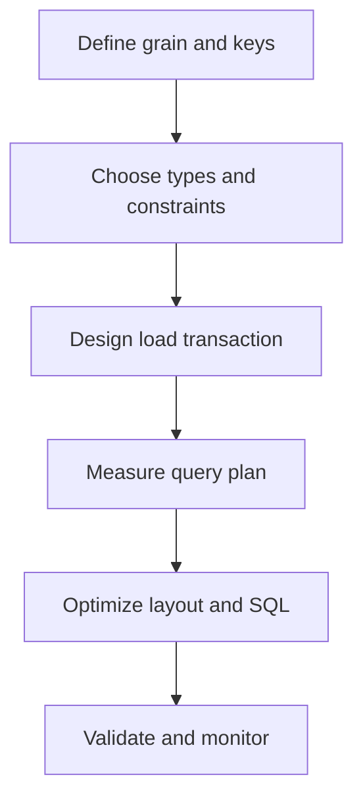

---
aliases:
  - DE SQL Week 6
  - Database Engineering SQL Week 6
tags:
  - data-engineering
  - sql
  - ddl
  - transactions
  - indexing
  - partitioning
  - query-optimization
  - interview-preparation
  - week-6
status: active
difficulty: intermediate
study_time: 6 days
created: 2026-08-16
previous: '[[Data-Engineer-SQL-Week-5-Obsidian]]'
---

# Data Engineer SQL — Week 6 Detailed Notes

> [!info] Week 6 goal
> Design reliable tables, change data safely, understand transactional behavior, read query plans, and select physical optimization strategies appropriate for relational and distributed systems.

## Obsidian navigation

- [[#Day 1 — DDL and DML|Day 1 — DDL and DML]]
- [[#Day 2 — Data types, keys, and constraints|Day 2 — Types and constraints]]
- [[#Day 3 — Transactions, ACID, and isolation|Day 3 — Transactions]]
- [[#Day 4 — Indexes and execution plans|Day 4 — Indexes and EXPLAIN]]
- [[#Day 5 — Partitioning, pruning, and physical layout|Day 5 — Partitioning]]
- [[#Day 6 — Query optimization workflow|Day 6 — Optimization]]
- [[#Week 6 mini-project — Production retail mart design|Mini-project]]
- [[#Week 6 interview questions|Interview questions]]
- [[#Week 6 final practice set|Final practice]]
- [[#Week 6 one-page cheat sheet|Cheat sheet]]

## Progress tracker

- [ ] Day 1 completed
- [ ] Day 2 completed
- [ ] Day 3 completed
- [ ] Day 4 completed
- [ ] Day 5 completed
- [ ] Day 6 completed
- [ ] Retail mart mini-project completed
- [ ] Week 6 completion test passed

> [!warning] Platform differences
> Examples use PostgreSQL-style SQL. DDL, transactions, indexes, query-plan output, identity columns, partitioning, and constraints vary significantly across databases and lakehouse engines. Preserve the concepts and verify target-platform syntax.

**Level:** Intermediate  
**Duration:** 6 study days plus 1 revision/rest day  
**Daily time:** 75–100 minutes  
**Primary dialect:** PostgreSQL-style SQL  
**Prerequisite:** [[Data-Engineer-SQL-Week-5-Obsidian|Week 5 — Window functions]]

## Week 6 learning outcomes

By the end of this week, you should be able to:

- Classify SQL statements as DDL, DML, DQL, TCL, or DCL.
- Create and evolve tables safely.
- Choose appropriate data types for keys, money, text, and timestamps.
- Use primary, foreign, unique, check, and not-null constraints.
- Explain ACID and transaction boundaries.
- Describe isolation anomalies and deadlock handling.
- Explain how indexes improve reads and increase write cost.
- Read important operators and estimates in an execution plan.
- Explain partitioning, pruning, clustering, and small-file risks.
- Identify non-sargable filters and expensive join patterns.
- Apply a repeatable query-optimization workflow.
- Design a partitioned, validated retail mart.

---

# Relational and lakehouse context

## Two physical worlds

| Concern | Relational row-store example | Distributed lakehouse example |
|---|---|---|
| Fast lookup | B-tree or other index | Data skipping, clustering, partition pruning |
| Storage unit | Pages/blocks | Files and row groups |
| Join optimization | Nested loop, hash, merge | Shuffle hash, sort merge, broadcast |
| Statistics | Table/index statistics | Table/file statistics and optimizer metadata |
| Transactions | Database transaction manager | Table-format transaction log and optimistic concurrency |
| Physical maintenance | Vacuum/analyze/reindex | Compaction, clustering, statistics maintenance |

The same logical SQL can need different physical optimization on different engines.

## Data Engineering design loop



---

# Day 1 — DDL and DML

## 1.1 SQL command categories

| Category | Purpose | Common statements |
|---|---|---|
| DQL | Query data | `SELECT` |
| DDL | Define database objects | `CREATE`, `ALTER`, `DROP`, `TRUNCATE` |
| DML | Insert or change rows | `INSERT`, `UPDATE`, `DELETE`, `MERGE` |
| TCL | Control transactions | `BEGIN`, `COMMIT`, `ROLLBACK`, `SAVEPOINT` |
| DCL | Manage permissions | `GRANT`, `REVOKE` |

Some engines classify or transact these statements differently.

## 1.2 CREATE SCHEMA

```sql
CREATE SCHEMA training;
```

Use schemas to organize objects by layer, domain, team, or purpose. Naming should fit governance and deployment standards.

## 1.3 CREATE TABLE

```sql
CREATE TABLE training.order_status_reference (
    status_code       VARCHAR(30) PRIMARY KEY,
    status_name       VARCHAR(100) NOT NULL,
    is_final          BOOLEAN NOT NULL DEFAULT FALSE,
    created_at        TIMESTAMP NOT NULL DEFAULT CURRENT_TIMESTAMP
);
```

A table definition establishes:

- Column names
- Data types
- Nullability
- Defaults
- Keys and constraints
- Sometimes storage, partitioning, and table properties

## 1.4 CREATE TABLE AS SELECT

```sql
CREATE TABLE training.completed_orders_copy AS
SELECT order_id,
       customer_id,
       order_date,
       order_total
FROM orders
WHERE order_status = 'COMPLETED';
```

`CREATE TABLE AS SELECT` copies query results, but constraints, defaults, indexes, comments, and identity behavior may not be copied. Define them explicitly when required.

## 1.5 INSERT

Specify target columns:

```sql
INSERT INTO training.order_status_reference (
    status_code,
    status_name,
    is_final
)
VALUES
    ('COMPLETED', 'Completed', TRUE),
    ('PENDING',   'Pending',   FALSE);
```

Avoid relying on physical column order:

```sql
INSERT INTO table_name VALUES (...);
```

Explicit columns make schema evolution safer.

## 1.6 INSERT SELECT

```sql
INSERT INTO training.completed_orders_copy (
    order_id,
    customer_id,
    order_date,
    order_total
)
SELECT order_id,
       customer_id,
       order_date,
       order_total
FROM orders
WHERE order_status = 'COMPLETED'
  AND order_date >= '2026-08-01';
```

For retries, plain insert can duplicate data unless keys reject it or the load strategy is idempotent.

## 1.7 UPDATE

```sql
UPDATE training.order_status_reference
SET status_name = 'Order Completed'
WHERE status_code = 'COMPLETED';
```

Before an update:

1. Run the same `WHERE` as a `SELECT`.
2. Confirm row count and sample rows.
3. Use a transaction when supported.
4. Validate after the change.

Missing `WHERE` updates every row.

## 1.8 DELETE

```sql
DELETE FROM training.completed_orders_copy
WHERE order_date < '2026-01-01';
```

Missing `WHERE` deletes every row. Use retention policies, backups, versioning, or recoverable table operations as appropriate.

## 1.9 MERGE concept

`MERGE` combines matched and unmatched actions. Syntax and supported clauses vary.

```sql
MERGE INTO target_customer AS t
USING staged_customer AS s
ON t.customer_id = s.customer_id
WHEN MATCHED THEN
    UPDATE SET customer_name = s.customer_name,
               city = s.city,
               updated_at = s.updated_at
WHEN NOT MATCHED THEN
    INSERT (customer_id, customer_name, city, updated_at)
    VALUES (s.customer_id, s.customer_name, s.city, s.updated_at);
```

Deduplicate `staged_customer` before merging. Multiple source rows for one target key can cause an error or nondeterministic behavior depending on the engine.

## 1.10 ALTER TABLE

Add a nullable column:

```sql
ALTER TABLE training.order_status_reference
ADD COLUMN display_order INTEGER;
```

Rename a column:

```sql
ALTER TABLE training.order_status_reference
RENAME COLUMN status_name TO display_name;
```

Change type cautiously:

```sql
ALTER TABLE some_table
ALTER COLUMN amount TYPE DECIMAL(18,2);
```

Type changes can scan/rewrite data, lock the table, fail on invalid values, or affect consumers.

## 1.11 Safe not-null migration pattern

Adding a mandatory column to a populated table often requires stages:

1. Add nullable column.
2. Backfill existing rows.
3. Validate no NULL remains.
4. Add or enforce `NOT NULL`.
5. Update application and pipeline contracts.

```sql
ALTER TABLE training.order_status_reference
ADD COLUMN source_system VARCHAR(30);

UPDATE training.order_status_reference
SET source_system = 'MASTER_DATA'
WHERE source_system IS NULL;

ALTER TABLE training.order_status_reference
ALTER COLUMN source_system SET NOT NULL;
```

## 1.12 TRUNCATE versus DELETE versus DROP

| Statement | Removes rows | Keeps table definition | Supports row filter | Typical behavior |
|---|---:|---:|---:|---|
| `DELETE` | Yes | Yes | Yes | Row-oriented/logged change, engine-dependent |
| `TRUNCATE` | All | Yes | No | Fast deallocation/reset behavior, engine-dependent |
| `DROP TABLE` | All | No | No | Removes object definition and data |

Transaction and recovery behavior varies. Never assume `TRUNCATE` or `DROP` can be rolled back on every platform.

## 1.13 Idempotent DDL and migrations

Some platforms support:

```sql
CREATE TABLE IF NOT EXISTS ...
ALTER TABLE ... ADD COLUMN IF NOT EXISTS ...
```

These can help retries, but they do not verify the existing object has the correct type, constraint, or definition. Production migrations should compare expected and actual state.

## Day 1 common mistakes

- Updating or deleting without a verified `WHERE`.
- Omitting target columns in inserts.
- Assuming CTAS copies constraints and indexes.
- Applying an incompatible type change without validation.
- Adding `NOT NULL` before backfilling.
- Running `MERGE` with duplicate source keys.
- Assuming DDL transactions behave identically on every engine.
- Using `IF NOT EXISTS` as a substitute for schema validation.

## Day 1 exercises

1. Create a schema called `training`.
2. Create a payment-status reference table.
3. Insert four status values with explicit columns.
4. Create a table from completed orders.
5. Add a `load_date` column.
6. Backfill `load_date` safely.
7. Enforce `NOT NULL` after validation.
8. Update one reference value.
9. Delete only obsolete reference rows.
10. Write a generic customer upsert using `MERGE`.
11. Explain `DELETE` versus `TRUNCATE`.
12. Write a safe five-step schema-migration checklist.

## Day 1 solutions

```sql
-- 1
CREATE SCHEMA training;

-- 2
CREATE TABLE training.payment_status_reference (
    status_code    VARCHAR(30) PRIMARY KEY,
    display_name   VARCHAR(100) NOT NULL,
    is_success     BOOLEAN NOT NULL DEFAULT FALSE,
    created_at     TIMESTAMP NOT NULL DEFAULT CURRENT_TIMESTAMP
);

-- 3
INSERT INTO training.payment_status_reference (
    status_code,
    display_name,
    is_success
)
VALUES
('PENDING',   'Pending',   FALSE),
('AUTHORIZED','Authorized',FALSE),
('CAPTURED',  'Captured',  TRUE),
('FAILED',    'Failed',    FALSE);

-- 4
CREATE TABLE training.completed_orders AS
SELECT order_id,
       customer_id,
       order_date,
       order_total
FROM orders
WHERE order_status = 'COMPLETED';

-- 5
ALTER TABLE training.completed_orders
ADD COLUMN load_date DATE;

-- 6
UPDATE training.completed_orders
SET load_date = CURRENT_DATE
WHERE load_date IS NULL;

-- Validate before step 7
SELECT COUNT(*) AS missing_load_dates
FROM training.completed_orders
WHERE load_date IS NULL;

-- 7
ALTER TABLE training.completed_orders
ALTER COLUMN load_date SET NOT NULL;

-- 8
UPDATE training.payment_status_reference
SET display_name = 'Payment Captured'
WHERE status_code = 'CAPTURED';

-- 9
DELETE FROM training.payment_status_reference
WHERE status_code = 'OBSOLETE';
```

---

# Day 2 — Data types, keys, and constraints

## 2.1 Why type choice matters

Data types affect:

- Valid values
- Precision
- Storage size
- Sorting and comparison
- Join compatibility
- Function availability
- Index and partition behavior
- Interoperability between systems

Choose types from business meaning, not only current sample values.

## 2.2 Integer types

Common relational types:

- `SMALLINT`
- `INTEGER`
- `BIGINT`

Use `BIGINT` for high-volume identifiers and counters when `INTEGER` capacity may be exceeded. Do not use numeric types for identifiers that can contain leading zeros or letters.

## 2.3 Exact versus approximate numeric

Use exact decimals for money:

```sql
amount DECIMAL(18,2)
```

Approximate floating-point types can introduce representation differences:

```text
FLOAT, REAL, DOUBLE PRECISION
```

Use floats for scientific measurements where approximation is acceptable, not financial equality checks.

## 2.4 Decimal precision and scale

`DECIMAL(18,2)` means:

- Up to 18 total digits
- Two digits after the decimal point

Choose enough precision for maximum expected totals, not just individual transaction amounts.

## 2.5 Text types

- `CHAR(n)`: fixed length, padding behavior varies.
- `VARCHAR(n)`: variable length with maximum.
- `TEXT` or `STRING`: variable/unbounded platform-specific text.

Do not choose tiny lengths based only on current data. Changing lengths later can break loads.

## 2.6 Date and timestamp types

- `DATE`: calendar date without time.
- `TIME`: time of day.
- `TIMESTAMP`: date and time, often without time-zone awareness.
- `TIMESTAMP WITH TIME ZONE` or platform equivalent: represents an instant with time-zone semantics.

Best practice for events:

- Store an unambiguous event instant, commonly UTC.
- Retain source time-zone context when needed.
- Derive business-local dates explicitly.
- Do not convert an event timestamp to date before defining the business time zone.

PostgreSQL `TIMESTAMPTZ` stores an instant and displays it in the session time zone; it does not preserve the original zone label.

## 2.7 Boolean

Use Boolean for true/false states when supported:

```sql
is_active BOOLEAN NOT NULL
```

If unknown is meaningful, allow NULL or use an explicit status enum/reference.

## 2.8 Semi-structured types

Platforms may support JSON, arrays, maps, structs, or variants.

Use them when source structure is genuinely flexible, but avoid hiding stable, frequently queried business attributes inside an opaque document.

## 2.9 NOT NULL

```sql
customer_name VARCHAR(100) NOT NULL
```

Use `NOT NULL` when missing data is invalid at this table layer. A raw landing layer may preserve bad records, while a curated layer can enforce stronger rules.

## 2.10 PRIMARY KEY

```sql
PRIMARY KEY (customer_id)
```

A primary key enforces uniqueness and non-nullability in relational databases. Some lakehouse systems treat key declarations as informational or do not support enforcement. Data pipelines must still validate uniqueness.

## 2.11 UNIQUE

```sql
UNIQUE (email)
```

NULL treatment in unique constraints varies. Some engines allow several NULL values because NULL is not equal to NULL; others provide configuration or NULLs-not-distinct behavior.

Do not assume unique email is a valid customer business key unless the business confirms it.

## 2.12 FOREIGN KEY

```sql
FOREIGN KEY (customer_id)
REFERENCES dim_customer (customer_id)
```

Foreign keys protect referential integrity but add write checks and deployment dependencies. Warehouses often use ETL quality checks instead of enforced foreign keys, especially in distributed systems.

## 2.13 CHECK

```sql
CHECK (order_total >= 0)
```

But negative values may represent refunds. A constraint must reflect true domain rules, not assumptions.

```sql
CHECK (order_status IN ('COMPLETED', 'SHIPPED', 'PENDING', 'CANCELLED'))
```

A reference table is more flexible when allowed values change frequently or need attributes.

## 2.14 DEFAULT

```sql
created_at TIMESTAMP NOT NULL DEFAULT CURRENT_TIMESTAMP
```

A default applies when the insert omits the column. It may not replace an explicitly supplied NULL.

## 2.15 Identity and sequence-generated keys

PostgreSQL-style:

```sql
customer_sk BIGINT GENERATED ALWAYS AS IDENTITY PRIMARY KEY
```

Identity values guarantee uniqueness, not gap-free numbering. Rollbacks, caching, and concurrency can create gaps.

## 2.16 Composite constraints

```sql
PRIMARY KEY (order_date, order_id)
```

Composite keys encode grain. Column order matters for some index access patterns and partitioned-table requirements.

## 2.17 Constraint naming

```sql
CONSTRAINT ck_order_total_nonnegative CHECK (order_total >= 0)
```

Named constraints produce clearer errors and easier migrations.

## 2.18 Dimension and fact types

Dimension table:

```sql
CREATE TABLE dim_customer_lab (
    customer_sk       BIGINT GENERATED ALWAYS AS IDENTITY PRIMARY KEY,
    customer_id       INTEGER NOT NULL UNIQUE,
    customer_name     VARCHAR(100) NOT NULL,
    city              VARCHAR(100),
    effective_from    TIMESTAMP NOT NULL,
    effective_to      TIMESTAMP NOT NULL,
    is_current        BOOLEAN NOT NULL,
    CONSTRAINT ck_customer_effective_range
        CHECK (effective_to > effective_from)
);
```

Fact grain should be written in the table comment and reflected in keys.

## Day 2 common mistakes

- Using float for money.
- Choosing identifier types that remove leading zeros.
- Storing dates as text.
- Mixing timestamp time-zone meanings.
- Assuming identity values are gap-free.
- Adding a check that rejects legitimate business events.
- Assuming key constraints are enforced in every platform.
- Using one natural key across source systems without source namespace.

## Day 2 exercises

1. Choose types for order ID, amount, event timestamp, country code, and active flag.
2. Create a customer dimension with surrogate and business keys.
3. Add an effective-date range check.
4. Create an order fact with a declared grain.
5. Add not-null constraints for required fields.
6. Add a status-domain check.
7. Create a composite unique constraint for source system and source order ID.
8. Explain why money should use decimal.
9. Explain why a phone number should usually be text.
10. Explain how UTC event time and local business date differ.
11. Explain when a foreign key may be omitted in a warehouse.
12. Write a schema-review checklist.

## Day 2 solution example

```sql
CREATE TABLE dim_customer_lab (
    customer_sk       BIGINT GENERATED ALWAYS AS IDENTITY,
    source_system     VARCHAR(30) NOT NULL,
    customer_id       VARCHAR(100) NOT NULL,
    customer_name     VARCHAR(200) NOT NULL,
    city              VARCHAR(100),
    email             VARCHAR(320),
    effective_from    TIMESTAMP NOT NULL,
    effective_to      TIMESTAMP NOT NULL,
    is_current        BOOLEAN NOT NULL DEFAULT TRUE,
    created_at        TIMESTAMP NOT NULL DEFAULT CURRENT_TIMESTAMP,
    CONSTRAINT pk_dim_customer_lab PRIMARY KEY (customer_sk),
    CONSTRAINT uq_dim_customer_source_key
        UNIQUE (source_system, customer_id, effective_from),
    CONSTRAINT ck_dim_customer_effective_range
        CHECK (effective_to > effective_from)
);

CREATE TABLE fact_order_lab (
    order_sk          BIGINT GENERATED ALWAYS AS IDENTITY,
    source_system     VARCHAR(30) NOT NULL,
    source_order_id   VARCHAR(100) NOT NULL,
    customer_sk       BIGINT,
    order_date        DATE NOT NULL,
    order_timestamp   TIMESTAMP NOT NULL,
    order_status      VARCHAR(30) NOT NULL,
    order_total       DECIMAL(18,2),
    currency_code     CHAR(3) NOT NULL,
    created_at        TIMESTAMP NOT NULL DEFAULT CURRENT_TIMESTAMP,
    CONSTRAINT pk_fact_order_lab PRIMARY KEY (order_sk),
    CONSTRAINT uq_fact_order_source_key
        UNIQUE (source_system, source_order_id),
    CONSTRAINT fk_fact_order_customer
        FOREIGN KEY (customer_sk) REFERENCES dim_customer_lab(customer_sk),
    CONSTRAINT ck_fact_order_status
        CHECK (order_status IN ('COMPLETED', 'SHIPPED', 'PENDING', 'CANCELLED'))
);
```

---

# Day 3 — Transactions, ACID, and isolation

## 3.1 Transaction definition

A transaction is a logical unit of work that commits as a whole or rolls back according to database capabilities.

```sql
BEGIN;

UPDATE accounts
SET balance = balance - 100
WHERE account_id = 1;

UPDATE accounts
SET balance = balance + 100
WHERE account_id = 2;

COMMIT;
```

If the second update fails, the transfer should not leave only the debit committed.

## 3.2 ACID

### Atomicity

All transaction operations succeed or none are committed.

### Consistency

A successful transaction moves data from one valid state to another according to constraints and application rules.

### Isolation

Concurrent transactions behave according to an isolation model, limiting how they observe each other.

### Durability

Committed changes survive system failures according to the platform durability guarantee.

## 3.3 BEGIN, COMMIT, and ROLLBACK

```sql
BEGIN;

UPDATE training.payment_status_reference
SET display_name = 'Captured Successfully'
WHERE status_code = 'CAPTURED';

-- Verify inside transaction
SELECT *
FROM training.payment_status_reference
WHERE status_code = 'CAPTURED';

ROLLBACK;
```

Replace `ROLLBACK` with `COMMIT` only after validation.

## 3.4 Autocommit

Many clients automatically commit each statement unless an explicit transaction is started. Know the client and driver configuration before running changes.

## 3.5 SAVEPOINT

```sql
BEGIN;

INSERT INTO audit_log (...);

SAVEPOINT before_optional_step;

UPDATE some_table
SET ...;

ROLLBACK TO SAVEPOINT before_optional_step;

COMMIT;
```

Savepoints allow partial rollback within a transaction. Support varies.

## 3.6 Isolation anomalies

### Dirty read

A transaction reads another transaction's uncommitted change.

### Non-repeatable read

The same row read twice returns different committed values because another transaction updated it.

### Phantom read

Repeating a predicate query returns additional or missing rows due to another transaction's insert/delete.

### Lost update

Two writers read the same value and overwrite each other so one update is lost.

### Write skew

Concurrent transactions update different rows based on a shared condition, violating a cross-row rule.

## 3.7 Common isolation levels

| Isolation level | General intent |
|---|---|
| Read uncommitted | Weak isolation; dirty reads may be possible |
| Read committed | Each statement reads committed data |
| Repeatable read | Repeated reads in one transaction remain stable according to engine semantics |
| Serializable | Strongest standard level; behaves like serial execution, possibly with retries |

Exact guarantees differ by database implementation. PostgreSQL, for example, maps read uncommitted to read committed behavior.

## 3.8 Optimistic versus pessimistic concurrency

- Pessimistic: lock resources before conflicting changes.
- Optimistic: allow concurrent work, detect conflicts at commit/write, and retry.

Lakehouse table formats often use optimistic concurrency with transaction logs. Relational databases can use MVCC and locks together.

## 3.9 Locks

Locks may apply to rows, pages, tables, predicates, or metadata depending on engine and operation.

Long transactions can:

- Hold locks longer
- Retain old row versions
- Block maintenance
- Increase conflict probability
- Cause transaction-log growth

Keep transactional units focused and monitor them.

## 3.10 Deadlocks

A deadlock occurs when transactions wait on each other in a cycle.

Typical prevention:

- Access tables and keys in a consistent order.
- Keep transactions short.
- Index lookup predicates to avoid locking/scanning unnecessary rows.
- Retry the transaction when the database aborts a deadlock victim.
- Avoid interactive waiting inside an open transaction.

## 3.11 Lost-update protection

Atomic increment:

```sql
UPDATE counters
SET value = value + 1
WHERE counter_id = 1;
```

Optimistic version check:

```sql
UPDATE target
SET attribute = :new_value,
    version_number = version_number + 1
WHERE business_key = :business_key
  AND version_number = :expected_version;
```

If zero rows update, the record changed concurrently; reload and retry according to business rules.

## 3.12 Transactional load pattern

```sql
BEGIN;

-- Remove and reload one controlled partition or batch
DELETE FROM target_orders
WHERE batch_date = :batch_date;

INSERT INTO target_orders (...)
SELECT ...
FROM staged_orders
WHERE batch_date = :batch_date;

-- Validate before commit
-- Application checks counts and totals here

COMMIT;
```

This can make a batch retry idempotent. Large delete-insert operations may be expensive; platform-specific replace or overwrite capabilities may be better.

## 3.13 Failure and retry

Retries require:

- Idempotent operations
- Stable batch identity
- Transaction rollback confirmation
- Bounded retry count
- Backoff for contention
- Error classification
- Duplicate prevention

Do not retry a non-idempotent insert blindly.

## Day 3 common mistakes

- Assuming autocommit is disabled.
- Leaving a transaction open during manual investigation.
- Using the strongest isolation without measuring contention.
- Ignoring deadlock and serialization retry requirements.
- Retrying non-idempotent writes.
- Treating ACID consistency as automatic business correctness.
- Assuming database and lakehouse transaction scopes are identical.

## Day 3 exercises

1. Write a transaction that transfers an amount between accounts.
2. Add validation before commit.
3. Demonstrate rollback.
4. Demonstrate a savepoint.
5. Define the four ACID properties.
6. Explain dirty, non-repeatable, and phantom reads.
7. Explain lost update.
8. Write an optimistic version-check update.
9. Design an idempotent daily delete-and-reload transaction.
10. List four deadlock-prevention techniques.
11. Explain why long transactions are risky.
12. Create a retry checklist.

## Day 3 solution patterns

```sql
-- Atomic transfer pattern
BEGIN;

UPDATE accounts
SET balance = balance - :amount
WHERE account_id = :from_account
  AND balance >= :amount;

-- Application must verify exactly one row was updated

UPDATE accounts
SET balance = balance + :amount
WHERE account_id = :to_account;

-- Application validates both updates before COMMIT
COMMIT;
```

```sql
-- Idempotent batch replacement pattern
BEGIN;

DELETE FROM daily_order_summary
WHERE summary_date = :run_date;

INSERT INTO daily_order_summary (
    summary_date,
    order_count,
    completed_revenue,
    loaded_at
)
SELECT order_date,
       COUNT(*),
       SUM(CASE WHEN order_status = 'COMPLETED' THEN order_total ELSE 0 END),
       CURRENT_TIMESTAMP
FROM orders
WHERE order_date = :run_date
GROUP BY order_date;

COMMIT;
```

---

# Day 4 — Indexes and execution plans

## 4.1 What is an index?

An index is an auxiliary data structure that helps locate rows without scanning the entire table for suitable access patterns.

Trade-off:

- Faster qualifying reads
- Additional storage
- Slower inserts, updates, and deletes
- Maintenance and statistics overhead

## 4.2 B-tree index

PostgreSQL default:

```sql
CREATE INDEX idx_orders_customer_id
ON orders (customer_id);
```

B-tree indexes commonly support equality, ranges, sorting, and prefix access on composite indexes.

## 4.3 Composite index

```sql
CREATE INDEX idx_orders_customer_date
ON orders (customer_id, order_date DESC);
```

Useful for:

```sql
WHERE customer_id = :customer_id
ORDER BY order_date DESC
```

Column order matters. The same index may not efficiently serve a filter on `order_date` alone, depending on engine and statistics.

## 4.4 Selectivity

Selectivity describes how narrowly a predicate filters data.

- `order_id = 1001`: highly selective.
- `is_active = TRUE` when 95 percent are active: low selectivity.

An optimizer may prefer a table scan for low-selectivity filters because many index lookups cost more.

## 4.5 Unique index

```sql
CREATE UNIQUE INDEX uq_customer_email
ON customers (email);
```

Before adding it, validate duplicate and NULL behavior. A constraint often expresses business intent better than a raw unique index.

## 4.6 Partial index

PostgreSQL example:

```sql
CREATE INDEX idx_orders_pending_date
ON orders (order_date)
WHERE order_status = 'PENDING';
```

Useful when queries repeatedly target a small subset. The query predicate must align with the index predicate.

## 4.7 Expression index

```sql
CREATE INDEX idx_customers_lower_email
ON customers (LOWER(email));
```

Can support:

```sql
WHERE LOWER(email) = LOWER(:email)
```

Expression-index support varies. Standardizing data at write time may be preferable.

## 4.8 Covering index concept

An index can include columns needed by a query so the engine may avoid reading the base table.

PostgreSQL example:

```sql
CREATE INDEX idx_orders_customer_cover
ON orders (customer_id, order_date)
INCLUDE (order_status, order_total);
```

Whether an index-only scan occurs depends on visibility, maintenance state, and the plan.

## 4.9 Do not index everything

Too many indexes:

- Increase write amplification
- Increase storage
- Slow vacuum/maintenance
- Increase migration time
- Complicate optimizer choices

Index based on real query workload.

## 4.10 EXPLAIN

```sql
EXPLAIN
SELECT order_id, order_total
FROM orders
WHERE customer_id = 1;
```

An estimated plan shows chosen operators and estimated rows/cost. Output is engine-specific.

## 4.11 EXPLAIN ANALYZE caution

```sql
EXPLAIN ANALYZE
SELECT ...;
```

This executes the statement in PostgreSQL. It is useful for actual timing and row counts but can be expensive. Do not use casually on write statements or massive production queries.

Some engines provide safer plan/analysis interfaces with different syntax.

## 4.12 Common plan operators

### Sequential scan

Reads most or all table pages. Good for small tables or large result fractions.

### Index scan

Uses an index to find rows, then fetches table data.

### Index-only scan

Returns data from index when possible.

### Nested-loop join

For each outer row, probes the inner input. Good when the outer input is small and inner lookup is efficient.

### Hash join

Builds a hash structure on one input and probes with the other. Common for equality joins.

### Merge join

Combines ordered inputs. Useful for large sorted equality/range-compatible joins.

### Sort

Orders rows for final output, grouping, merge join, distinct, or windows.

### Aggregate

Implements grouping using hashing, sorting, or other methods.

## 4.13 Estimates versus actuals

Large differences between estimated and actual rows can cause poor plans.

Causes:

- Stale statistics
- Correlated columns
- Skew
- Expressions without statistics
- Parameter-sensitive predicates
- Rapidly changing data

Update statistics using platform tools and consider extended statistics where supported.

## 4.14 Sargability

A sargable predicate can use an access structure or data skipping effectively.

Less efficient pattern:

```sql
WHERE CAST(order_date AS VARCHAR) LIKE '2026-07%'
```

Better:

```sql
WHERE order_date >= '2026-07-01'
  AND order_date <  '2026-08-01'
```

Another issue:

```sql
WHERE DATE_TRUNC('day', event_time) = '2026-08-01'
```

Prefer timestamp range when possible.

## 4.15 Databricks and distributed-engine note

Databricks tables do not use PostgreSQL B-tree indexes in the same way. Performance relies on mechanisms including:

- File statistics and data skipping
- Partition pruning
- Clustering/layout optimization
- Compaction
- Broadcast or shuffle join planning
- Cost-based optimization and table statistics

Do not transfer row-store index advice directly to lakehouse tables.

## Day 4 common mistakes

- Adding an index for every column.
- Ignoring composite-index order.
- Assuming the optimizer must use an index.
- Treating a sequential scan as always bad.
- Running `EXPLAIN ANALYZE` on dangerous statements.
- Ignoring estimated-versus-actual row differences.
- Applying functions/casts to filtered keys.
- Using row-store index advice on a lakehouse engine.

## Day 4 exercises

1. Create an index for customer order lookup.
2. Create a composite index for customer and descending order date.
3. Create a partial index for pending orders.
4. Create an expression index for normalized email.
5. Explain index write cost.
6. Explain selectivity.
7. Read an estimated plan for customer lookup.
8. Compare plan before and after an index.
9. Rewrite a non-sargable date filter.
10. List main join operators.
11. Explain stale-statistics impact.
12. Explain why Databricks optimization differs.

## Day 4 solution snippets

```sql
CREATE INDEX idx_orders_customer
ON orders (customer_id);

CREATE INDEX idx_orders_customer_date
ON orders (customer_id, order_date DESC);

CREATE INDEX idx_orders_pending
ON orders (order_date, customer_id)
WHERE order_status = 'PENDING';

CREATE INDEX idx_customers_normalized_email
ON customers (LOWER(email));

EXPLAIN
SELECT order_id, order_date, order_total
FROM orders
WHERE customer_id = 1
ORDER BY order_date DESC;
```

---

# Day 5 — Partitioning, pruning, and physical layout

## 5.1 What is partitioning?

Partitioning divides a logical table into physical or logical segments according to a partition key.

Common strategies:

- Range: dates or numeric ranges
- List: region or status categories
- Hash: distribute keys across buckets

Partitioning is not the same as an index.

## 5.2 Range partitioning example

PostgreSQL-style:

```sql
CREATE TABLE fact_order_partitioned (
    order_date      DATE NOT NULL,
    order_id        BIGINT NOT NULL,
    customer_id     BIGINT,
    order_total     DECIMAL(18,2),
    order_status    VARCHAR(30) NOT NULL,
    PRIMARY KEY (order_date, order_id)
) PARTITION BY RANGE (order_date);
```

Create partitions:

```sql
CREATE TABLE fact_order_2026_07
PARTITION OF fact_order_partitioned
FOR VALUES FROM ('2026-07-01') TO ('2026-08-01');

CREATE TABLE fact_order_2026_08
PARTITION OF fact_order_partitioned
FOR VALUES FROM ('2026-08-01') TO ('2026-09-01');

CREATE TABLE fact_order_default
PARTITION OF fact_order_partitioned DEFAULT;
```

Half-open partition boundaries avoid overlap.

## 5.3 Partition pruning

This filter allows the optimizer to skip unrelated monthly partitions:

```sql
WHERE order_date >= '2026-08-01'
  AND order_date <  '2026-09-01'
```

Pruning reduces scanned partitions. Verify in the plan rather than assuming it occurred.

## 5.4 Non-prunable predicate

Potentially problematic:

```sql
WHERE TO_CHAR(order_date, 'YYYY-MM') = '2026-08'
```

The function can hide the partition key range from the optimizer. Use direct range predicates.

## 5.5 Choosing a partition key

Good partition keys commonly:

- Appear in frequent filters
- Support retention or incremental loads
- Produce manageable partition sizes
- Have predictable arrival behavior
- Avoid extreme skew

Event date is common, but business date and ingestion date serve different purposes.

## 5.6 Over-partitioning

Too many tiny partitions or files cause:

- Metadata overhead
- Slow planning/listing
- Small-file inefficiency
- Excess tasks
- Poor compression
- Maintenance burden

Do not partition by high-cardinality fields such as transaction ID.

## 5.7 Under-partitioning

Very large partitions can:

- Scan excessive data
- Slow overwrite and maintenance
- Increase skew
- Reduce parallel balance

Choose partition granularity from data volume and access patterns.

## 5.8 Partitioning versus indexing

| Feature | Partitioning | Indexing |
|---|---|---|
| Main purpose | Skip large data segments/manage lifecycle | Locate qualifying rows efficiently |
| Typical key | Date, region, coarse category | Selective lookup/join/sort columns |
| Number of values | Usually moderate | Can be high cardinality |
| Write impact | Routing and partition management | Maintain index entries |
| Retention | Drop/detach partitions efficiently | Does not directly remove table segments |

They can be used together in relational systems.

## 5.9 Late-arriving data

An order can arrive after its business-date partition has been processed.

Strategies:

- Reopen and upsert historical partitions.
- Use an overlap/lookback window.
- Track ingestion date separately.
- Maintain late-arrival metrics.
- Avoid assuming processing date equals business date.

## 5.10 Default partition

A default partition prevents insert failures for values outside defined ranges, but it can hide missing partition maintenance. Monitor and redistribute default-partition rows.

## 5.11 Partition lifecycle

Range partitions support:

- Create future partitions
- Load/validate independently
- Detach/archive old partitions
- Drop expired partitions
- Rebuild indexes per partition

Automate partition creation before data arrives.

## 5.12 Lakehouse files and compaction

In file-based systems, partitioning creates directory/file layout. Frequent small writes can create many small files.

Mitigations:

- Batch writes where possible
- Compaction/optimization
- Appropriate target file size
- Clustering on common filters
- Avoid overly granular partitions
- Monitor file count and scan efficiency

## 5.13 Clustering

Clustering groups related values within data layout to improve skipping without creating a directory partition for every value. Exact mechanisms differ by engine.

Use for columns frequently filtered but unsuitable for static high-cardinality partitioning.

## 5.14 Skew

If one partition key value dominates, a task or node can process far more data than others.

Example: 90 percent of records have `country = 'India'`.

Partitioning or joining on this key can create imbalance. Analyze distribution, not just distinct count.

## Day 5 common mistakes

- Partitioning by transaction ID.
- Creating hourly partitions for low-volume data.
- Wrapping partition columns in functions.
- Assuming partitioning makes every query faster.
- Ignoring late-arriving records.
- Allowing a default partition to grow unnoticed.
- Ignoring small-file and metadata overhead.
- Confusing business date with ingestion date.

## Day 5 exercises

1. Design monthly range partitions for orders.
2. Write August boundaries using a half-open interval.
3. Write a prunable August filter.
4. Rewrite a month-string filter as a range.
5. Choose a partition key for event data and justify it.
6. Explain why order ID is a poor partition key.
7. Compare partitioning and indexing.
8. Design late-arrival handling.
9. Define default-partition monitoring.
10. Explain over-partitioning.
11. Explain data skew.
12. Create a lakehouse small-file checklist.

## Day 5 solution pattern

```sql
CREATE TABLE training.fact_order_partitioned (
    order_date      DATE NOT NULL,
    order_id        BIGINT NOT NULL,
    customer_id     BIGINT,
    order_status    VARCHAR(30) NOT NULL,
    order_total     DECIMAL(18,2),
    loaded_at       TIMESTAMP NOT NULL DEFAULT CURRENT_TIMESTAMP,
    CONSTRAINT pk_fact_order_partitioned
        PRIMARY KEY (order_date, order_id)
) PARTITION BY RANGE (order_date);

CREATE TABLE training.fact_order_2026_08
PARTITION OF training.fact_order_partitioned
FOR VALUES FROM ('2026-08-01') TO ('2026-09-01');

CREATE TABLE training.fact_order_2026_09
PARTITION OF training.fact_order_partitioned
FOR VALUES FROM ('2026-09-01') TO ('2026-10-01');
```

---

# Day 6 — Query optimization workflow

## 6.1 Optimize measurable problems

Do not optimize by intuition alone. Record:

- Query latency
- Rows and bytes scanned
- CPU and memory
- Shuffle or network bytes
- Spill
- Partition/file count
- Concurrency
- Result size
- Plan estimates and actuals

Preserve a correct baseline before changing SQL.

## 6.2 Step-by-step workflow

1. Confirm correctness and output grain.
2. Capture query, parameters, plan, and runtime metrics.
3. Identify the most expensive operator or data movement.
4. Check row-estimate accuracy.
5. Reduce unnecessary input data and columns.
6. Fix key, type, and predicate issues.
7. Optimize joins and aggregation grain.
8. Consider physical layout or indexes.
9. Re-run with realistic data and concurrency.
10. Validate identical business results.

## 6.3 Avoid SELECT star

```sql
SELECT required_column_1,
       required_column_2
FROM large_table;
```

Column pruning reduces I/O in columnar systems and creates stable interfaces.

## 6.4 Filter at the correct stage

Push safe source-row filters before expensive joins and windows. Do not move filters across outer joins when it changes semantics.

Correctness comes first; then verify optimizer pushdown.

## 6.5 Keep filter and join types compatible

Expensive pattern:

```sql
ON CAST(a.customer_id AS VARCHAR) = b.customer_id
```

Standardize types during ingestion or model design. Runtime casts can block indexes, pruning, and efficient hash construction.

## 6.6 Aggregate before joining when possible

Instead of joining billions of item rows and then grouping, pre-aggregate to the required key when detail is not needed.

```sql
WITH item_totals AS (
    SELECT order_id,
           SUM(quantity * unit_price) AS item_total
    FROM order_items
    GROUP BY order_id
)
SELECT o.order_id,
       o.order_total,
       i.item_total
FROM orders AS o
JOIN item_totals AS i
  ON o.order_id = i.order_id;
```

## 6.7 Join order and strategy

Optimizers choose join order, but inaccurate statistics or complex expressions can cause poor choices.

Distributed considerations:

- Broadcast genuinely small dimensions.
- Avoid broadcasting data that can exceed executor memory.
- Filter before shuffle.
- Address skewed keys.
- Avoid accidental many-to-many joins.
- Repartition deliberately only when evidence supports it.

## 6.8 DISTINCT is expensive and often suspicious

`DISTINCT` can require global shuffle/sort/hash. If added after a join, investigate whether the join is multiplying rows incorrectly.

## 6.9 UNION ALL versus UNION

Use `UNION ALL` when duplicate preservation is correct. `UNION` adds duplicate-removal work.

## 6.10 Window optimization

- Pre-filter and pre-aggregate.
- Reuse identical window specifications.
- Limit partition width.
- Avoid enormous skewed partitions.
- Use deterministic but minimal ordering columns.
- Materialize reused expensive stages only after measuring benefit.

## 6.11 Avoid row-by-row logic

Correlated subqueries and scalar user-defined functions can behave like repeated row processing when not optimized.

Prefer set-based joins, aggregates, CTEs, and native functions. Verify plans because optimizers can decorrelate some subqueries.

## 6.12 Statistics

Optimizers use statistics for row counts, value distributions, and selectivity.

Maintain statistics after major loads. In PostgreSQL:

```sql
ANALYZE orders;
```

Exact commands and automatic behavior vary.

## 6.13 Parameter sensitivity

One cached plan may be good for a selective parameter and bad for a common value. Database solutions include plan recompile, custom/generic plan controls, hints, or query redesign depending on platform.

## 6.14 Materialization trade-off

Persist an intermediate result when:

- It is reused many times.
- Recalculation dominates runtime.
- Stable checkpointing improves reliability.
- Consumers need predictable latency.

Avoid materialization when write/storage/refresh cost exceeds the saved computation.

## 6.15 Validate optimized results

Compare old and new:

- Row count
- Distinct keys
- NULL counts
- Numeric totals
- Min/max dates
- Exact set differences where feasible
- Sample records
- Performance under realistic scale

Faster wrong SQL is a failure.

## 6.16 Optimization anti-patterns

- Adding indexes without workload evidence
- Hints before statistics and SQL correctness
- `SELECT DISTINCT` as duplicate repair
- Casting join keys at runtime
- Partitioning every column
- Caching everything
- Splitting one query into many tables without measurement
- Testing only on tiny data
- Comparing runtimes with warm versus cold cache inconsistently

## Day 6 exercises

1. Rewrite a `SELECT *` query with explicit columns.
2. Rewrite a non-sargable date filter.
3. Remove an unnecessary `DISTINCT` by fixing join grain.
4. Pre-aggregate order items before joining.
5. Replace `UNION` with `UNION ALL` when valid.
6. Identify a skewed join key.
7. List metrics to capture before optimization.
8. Explain estimated versus actual row differences.
9. Design result-validation queries.
10. Decide whether to materialize a reused stage.
11. Explain why tiny test data is misleading.
12. Write a ten-step tuning checklist.

## Day 6 example rewrite

Before:

```sql
SELECT DISTINCT c.*,
       CAST(o.order_date AS VARCHAR) AS order_date_text
FROM customers AS c
JOIN orders AS o
  ON CAST(c.customer_id AS VARCHAR) = CAST(o.customer_id AS VARCHAR)
JOIN order_items AS oi
  ON o.order_id = oi.order_id
WHERE CAST(o.order_date AS VARCHAR) LIKE '2026-08%';
```

After, assuming compatible integer keys and customer-level output:

```sql
SELECT c.customer_id,
       c.customer_name,
       c.city
FROM customers AS c
WHERE EXISTS (
    SELECT 1
    FROM orders AS o
    WHERE o.customer_id = c.customer_id
      AND o.order_date >= '2026-08-01'
      AND o.order_date <  '2026-09-01'
);
```

The rewrite:

- Expresses an existence requirement directly.
- Avoids item join because no item attribute is needed.
- Removes runtime key casts.
- Uses a prunable/indexable date range.
- Returns explicit columns.
- Avoids duplicate creation and `DISTINCT` cleanup.

---

# Week 6 mini-project — Production retail mart design

## Requirement

Design a small retail mart with:

1. Customer dimension with surrogate and source keys
2. Monthly partitioned order fact
3. Exact monetary types
4. Named constraints
5. Source lineage and load timestamps
6. Indexes for common relational queries
7. Transactional August load
8. Data-quality validation
9. An execution-plan review query
10. Retention and late-arrival notes

## Dimension DDL

```sql
CREATE SCHEMA IF NOT EXISTS retail_mart;

CREATE TABLE retail_mart.dim_customer (
    customer_sk       BIGINT GENERATED ALWAYS AS IDENTITY,
    source_system     VARCHAR(30) NOT NULL,
    source_customer_id VARCHAR(100) NOT NULL,
    customer_name     VARCHAR(200) NOT NULL,
    city              VARCHAR(100),
    email             VARCHAR(320),
    effective_from    TIMESTAMP NOT NULL,
    effective_to      TIMESTAMP NOT NULL,
    is_current        BOOLEAN NOT NULL DEFAULT TRUE,
    created_at        TIMESTAMP NOT NULL DEFAULT CURRENT_TIMESTAMP,
    updated_at        TIMESTAMP NOT NULL DEFAULT CURRENT_TIMESTAMP,
    CONSTRAINT pk_dim_customer PRIMARY KEY (customer_sk),
    CONSTRAINT uq_dim_customer_version
        UNIQUE (source_system, source_customer_id, effective_from),
    CONSTRAINT ck_dim_customer_effective_range
        CHECK (effective_to > effective_from)
);
```

## Partitioned fact DDL

```sql
CREATE TABLE retail_mart.fact_order (
    order_date        DATE NOT NULL,
    order_id          BIGINT NOT NULL,
    source_system     VARCHAR(30) NOT NULL,
    source_order_id   VARCHAR(100) NOT NULL,
    customer_sk       BIGINT,
    order_timestamp   TIMESTAMP NOT NULL,
    order_status      VARCHAR(30) NOT NULL,
    order_total       DECIMAL(18,2),
    currency_code     CHAR(3) NOT NULL,
    batch_id          VARCHAR(100) NOT NULL,
    loaded_at         TIMESTAMP NOT NULL DEFAULT CURRENT_TIMESTAMP,
    CONSTRAINT pk_fact_order PRIMARY KEY (order_date, order_id),
    CONSTRAINT uq_fact_order_source
        UNIQUE (order_date, source_system, source_order_id),
    CONSTRAINT fk_fact_order_customer
        FOREIGN KEY (customer_sk)
        REFERENCES retail_mart.dim_customer(customer_sk),
    CONSTRAINT ck_fact_order_status
        CHECK (order_status IN ('COMPLETED', 'SHIPPED', 'PENDING', 'CANCELLED'))
) PARTITION BY RANGE (order_date);

CREATE TABLE retail_mart.fact_order_2026_08
PARTITION OF retail_mart.fact_order
FOR VALUES FROM ('2026-08-01') TO ('2026-09-01');

CREATE TABLE retail_mart.fact_order_default
PARTITION OF retail_mart.fact_order DEFAULT;
```

## Index design

```sql
CREATE INDEX idx_dim_customer_current_source
ON retail_mart.dim_customer (
    source_system,
    source_customer_id
)
WHERE is_current = TRUE;

CREATE INDEX idx_fact_order_customer_date
ON retail_mart.fact_order (
    customer_sk,
    order_date DESC
);

CREATE INDEX idx_fact_order_status_date
ON retail_mart.fact_order (
    order_status,
    order_date
);
```

Indexes should be justified by actual query patterns. Partitioned index behavior varies by database version.

## Transactional August load pattern

```sql
BEGIN;

DELETE FROM retail_mart.fact_order
WHERE order_date >= '2026-08-01'
  AND order_date <  '2026-09-01'
  AND batch_id = :batch_id;

INSERT INTO retail_mart.fact_order (
    order_date,
    order_id,
    source_system,
    source_order_id,
    customer_sk,
    order_timestamp,
    order_status,
    order_total,
    currency_code,
    batch_id
)
SELECT s.order_date,
       s.order_id,
       s.source_system,
       s.source_order_id,
       d.customer_sk,
       s.order_timestamp,
       s.order_status,
       s.order_total,
       s.currency_code,
       :batch_id
FROM staged_orders AS s
LEFT JOIN retail_mart.dim_customer AS d
  ON s.source_system = d.source_system
 AND s.source_customer_id = d.source_customer_id
 AND s.order_timestamp >= d.effective_from
 AND s.order_timestamp <  d.effective_to
WHERE s.order_date >= '2026-08-01'
  AND s.order_date <  '2026-09-01';

COMMIT;
```

The actual production load should validate counts and duplicates before commit or use an orchestration-controlled staging and swap pattern.

## Validation queries

```sql
-- Key uniqueness
SELECT order_date, order_id, COUNT(*) AS occurrences
FROM retail_mart.fact_order
WHERE order_date >= '2026-08-01'
  AND order_date <  '2026-09-01'
GROUP BY order_date, order_id
HAVING COUNT(*) > 1;

-- Missing dimension lookup
SELECT COUNT(*) AS unknown_customer_count
FROM retail_mart.fact_order
WHERE order_date >= '2026-08-01'
  AND order_date <  '2026-09-01'
  AND customer_sk IS NULL;

-- Status and numeric quality
SELECT order_status,
       COUNT(*) AS order_count,
       SUM(order_total) AS total_value,
       SUM(CASE WHEN order_total IS NULL THEN 1 ELSE 0 END) AS missing_total_count
FROM retail_mart.fact_order
WHERE order_date >= '2026-08-01'
  AND order_date <  '2026-09-01'
GROUP BY order_status;

-- Partition/default monitoring
SELECT COUNT(*)
FROM retail_mart.fact_order_default;
```

## Plan review

```sql
EXPLAIN
SELECT customer_sk,
       COUNT(*) AS order_count,
       SUM(order_total) AS completed_revenue
FROM retail_mart.fact_order
WHERE order_date >= '2026-08-01'
  AND order_date <  '2026-09-01'
  AND order_status = 'COMPLETED'
GROUP BY customer_sk;
```

Confirm:

- Only the August partition is scanned.
- Estimates are reasonable.
- Join and aggregation strategies fit data volume.
- Index use or sequential scan choice is justified.

## Operational notes

- Pre-create future partitions.
- Monitor default-partition rows.
- Handle late business dates with an overlap/upsert process.
- Run statistics maintenance after major loads.
- Review indexes as workloads evolve.
- Define archive/drop retention with recovery requirements.
- In a lakehouse, translate indexes/partitions into supported layout, clustering, compaction, and optimization features.

---

# Week 6 interview questions

## DDL, DML, and types

### 1. DDL versus DML?

DDL defines database objects; DML inserts, updates, deletes, or merges rows.

### 2. DELETE versus TRUNCATE?

`DELETE` can filter rows and follows row-change semantics. `TRUNCATE` removes all rows using engine-specific faster mechanisms and has different transaction/recovery behavior.

### 3. DROP versus TRUNCATE?

`DROP` removes the object definition and data. `TRUNCATE` keeps the table definition.

### 4. Why specify columns in INSERT?

It prevents dependence on physical column order and makes schema evolution safer.

### 5. Why deduplicate before MERGE?

Multiple source rows matching one target row can make the update ambiguous or fail.

### 6. Why use DECIMAL for money?

It stores exact fixed-scale values and avoids binary floating-point approximation errors.

### 7. Why store phone number as text?

It is an identifier, can contain leading zeros and symbols, and is not used arithmetically.

### 8. Primary key versus unique constraint?

A primary key identifies the row and disallows NULL. Unique constraints enforce uniqueness with engine-specific NULL behavior.

### 9. Natural versus surrogate key?

A natural key comes from business/source data; a surrogate key is generated independently, useful for integration and historical versions.

### 10. Why might a warehouse not enforce foreign keys?

Distributed platforms may not support them or write performance and load ordering may favor pipeline quality checks. Integrity must still be validated.

## Transactions

### 11. What are ACID properties?

Atomicity, consistency, isolation, and durability.

### 12. COMMIT versus ROLLBACK?

`COMMIT` makes transaction changes durable; `ROLLBACK` discards uncommitted changes.

### 13. What is autocommit?

A client/database mode where each statement is committed automatically unless an explicit transaction is opened.

### 14. What is a dirty read?

Reading another transaction's uncommitted data.

### 15. What is a non-repeatable read?

Reading the same row twice and seeing different committed values within one transaction.

### 16. What is a phantom read?

Repeating a predicate query and seeing rows appear or disappear because of concurrent commits.

### 17. What is a lost update?

One concurrent writer overwrites another writer's update.

### 18. What is a deadlock?

Transactions wait on one another in a cycle; the database typically aborts one transaction.

### 19. How do you handle deadlocks?

Use consistent access order, short transactions, appropriate indexes, and bounded retries.

### 20. Why must retries be idempotent?

A retry should not duplicate or corrupt effects when the prior attempt partially or fully succeeded.

## Indexes and plans

### 21. What is an index?

An auxiliary structure that speeds supported lookups at the cost of storage and write maintenance.

### 22. Why might an optimizer ignore an index?

Low selectivity, small table, stale statistics, incompatible predicate, high lookup cost, or a cheaper scan.

### 23. What is a composite index?

An index over multiple ordered columns. Column order influences supported access patterns.

### 24. What is a covering index?

An index containing all columns needed by a query, potentially avoiding base-table reads.

### 25. What is a partial index?

An index containing only rows satisfying a predicate.

### 26. What does EXPLAIN show?

The optimizer's estimated execution plan, including scans, joins, sorting, aggregation, row estimates, and costs.

### 27. EXPLAIN versus EXPLAIN ANALYZE?

`EXPLAIN` estimates. `EXPLAIN ANALYZE` executes and reports actual behavior in PostgreSQL, so it must be used carefully.

### 28. Main relational join algorithms?

Nested loop, hash join, and merge join.

### 29. What is sargability?

Whether a predicate can effectively use an access method such as an index or pruning.

### 30. Why do wrong row estimates matter?

They can cause incorrect join order, algorithm, memory allocation, and scan choices.

## Partitioning and optimization

### 31. What is partition pruning?

Skipping partitions that cannot satisfy the filter.

### 32. Partition versus index?

Partitioning divides a table into manageable segments; an index provides a lookup structure. They address different access and lifecycle needs.

### 33. Good partition key characteristics?

Frequent filters, lifecycle alignment, balanced volume, manageable cardinality, and predictable arrival.

### 34. Why not partition by transaction ID?

It creates extremely many tiny partitions and metadata overhead without useful coarse pruning.

### 35. What is over-partitioning?

Creating too many small partitions/files, increasing planning, metadata, and execution overhead.

### 36. How do late-arriving records affect partitions?

Historical partitions must be reopened/upserted or processed using a lookback strategy.

### 37. What is data skew?

An uneven key distribution causing a small number of tasks or nodes to process disproportionate data.

### 38. Why pre-aggregate before joining?

It can reduce row count, shuffle, and duplicate multiplication when detail is unnecessary.

### 39. Why is DISTINCT often suspicious after a join?

It may hide an incomplete key or wrong-grain many-to-many join and adds expensive duplicate removal.

### 40. How do you prove an optimization is correct?

Compare row counts, distinct keys, NULLs, totals, date ranges, set differences, and sample records before accepting performance improvement.

### 41. How does Databricks optimization differ from PostgreSQL indexing?

Databricks relies on partition pruning, file statistics, data skipping, clustering, compaction, and distributed join strategies instead of ordinary B-tree indexes.

### 42. What is the first step in tuning?

Confirm query correctness, grain, baseline workload, runtime metrics, and the execution plan.

---

# Week 6 final practice set

## DDL, DML, and types

1. Create a schema and reference table.
2. Insert rows with explicit columns.
3. Create a table from a query and list missing metadata.
4. Add and backfill a new required column.
5. Write a safe update.
6. Write a safe delete.
7. Write a customer merge.
8. Compare delete, truncate, and drop.
9. Choose types for money, event time, phone, and business key.
10. Create a dimension with a surrogate key.
11. Create a fact with source lineage.
12. Add named constraints.

## Transactions

13. Write a two-account transfer transaction.
14. Demonstrate rollback.
15. Demonstrate a savepoint.
16. Define ACID.
17. Explain four isolation anomalies.
18. Write an optimistic-lock update.
19. Design an idempotent batch replacement.
20. Write a retry checklist.

## Indexes and plans

21. Index orders by customer ID.
22. Create customer-date composite index.
23. Create a pending-order partial index.
24. Create a normalized-email expression index.
25. Explain composite-index order.
26. Explain why a scan can beat an index.
27. Use `EXPLAIN` on a customer lookup.
28. Rewrite a non-sargable date filter.
29. Identify nested-loop, hash, and merge-join use cases.
30. Diagnose inaccurate estimates.

## Partitioning

31. Create a monthly partitioned order table.
32. Create August and September partitions.
33. Write a prunable August query.
34. Design a default-partition monitor.
35. Explain over-partitioning.
36. Explain partition skew.
37. Design late-arrival processing.
38. Compare business-date and ingestion-date partitioning.

## Optimization and design

39. Remove unnecessary columns from a query.
40. Remove a runtime join-key cast by redesigning types.
41. Pre-aggregate items before joining orders.
42. Replace join-plus-distinct with `EXISTS`.
43. Replace `UNION` with `UNION ALL` when valid.
44. Design statistics maintenance.
45. Design an optimization benchmark.
46. Validate old and new query results.
47. Design a relational retail mart.
48. Translate its physical design to a lakehouse.
49. Review the plan for partition pruning.
50. Write a production optimization checklist.

## Selected final solutions

```sql
-- 18: optimistic concurrency pattern
UPDATE target_table
SET attribute = :new_value,
    version_number = version_number + 1
WHERE business_key = :business_key
  AND version_number = :expected_version;
```

```sql
-- 28: sargable range
SELECT order_id, order_date, order_total
FROM orders
WHERE order_date >= '2026-08-01'
  AND order_date <  '2026-09-01';
```

```sql
-- 41: aggregate before join
WITH item_totals AS (
    SELECT order_id,
           SUM(quantity * unit_price) AS item_total
    FROM order_items
    GROUP BY order_id
)
SELECT o.order_id,
       o.order_total,
       i.item_total,
       o.order_total - i.item_total AS difference
FROM orders AS o
LEFT JOIN item_totals AS i
  ON o.order_id = i.order_id;
```

```sql
-- 42: existence without duplicate creation
SELECT c.customer_id,
       c.customer_name
FROM customers AS c
WHERE EXISTS (
    SELECT 1
    FROM orders AS o
    WHERE o.customer_id = c.customer_id
);
```

```sql
-- 46: result reconciliation patterns
SELECT COUNT(*) AS row_count,
       COUNT(DISTINCT business_key) AS distinct_keys,
       SUM(amount) AS total_amount,
       MIN(business_date) AS minimum_date,
       MAX(business_date) AS maximum_date
FROM optimized_result;

SELECT * FROM original_result
EXCEPT
SELECT * FROM optimized_result;

SELECT * FROM optimized_result
EXCEPT
SELECT * FROM original_result;
```

---

# Week 6 one-page cheat sheet

## Safe schema evolution

1. Add nullable column.
2. Backfill valid values.
3. Validate NULL and domain counts.
4. Add constraints.
5. Update producers and consumers.
6. Monitor after deployment.

## Transaction pattern

```sql
BEGIN;

-- Make related changes
-- Validate affected rows

COMMIT;
-- or ROLLBACK;
```

## Useful constraints

```sql
CONSTRAINT pk_table PRIMARY KEY (business_key)
CONSTRAINT uq_table UNIQUE (source_system, source_key)
CONSTRAINT fk_table FOREIGN KEY (dimension_key) REFERENCES dimension(dimension_key)
CONSTRAINT ck_table CHECK (effective_to > effective_from)
```

## Index decision checklist

- Query filters and joins use the column frequently.
- Predicate is selective enough.
- Composite column order matches access patterns.
- Write overhead is acceptable.
- Existing indexes do not already cover the need.
- Plan confirms benefit on realistic data.

## Prunable date filter

```sql
WHERE business_date >= :start_date
  AND business_date <  :next_boundary
```

## Optimization workflow

1. Validate correctness and grain.
2. Capture plan and runtime metrics.
3. Find expensive scans, joins, sorts, or shuffles.
4. Check estimates and statistics.
5. Reduce rows and columns safely.
6. Fix types and sargability.
7. Align join and aggregation grain.
8. Consider index/layout/materialization.
9. Benchmark realistically.
10. Reconcile old and new results.

## Platform mapping

| Need | PostgreSQL-style | Lakehouse-style |
|---|---|---|
| Selective lookup | Index | Clustering/data skipping |
| Date elimination | Partition pruning/index | Partition pruning/file stats |
| Small dimension join | Indexed nested/hash join | Broadcast join |
| Maintenance | Analyze/vacuum/reindex | Statistics/compaction/clustering |
| Atomic table changes | Database transaction | Transaction-log commit |

## Week 6 completion test

You have completed Week 6 when you can:

- Create and evolve a table safely.
- Choose correct types and constraints.
- Explain ACID, isolation anomalies, deadlocks, and retries.
- Design and justify an index.
- Interpret common plan operators and estimates.
- Design a partition key and prunable predicate.
- Explain lakehouse layout versus relational indexes.
- Follow a measured tuning workflow.
- Prove an optimized query returns the same business result.

## Next week preview

Week 7 covers warehouse loading patterns:

- Full and incremental loads
- Watermarks and lookback windows
- Idempotency and audit columns
- Upserts and `MERGE`
- Change Data Capture
- Delete handling
- SCD Type 1 and Type 2
- Source-to-target reconciliation
