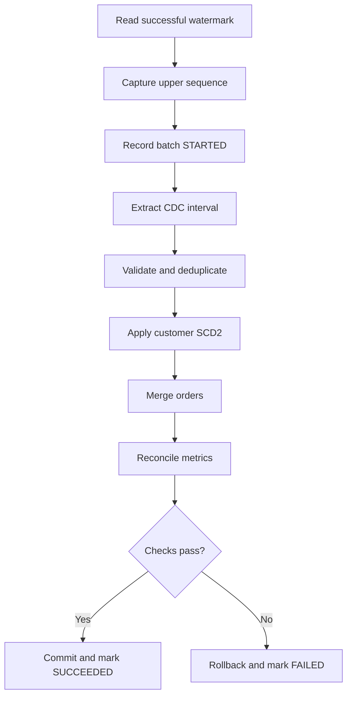

---
aliases:
  - DE SQL Week 7
  - Incremental Loads and SCD Week 7
tags:
  - data-engineering
  - sql
  - incremental-load
  - cdc
  - merge
  - scd
  - data-warehouse
  - interview-preparation
  - week-7
status: active
difficulty: intermediate-advanced
study_time: 6 days
created: 2026-08-16
previous: '[[Data-Engineer-SQL-Week-6-Obsidian]]'
---

# Data Engineer SQL — Week 7 Detailed Notes

> [!info] Week 7 goal
> Build warehouse loads that can process changes incrementally, recover safely from failures, preserve history when required, and prove source-to-target correctness.

## Obsidian navigation

- [[#Day 1 — Full loads, incremental loads, and watermarks|Day 1 — Incremental loads]]
- [[#Day 2 — Idempotency, audit controls, and reconciliation|Day 2 — Reliability controls]]
- [[#Day 3 — Upserts and MERGE|Day 3 — MERGE]]
- [[#Day 4 — Change Data Capture and delete handling|Day 4 — CDC]]
- [[#Day 5 — Slowly Changing Dimension Type 1|Day 5 — SCD Type 1]]
- [[#Day 6 — Slowly Changing Dimension Type 2|Day 6 — SCD Type 2]]
- [[#Week 7 mini-project — End-to-end incremental warehouse load|Mini-project]]
- [[#Week 7 interview questions|Interview questions]]
- [[#Week 7 final practice set|Final practice]]
- [[#Week 7 one-page cheat sheet|Cheat sheet]]

## Progress tracker

- [ ] Day 1 completed
- [ ] Day 2 completed
- [ ] Day 3 completed
- [ ] Day 4 completed
- [ ] Day 5 completed
- [ ] Day 6 completed
- [ ] Incremental warehouse mini-project completed
- [ ] Week 7 completion test passed

> [!warning] Dialect and platform note
> Examples use PostgreSQL-style and generic warehouse SQL. `MERGE`, CDC, identity columns, transaction scope, delete vectors, table history, and constraint enforcement vary by database and lakehouse engine. Adapt syntax while preserving key, ordering, idempotency, and reconciliation rules.

**Level:** Intermediate to advanced  
**Duration:** 6 study days plus 1 revision/rest day  
**Daily time:** 75–110 minutes  
**Primary dialect:** PostgreSQL-style plus generic `MERGE`  
**Prerequisite:** [[Data-Engineer-SQL-Week-6-Obsidian|Week 6 — Database engineering fundamentals]]

## Week 7 learning outcomes

By the end of this week, you should be able to:

- Choose between full, append, incremental, and snapshot loads.
- Design half-open watermark boundaries.
- Explain why timestamp watermarks can miss late changes.
- Use lookback windows with deterministic deduplication.
- Build idempotent retry behavior.
- Create batch-control and audit records.
- Deduplicate a `MERGE` source before applying changes.
- Process ordered CDC inserts, updates, and deletes.
- Explain snapshot delete detection and its limitations.
- Implement SCD Type 1 overwrites.
- Implement SCD Type 2 expiration and insertion.
- Join facts to the correct historical dimension version.
- Handle late-arriving facts and dimension changes.
- Reconcile counts, keys, amounts, and action metrics.

---

# Practice setup

Continue using the retail tables created in previous weeks.

## Batch-control table

```sql
CREATE TABLE etl_batch_control (
    pipeline_name          VARCHAR(100) NOT NULL,
    batch_id               VARCHAR(100) NOT NULL,
    batch_status           VARCHAR(30) NOT NULL,
    lower_watermark        TIMESTAMP,
    upper_watermark        TIMESTAMP,
    lower_sequence         BIGINT,
    upper_sequence         BIGINT,
    started_at             TIMESTAMP NOT NULL,
    completed_at           TIMESTAMP,
    source_row_count       BIGINT,
    staged_row_count       BIGINT,
    inserted_row_count     BIGINT,
    updated_row_count      BIGINT,
    deleted_row_count      BIGINT,
    rejected_row_count     BIGINT,
    error_message          VARCHAR(2000),
    CONSTRAINT pk_etl_batch_control
        PRIMARY KEY (pipeline_name, batch_id),
    CONSTRAINT ck_etl_batch_status
        CHECK (batch_status IN ('STARTED', 'SUCCEEDED', 'FAILED'))
);
```

## Order target

```sql
CREATE TABLE warehouse_orders (
    order_id           BIGINT PRIMARY KEY,
    customer_id        BIGINT,
    order_date         DATE NOT NULL,
    order_status       VARCHAR(30) NOT NULL,
    order_total        DECIMAL(18,2),
    source_updated_at  TIMESTAMP NOT NULL,
    source_sequence    BIGINT NOT NULL,
    is_deleted         BOOLEAN NOT NULL DEFAULT FALSE,
    created_at         TIMESTAMP NOT NULL DEFAULT CURRENT_TIMESTAMP,
    updated_at         TIMESTAMP NOT NULL DEFAULT CURRENT_TIMESTAMP,
    last_batch_id      VARCHAR(100) NOT NULL
);
```

## CDC event source

```sql
CREATE TABLE order_change_events (
    change_id          BIGINT PRIMARY KEY,
    order_id           BIGINT NOT NULL,
    operation_code     CHAR(1) NOT NULL,
    customer_id        BIGINT,
    order_date         DATE,
    order_status       VARCHAR(30),
    order_total        DECIMAL(18,2),
    source_updated_at  TIMESTAMP NOT NULL,
    source_sequence    BIGINT NOT NULL,
    arrived_at         TIMESTAMP NOT NULL,
    CONSTRAINT ck_order_change_operation
        CHECK (operation_code IN ('I', 'U', 'D'))
);

INSERT INTO order_change_events VALUES
(1, 2001, 'I', 1, '2026-08-01', 'PENDING',   5000.00, '2026-08-01 09:00:00', 1001, '2026-08-01 09:00:03'),
(2, 2001, 'U', 1, '2026-08-01', 'COMPLETED', 5000.00, '2026-08-01 09:10:00', 1002, '2026-08-01 09:10:02'),
(3, 2002, 'I', 2, '2026-08-01', 'PENDING',   7500.00, '2026-08-01 09:15:00', 1003, '2026-08-01 09:15:01'),
(4, 2002, 'D', 2, '2026-08-01', NULL,            NULL, '2026-08-01 09:20:00', 1004, '2026-08-01 09:20:01'),
(5, 2003, 'I', 3, '2026-08-02', 'PENDING',   1200.00, '2026-08-02 10:00:00', 1005, '2026-08-02 10:00:02'),
(6, 2003, 'U', 3, '2026-08-02', 'SHIPPED',   1200.00, '2026-08-02 10:05:00', 1006, '2026-08-02 10:05:04'),
(7, 2003, 'U', 3, '2026-08-02', 'COMPLETED', 1200.00, '2026-08-02 10:10:00', 1007, '2026-08-02 10:10:03');
```

`source_sequence` represents authoritative commit order. It is safer than relying only on timestamps that can tie or arrive late.

## Customer change staging

```sql
CREATE TABLE staged_customer_changes (
    ingestion_id       BIGINT PRIMARY KEY,
    source_system      VARCHAR(30) NOT NULL,
    customer_id        VARCHAR(100) NOT NULL,
    customer_name      VARCHAR(200),
    city               VARCHAR(100),
    email              VARCHAR(320),
    source_updated_at  TIMESTAMP NOT NULL,
    source_sequence    BIGINT NOT NULL,
    operation_code     CHAR(1) NOT NULL,
    batch_id           VARCHAR(100) NOT NULL,
    CONSTRAINT ck_customer_change_operation
        CHECK (operation_code IN ('I', 'U', 'D'))
);

INSERT INTO staged_customer_changes VALUES
(1, 'CRM', 'C001', 'Aarav Sharma', 'Pune',   'aarav@example.com',     '2026-08-01 09:00:00', 5001, 'I', 'batch-001'),
(2, 'CRM', 'C001', 'Aarav Sharma', 'Mumbai', 'aarav@example.com',     '2026-08-02 10:00:00', 5002, 'U', 'batch-001'),
(3, 'CRM', 'C001', 'Aarav Sharma', 'Mumbai', 'aarav.new@example.com', '2026-08-02 10:00:00', 5003, 'U', 'batch-001'),
(4, 'CRM', 'C002', 'Diya Patel',   'Mumbai', 'diya@example.com',      '2026-08-02 11:00:00', 5004, 'I', 'batch-001'),
(5, 'CRM', 'C003', 'Kabir Singh',  'Pune',   NULL,                    '2026-08-02 12:00:00', 5005, 'I', 'batch-001');
```

Customer `C001` has several events; source sequence resolves the same-timestamp tie.

> [!warning] Setup safety
> Run setup once in a practice schema. Production pipelines should manage schema deployment through versioned migrations.

---

# Day 1 — Full loads, incremental loads, and watermarks

## 1.1 Full load

A full load processes the complete source population.

```sql
INSERT INTO target_orders (...)
SELECT ...
FROM source_orders;
```

Common full-load strategies:

- Truncate and reload
- Build a replacement table and swap
- Overwrite a complete table or partition
- Compare a full snapshot to the current target

Advantages:

- Simple logic
- Naturally captures all current source rows
- Useful for small dimensions or initial loads

Disadvantages:

- High scan and write cost
- Longer runtime
- Larger operational window
- Can stress source systems
- Requires careful atomic replacement

## 1.2 Incremental load

An incremental load processes only new or changed records since a tracked position.

Benefits:

- Lower source and target work
- Faster recurring loads
- Reduced data movement

Challenges:

- Correct change detection
- Boundary handling
- Late data
- Deletes
- Retry safety
- Watermark advancement

## 1.3 Common incremental sources

- Reliable `updated_at` timestamp
- Monotonically increasing sequence or ID
- Database transaction-log CDC
- Source version number
- File-arrival metadata
- API cursor/token
- Snapshot comparison

The best source is an authoritative change log with stable order and delete events.

## 1.4 Watermark

A watermark records how far successful processing has progressed.

Example using half-open boundaries:

```sql
SELECT *
FROM source_orders
WHERE source_updated_at >= :lower_watermark
  AND source_updated_at <  :upper_watermark;
```

The next batch begins at the prior upper watermark.

```text
Batch 1: [00:00, 01:00)
Batch 2: [01:00, 02:00)
```

No timestamp belongs to both intervals.

## 1.5 Capture upper watermark at batch start

```sql
SELECT CURRENT_TIMESTAMP AS upper_watermark;
```

Use a consistent source-side value when possible. The batch then processes records below that fixed bound while new changes continue into the next interval.

Do not repeatedly call current time inside extraction and assume one stable boundary.

## 1.6 Advance only after success

Correct order:

1. Read last successful watermark.
2. Capture new upper watermark.
3. Extract and stage.
4. Validate and apply target changes.
5. Commit target work.
6. Mark batch successful with new watermark.

If processing fails, do not advance the successful watermark.

## 1.7 Timestamp limitations

Timestamp watermarks can miss changes when:

- Updates share boundary timestamps.
- Source clocks differ.
- A transaction commits later with an older application timestamp.
- Precision is truncated.
- Source updates timestamps incorrectly.
- Rows arrive out of order.
- Deletes are not present.

Prefer log sequence/commit position when available.

## 1.8 Lookback window

Re-read a controlled overlap:

```sql
SELECT *
FROM source_orders
WHERE source_updated_at >= :lower_watermark - INTERVAL '15 minutes'
  AND source_updated_at <  :upper_watermark;
```

Because rows can be re-read, the target must use deterministic deduplication and idempotent upsert logic.

The lookback size should come from measured lateness and service-level requirements.

## 1.9 Sequence watermark

```sql
SELECT *
FROM order_change_events
WHERE source_sequence > :last_successful_sequence
  AND source_sequence <= :current_max_sequence;
```

This works when sequence values are authoritative, ordered, stable, and retained long enough.

Gaps in a sequence are not automatically errors; generators can skip values. Monotonic ordering matters more than gap-free numbering.

## 1.10 Append-only incremental load

For immutable events with unique event IDs:

```sql
INSERT INTO target_events (...)
SELECT s...
FROM source_events AS s
WHERE s.sequence_id > :last_sequence
  AND s.sequence_id <= :upper_sequence
  AND NOT EXISTS (
      SELECT 1
      FROM target_events AS t
      WHERE t.event_id = s.event_id
  );
```

The unique event key protects retries.

## 1.11 Snapshot incremental comparison

If only full snapshots exist:

- New key in source: insert.
- Key in both with changed attributes: update or create new version.
- Key absent from source: possible delete, but only if snapshot completeness is guaranteed.

Never infer deletes from a partial extract.

## 1.12 High-watermark versus event time

- Event time: when the business event occurred.
- Update time: when source row was changed.
- Commit sequence: transaction/change-log order.
- Arrival time: when the pipeline received it.

Track them separately. Incremental extraction normally uses update/commit/arrival metadata, not business event time alone.

## Day 1 common mistakes

- Advancing the watermark before target commit.
- Using business event time as the only change cursor.
- Using inclusive upper and lower bounds in adjacent batches.
- Assuming source timestamps reflect commit order.
- Adding lookback without idempotent target logic.
- Inferring deletes from an incomplete snapshot.
- Assuming sequence values must be gap-free.
- Losing the exact lower and upper bounds used by a batch.

## Day 1 exercises

1. Compare full and incremental loads.
2. Write a half-open timestamp extraction.
3. Write a sequence-based extraction.
4. Capture a stable upper watermark.
5. Design a 30-minute lookback extraction.
6. Explain why the target must deduplicate lookback rows.
7. List five timestamp-watermark failure modes.
8. Explain event, update, arrival, and commit times.
9. Design an initial-load watermark.
10. Design retry behavior after extraction succeeds but target write fails.
11. Explain when snapshot delete detection is safe.
12. Create a watermark-validation checklist.

## Day 1 solution patterns

```sql
-- Timestamp interval
SELECT *
FROM source_orders
WHERE source_updated_at >= :last_successful_upper_watermark
  AND source_updated_at <  :current_upper_watermark;
```

```sql
-- Lookback interval
SELECT *
FROM source_orders
WHERE source_updated_at >= :last_successful_upper_watermark - INTERVAL '30 minutes'
  AND source_updated_at <  :current_upper_watermark;
```

```sql
-- Commit sequence interval
SELECT *
FROM order_change_events
WHERE source_sequence > :last_successful_sequence
  AND source_sequence <= :captured_upper_sequence
ORDER BY source_sequence, change_id;
```

---

# Day 2 — Idempotency, audit controls, and reconciliation

## 2.1 Idempotency

An idempotent pipeline produces the same target state when the same input batch is processed again.

It does not mean the job performs no writes; it means retries do not create duplicates or conflicting state.

## 2.2 Idempotency strategies

### Upsert by stable business key

Insert new keys and update existing keys deterministically.

### Delete and reload controlled scope

```sql
BEGIN;

DELETE FROM daily_summary
WHERE summary_date = :run_date;

INSERT INTO daily_summary (...)
SELECT ...
FROM source
WHERE business_date = :run_date;

COMMIT;
```

### Partition overwrite

Atomically replace a complete partition when supported.

### Append with unique event ID

Enforce one row per immutable event ID.

### Batch-tag cleanup and reload

Remove rows previously written by the same stable batch ID, then reinsert.

## 2.3 Batch identity

A batch needs a stable identity across retries.

Bad:

```text
Generate a new batch ID on every retry.
```

Better:

```text
Reuse the same logical batch ID for the same watermark interval.
```

Attempts can have separate attempt numbers while sharing one batch ID.

## 2.4 Batch start record

```sql
INSERT INTO etl_batch_control (
    pipeline_name,
    batch_id,
    batch_status,
    lower_watermark,
    upper_watermark,
    started_at
)
VALUES (
    'orders_incremental',
    :batch_id,
    'STARTED',
    :lower_watermark,
    :upper_watermark,
    CURRENT_TIMESTAMP
);
```

Use upsert or controlled attempt handling if the same batch record already exists.

## 2.5 Successful completion

```sql
UPDATE etl_batch_control
SET batch_status = 'SUCCEEDED',
    completed_at = CURRENT_TIMESTAMP,
    source_row_count = :source_count,
    staged_row_count = :staged_count,
    inserted_row_count = :inserted_count,
    updated_row_count = :updated_count,
    deleted_row_count = :deleted_count,
    rejected_row_count = :rejected_count,
    error_message = NULL
WHERE pipeline_name = 'orders_incremental'
  AND batch_id = :batch_id;
```

The new watermark becomes eligible only from a successful committed batch.

## 2.6 Failure record

```sql
UPDATE etl_batch_control
SET batch_status = 'FAILED',
    completed_at = CURRENT_TIMESTAMP,
    error_message = :sanitized_error
WHERE pipeline_name = 'orders_incremental'
  AND batch_id = :batch_id;
```

Do not store secrets or sensitive payloads in error text.

## 2.7 Audit columns

Common target columns:

- `created_at`
- `updated_at`
- `last_batch_id`
- `source_system`
- `source_updated_at`
- `source_sequence`
- `record_hash`
- `is_deleted`

Business timestamps and pipeline timestamps must remain distinct.

## 2.8 Reconciliation levels

### Level 1: counts

- Source extracted rows
- Staged rows
- Rejected rows
- Inserted, updated, and deleted rows
- Target affected rows

### Level 2: keys

- Distinct source keys
- Duplicate keys
- Source-only and target-only keys
- NULL keys

### Level 3: values

- Amount totals
- Min/max event and update times
- Status distribution
- Column-level hashes or comparisons

### Level 4: business invariants

- Completed revenue definition
- Valid state transitions
- Referential integrity
- SCD interval rules

## 2.9 Reconciliation equation

For a staged batch:

```text
source_rows = staged_valid_rows + rejected_rows
```

For action classification:

```text
deduplicated_source_keys = insert_keys + update_keys + unchanged_keys + delete_keys
```

Exact equations depend on whether deletes arrive separately and whether multiple CDC events per key are collapsed.

## 2.10 Source-to-target metrics

```sql
WITH source_metrics AS (
    SELECT COUNT(*) AS row_count,
           COUNT(DISTINCT order_id) AS distinct_keys,
           SUM(order_total) AS total_amount,
           MIN(source_updated_at) AS minimum_update,
           MAX(source_updated_at) AS maximum_update
    FROM staged_orders
    WHERE batch_id = :batch_id
),
target_metrics AS (
    SELECT COUNT(*) AS row_count,
           COUNT(DISTINCT order_id) AS distinct_keys,
           SUM(order_total) AS total_amount,
           MIN(source_updated_at) AS minimum_update,
           MAX(source_updated_at) AS maximum_update
    FROM warehouse_orders
    WHERE last_batch_id = :batch_id
)
SELECT s.row_count AS source_rows,
       t.row_count AS target_rows,
       s.distinct_keys AS source_keys,
       t.distinct_keys AS target_keys,
       s.total_amount AS source_amount,
       t.total_amount AS target_amount
FROM source_metrics AS s
CROSS JOIN target_metrics AS t;
```

Target rows updated in place may not be fully represented by `last_batch_id` totals if the metric is current-state rather than batch-action state. Maintain explicit action audit when necessary.

## 2.11 Reject table

```sql
CREATE TABLE rejected_order_records (
    batch_id         VARCHAR(100) NOT NULL,
    source_record_id VARCHAR(200),
    rejection_code  VARCHAR(100) NOT NULL,
    rejection_detail VARCHAR(1000),
    rejected_at     TIMESTAMP NOT NULL DEFAULT CURRENT_TIMESTAMP
);
```

Preserve enough lineage for correction and replay without exposing sensitive raw data unnecessarily.

## 2.12 Invariants before success

Do not mark success until:

- Staging extraction is complete.
- Business key duplicates are resolved.
- Required fields pass thresholds.
- Target write commits.
- Counts and action metrics reconcile.
- Watermark bounds are recorded.
- Error/reject policies are satisfied.

## Day 2 common mistakes

- Generating a new logical batch ID for every retry.
- Marking batch success before target commit.
- Advancing watermark when reconciliation fails.
- Tracking only source row count.
- Mixing batch-action metrics with target-state metrics.
- Discarding rejected records without lineage.
- Logging sensitive error data.
- Assuming a unique constraint alone handles every retry scenario.

## Day 2 exercises

1. Define idempotency.
2. Choose an idempotency strategy for immutable events.
3. Choose one for daily partition summaries.
4. Design a batch ID and attempt ID.
5. Insert a batch-control start row.
6. Update success metrics.
7. Update failure status.
8. Design target audit columns.
9. Write count and key reconciliation.
10. Write amount reconciliation.
11. Design a reject table.
12. Write pre-success invariants.

## Day 2 solution checklist

```text
Batch starts with stable ID and fixed bounds.
Extraction and stage counts are recorded.
Duplicate source keys are measured and resolved.
Invalid rows are rejected with lineage.
Target actions are committed atomically where possible.
Insert/update/delete/unchanged counts are captured.
Key and numeric reconciliation passes.
Only then is the batch marked successful.
The next run reads only the last successful watermark.
```

---

# Day 3 — Upserts and MERGE

## 3.1 Upsert definition

An upsert inserts a new key or updates an existing key. It is a current-state pattern and does not automatically preserve history.

## 3.2 Generic MERGE structure

```sql
MERGE INTO warehouse_orders AS t
USING staged_orders AS s
ON t.order_id = s.order_id
WHEN MATCHED THEN
    UPDATE SET customer_id = s.customer_id,
               order_date = s.order_date,
               order_status = s.order_status,
               order_total = s.order_total,
               source_updated_at = s.source_updated_at,
               source_sequence = s.source_sequence,
               is_deleted = FALSE,
               updated_at = CURRENT_TIMESTAMP,
               last_batch_id = s.batch_id
WHEN NOT MATCHED THEN
    INSERT (
        order_id,
        customer_id,
        order_date,
        order_status,
        order_total,
        source_updated_at,
        source_sequence,
        is_deleted,
        last_batch_id
    )
    VALUES (
        s.order_id,
        s.customer_id,
        s.order_date,
        s.order_status,
        s.order_total,
        s.source_updated_at,
        s.source_sequence,
        FALSE,
        s.batch_id
    );
```

Exact syntax and clause capabilities vary.

## 3.3 Deduplicate source first

```sql
WITH ranked_source AS (
    SELECT s.*,
           ROW_NUMBER() OVER (
               PARTITION BY order_id
               ORDER BY source_sequence DESC,
                        source_updated_at DESC,
                        ingestion_id DESC
           ) AS rn
    FROM staged_orders AS s
    WHERE batch_id = :batch_id
)
SELECT *
FROM ranked_source
WHERE rn = 1;
```

Materialize or reference this deduplicated result as the `MERGE` source.

## 3.4 Apply only newer events

Do not let a late older change overwrite newer target state.

```sql
WHEN MATCHED
 AND s.source_sequence > t.source_sequence
THEN UPDATE SET ...
```

Sequence comparison is generally safer than timestamp comparison when an authoritative sequence exists.

## 3.5 Avoid unnecessary updates

```sql
WHEN MATCHED
 AND s.source_sequence > t.source_sequence
 AND (
        s.customer_id  IS DISTINCT FROM t.customer_id
     OR s.order_status IS DISTINCT FROM t.order_status
     OR s.order_total  IS DISTINCT FROM t.order_total
 )
THEN UPDATE SET ...
```

Avoiding unchanged updates can reduce write amplification and preserve accurate audit timestamps.

Use the target engine's NULL-safe comparison syntax.

## 3.6 Hash comparison

A record hash can summarize tracked attributes:

```text
hash(normalized customer_id, status, amount, ...)
```

Benefits:

- Compact change comparison
- Easier wide-row detection

Risks:

- Inconsistent normalization
- NULL and delimiter ambiguity
- Hash algorithm changes
- Collision risk
- Hiding which column changed

Use a strong, stable algorithm and keep direct comparisons where explainability matters.

## 3.7 Soft delete in MERGE

```sql
WHEN MATCHED
 AND s.operation_code = 'D'
 AND s.source_sequence > t.source_sequence
THEN UPDATE SET is_deleted = TRUE,
                source_sequence = s.source_sequence,
                source_updated_at = s.source_updated_at,
                updated_at = CURRENT_TIMESTAMP,
                last_batch_id = s.batch_id
```

Then restrict insert/update clauses to non-delete operations.

## 3.8 Hard delete

```sql
WHEN MATCHED
 AND s.operation_code = 'D'
THEN DELETE
```

Hard delete removes current data and can break audit, facts, or recovery. Choose based on legal, retention, and model requirements.

## 3.9 NOT MATCHED BY SOURCE

Some engines support target actions for rows absent from source. This is safe only when the source is a complete authoritative snapshot for the comparison scope.

Never use snapshot absence to delete target records when the source is incremental or filtered.

## 3.10 Action classification before MERGE

```sql
SELECT s.order_id,
       CASE
           WHEN t.order_id IS NULL AND s.operation_code <> 'D' THEN 'INSERT'
           WHEN t.order_id IS NULL AND s.operation_code = 'D' THEN 'IGNORE_OR_AUDIT_DELETE'
           WHEN s.source_sequence <= t.source_sequence THEN 'STALE_OR_DUPLICATE'
           WHEN s.operation_code = 'D' THEN 'DELETE'
           WHEN s.customer_id IS DISTINCT FROM t.customer_id
             OR s.order_status IS DISTINCT FROM t.order_status
             OR s.order_total IS DISTINCT FROM t.order_total
           THEN 'UPDATE'
           ELSE 'UNCHANGED'
       END AS action_code
FROM deduplicated_staging AS s
LEFT JOIN warehouse_orders AS t
  ON s.order_id = t.order_id;
```

Persisting action classification can improve audit and debugging.

## 3.11 Merge metrics

Capture:

- Source rows before dedup
- Distinct source keys
- Duplicates removed
- Insert actions
- Update actions
- Delete actions
- Stale/duplicate events
- Unchanged keys
- Rejects

Do not rely only on total rows affected.

## 3.12 Concurrency

Concurrent merges into overlapping keys can conflict or produce lost updates depending on engine.

Controls:

- Serialize overlapping key ranges.
- Use optimistic concurrency and retry.
- Partition workloads by non-overlapping keys.
- Compare source sequence in update condition.
- Keep batch metadata stable across retry.

## Day 3 common mistakes

- Merging multiple source rows per target key.
- Overwriting a newer target with an older event.
- Updating unchanged rows.
- Treating NULL equality incorrectly.
- Deleting target rows absent from an incremental source.
- Losing audit action counts.
- Using hard delete without retention analysis.
- Assuming all engines implement identical `MERGE` semantics.

## Day 3 exercises

1. Define an upsert.
2. Deduplicate source rows before merge.
3. Write insert and update merge clauses.
4. Add newer-sequence protection.
5. Avoid unchanged updates.
6. Add soft-delete handling.
7. Add hard-delete handling as an alternative.
8. Classify actions before merge.
9. Count each action.
10. Explain `NOT MATCHED BY SOURCE` risk.
11. Design concurrent-merge protection.
12. Write merge validation checks.

## Day 3 solution pattern

```sql
WITH ranked AS (
    SELECT c.*,
           ROW_NUMBER() OVER (
               PARTITION BY order_id
               ORDER BY source_sequence DESC, change_id DESC
           ) AS rn
    FROM order_change_events AS c
    WHERE source_sequence > :lower_sequence
      AND source_sequence <= :upper_sequence
),
latest_changes AS (
    SELECT *
    FROM ranked
    WHERE rn = 1
)
MERGE INTO warehouse_orders AS t
USING latest_changes AS s
ON t.order_id = s.order_id
WHEN MATCHED
 AND s.source_sequence > t.source_sequence
 AND s.operation_code = 'D'
THEN UPDATE SET is_deleted = TRUE,
                source_sequence = s.source_sequence,
                source_updated_at = s.source_updated_at,
                updated_at = CURRENT_TIMESTAMP,
                last_batch_id = :batch_id
WHEN MATCHED
 AND s.source_sequence > t.source_sequence
 AND s.operation_code IN ('I', 'U')
THEN UPDATE SET customer_id = s.customer_id,
                order_date = s.order_date,
                order_status = s.order_status,
                order_total = s.order_total,
                source_sequence = s.source_sequence,
                source_updated_at = s.source_updated_at,
                is_deleted = FALSE,
                updated_at = CURRENT_TIMESTAMP,
                last_batch_id = :batch_id
WHEN NOT MATCHED
 AND s.operation_code IN ('I', 'U')
THEN INSERT (
    order_id,
    customer_id,
    order_date,
    order_status,
    order_total,
    source_updated_at,
    source_sequence,
    is_deleted,
    last_batch_id
)
VALUES (
    s.order_id,
    s.customer_id,
    s.order_date,
    s.order_status,
    s.order_total,
    s.source_updated_at,
    s.source_sequence,
    FALSE,
    :batch_id
);
```

Some engines do not allow a CTE directly before `MERGE` or use different syntax. Materialize `latest_changes` when necessary.

---

# Day 4 — Change Data Capture and delete handling

## 4.1 CDC definition

Change Data Capture represents source inserts, updates, and deletes so downstream systems can apply changes without rereading the entire source.

Common CDC origins:

- Database transaction log
- Trigger/audit table
- Source-provided change feed
- Application event stream
- Snapshot difference

Transaction-log CDC is generally the most authoritative for database changes.

## 4.2 CDC event fields

Useful fields include:

- Unique change ID
- Business key
- Operation code
- Before image
- After image
- Commit sequence or log position
- Source transaction ID
- Commit timestamp
- Table/source system
- Arrival timestamp

## 4.3 Order events by source sequence

```sql
SELECT *
FROM order_change_events
WHERE source_sequence > :last_sequence
  AND source_sequence <= :upper_sequence
ORDER BY source_sequence, change_id;
```

Arrival order is not necessarily source commit order.

## 4.4 Multiple events for one key

For current-state target, collapse to the latest event in the batch:

```sql
WITH ranked AS (
    SELECT c.*,
           ROW_NUMBER() OVER (
               PARTITION BY order_id
               ORDER BY source_sequence DESC, change_id DESC
           ) AS rn
    FROM order_change_events AS c
    WHERE source_sequence > :lower_sequence
      AND source_sequence <= :upper_sequence
)
SELECT *
FROM ranked
WHERE rn = 1;
```

For audit/history targets, retain every event in sequence.

## 4.5 Insert followed by delete in one batch

Order `2002` is inserted then deleted. A current-state collapse keeps the delete as latest action. If the key did not exist before the batch:

- Hard-delete target: final state is absent.
- Soft-delete target: a deleted tombstone row may be retained.
- Event history: both insert and delete remain.

Choose according to target purpose.

## 4.6 Duplicate CDC event delivery

Streams can redeliver events. Use a unique `change_id` or source log position to prevent double application.

```sql
INSERT INTO applied_change_ids (change_id, applied_at)
VALUES (:change_id, CURRENT_TIMESTAMP)
ON CONFLICT (change_id) DO NOTHING;
```

Exact syntax varies. Marking an event applied must be atomic with target changes or coordinated safely.

## 4.7 Out-of-order arrival

Compare authoritative source sequence:

```sql
WHERE incoming.source_sequence > target.source_sequence
```

Do not overwrite a newer target merely because an old event arrived later.

## 4.8 Before and after images

Before image enables:

- Audit of changed values
- Reversal or compensation
- Precise change detection
- Updating aggregates by subtracting old and adding new

After image represents the new state.

If only changed columns are emitted, reconstructing a complete row may require stateful combination with current target.

## 4.9 Delete strategies

### Hard delete

Remove target row.

### Soft delete

Set `is_deleted = TRUE` and retain the row.

### Tombstone event

Append a delete marker to event history.

### SCD expiration

End-date the current dimension version.

The correct choice depends on recovery, history, legal, privacy, and downstream requirements.

## 4.10 Snapshot delete detection

```sql
SELECT t.business_key
FROM target_current AS t
LEFT JOIN complete_source_snapshot AS s
  ON t.business_key = s.business_key
WHERE s.business_key IS NULL;
```

Safe only when:

- Source snapshot is complete.
- Scope and filters match the target population.
- Snapshot represents an agreed point in time.
- Key normalization is consistent.
- Temporary source omissions are not treated as deletion.

## 4.11 CDC retention and restart

If a consumer is offline longer than CDC retention, its sequence may no longer be available. Recovery plan:

- Rebuild from a current full snapshot.
- Record a new starting log position.
- Reconcile target with source.
- Preserve history according to policy.

Monitor consumer lag relative to retention.

## 4.12 Schema evolution in CDC

CDC payloads can change when source columns are added, renamed, or retyped.

Pipeline needs:

- Schema version
- Backward/forward compatibility rules
- Unknown-field handling
- Type validation
- Replay support
- Alerting for incompatible changes

## Day 4 common mistakes

- Processing by arrival timestamp instead of commit sequence.
- Losing intermediate events when audit history requires them.
- Applying duplicate change IDs twice.
- Ignoring deletes.
- Overwriting new target state with late old events.
- Assuming a snapshot is complete.
- Letting CDC retention expire without recovery plan.
- Ignoring schema evolution.

## Day 4 exercises

1. Define CDC.
2. List required CDC metadata.
3. Extract a sequence interval.
4. Collapse several events to latest current state.
5. Preserve every event for history.
6. Handle insert-then-delete in one batch.
7. Reject duplicate change IDs.
8. Protect against out-of-order events.
9. Compare hard delete and soft delete.
10. Design snapshot delete detection.
11. Design CDC retention recovery.
12. Design schema-evolution handling.

## Day 4 current-state result example

```sql
WITH ranked AS (
    SELECT c.*,
           ROW_NUMBER() OVER (
               PARTITION BY order_id
               ORDER BY source_sequence DESC, change_id DESC
           ) AS rn
    FROM order_change_events AS c
),
latest AS (
    SELECT *
    FROM ranked
    WHERE rn = 1
)
SELECT order_id,
       operation_code,
       customer_id,
       order_status,
       order_total,
       source_sequence
FROM latest
ORDER BY order_id;
```

Expected current actions from sample data:

- `2001`: update/current completed state
- `2002`: delete
- `2003`: update/current completed state

---

# Day 5 — Slowly Changing Dimension Type 1

## 5.1 SCD purpose

Slowly Changing Dimension patterns define how dimension attribute changes are stored.

Common types:

- Type 0: retain original value.
- Type 1: overwrite current value; no attribute history.
- Type 2: insert new version; preserve history.
- Type 3: keep limited previous value in extra columns.

Week 7 focuses on Types 1 and 2.

## 5.2 Type 1 behavior

If customer city changes from Pune to Mumbai:

```text
Before: C001, Pune
After:  C001, Mumbai
```

The old value is overwritten.

Use Type 1 for:

- Corrections where history is unnecessary
- Non-historical descriptive attributes
- Current-state operational dimensions

Do not use it when facts must report attributes as they were at event time.

## 5.3 Type 1 table

```sql
CREATE TABLE dim_customer_scd1 (
    customer_sk        BIGINT GENERATED ALWAYS AS IDENTITY PRIMARY KEY,
    source_system      VARCHAR(30) NOT NULL,
    customer_id        VARCHAR(100) NOT NULL,
    customer_name      VARCHAR(200) NOT NULL,
    city               VARCHAR(100),
    email              VARCHAR(320),
    source_updated_at  TIMESTAMP NOT NULL,
    source_sequence    BIGINT NOT NULL,
    created_at         TIMESTAMP NOT NULL DEFAULT CURRENT_TIMESTAMP,
    updated_at         TIMESTAMP NOT NULL DEFAULT CURRENT_TIMESTAMP,
    last_batch_id      VARCHAR(100) NOT NULL,
    CONSTRAINT uq_dim_customer_scd1_source_key
        UNIQUE (source_system, customer_id)
);
```

## 5.4 Deduplicate source

```sql
WITH ranked AS (
    SELECT s.*,
           ROW_NUMBER() OVER (
               PARTITION BY source_system, customer_id
               ORDER BY source_sequence DESC,
                        source_updated_at DESC,
                        ingestion_id DESC
           ) AS rn
    FROM staged_customer_changes AS s
    WHERE batch_id = :batch_id
),
latest AS (
    SELECT *
    FROM ranked
    WHERE rn = 1
)
SELECT *
FROM latest;
```

## 5.5 Type 1 merge

```sql
MERGE INTO dim_customer_scd1 AS t
USING latest_customer_changes AS s
ON t.source_system = s.source_system
AND t.customer_id = s.customer_id
WHEN MATCHED
 AND s.source_sequence > t.source_sequence
 AND s.operation_code IN ('I', 'U')
THEN UPDATE SET customer_name = s.customer_name,
                city = s.city,
                email = s.email,
                source_updated_at = s.source_updated_at,
                source_sequence = s.source_sequence,
                updated_at = CURRENT_TIMESTAMP,
                last_batch_id = s.batch_id
WHEN NOT MATCHED
 AND s.operation_code IN ('I', 'U')
THEN INSERT (
    source_system,
    customer_id,
    customer_name,
    city,
    email,
    source_updated_at,
    source_sequence,
    last_batch_id
)
VALUES (
    s.source_system,
    s.customer_id,
    s.customer_name,
    s.city,
    s.email,
    s.source_updated_at,
    s.source_sequence,
    s.batch_id
);
```

## 5.6 Type 1 delete handling

Options:

- Hard delete dimension row
- Add `is_deleted` and soft delete
- Retain dimension row but deactivate it
- Map deleted source key to unknown/inactive behavior

Hard delete can break fact foreign-key references. Soft delete is often safer.

## 5.7 Change detection

Direct NULL-safe comparisons:

```sql
s.customer_name IS DISTINCT FROM t.customer_name
OR s.city        IS DISTINCT FROM t.city
OR s.email       IS DISTINCT FROM t.email
```

Or use a normalized attribute hash. Direct comparison is transparent; a hash is compact for wide dimensions.

## 5.8 Corrected history limitation

If a current city is overwritten, historical reports that join current customer attributes may show the new city for old orders. This is expected Type 1 behavior.

Use Type 2 when historical attribute context is required.

## 5.9 Type 1 audit

Track:

- Insert count
- Update count
- Delete/deactivate count
- Unchanged count
- Stale event count
- Source and target sequence
- Batch ID
- Rejected key count

## 5.10 Type 1 validation

```sql
SELECT source_system,
       customer_id,
       COUNT(*) AS occurrences
FROM dim_customer_scd1
GROUP BY source_system, customer_id
HAVING COUNT(*) > 1;
```

One row must exist per business key.

## Day 5 common mistakes

- Using Type 1 when historical reporting is required.
- Merging undeduplicated source changes.
- Applying older events over newer state.
- Updating unchanged values and audit timestamps.
- Hard deleting dimensions referenced by facts.
- Failing to namespace business keys by source system.
- Not validating one row per business key.

## Day 5 exercises

1. Define SCD Type 1.
2. List appropriate Type 1 attributes.
3. Create a Type 1 customer dimension.
4. Deduplicate customer changes.
5. Classify insert, update, unchanged, and stale actions.
6. Write Type 1 merge logic.
7. Add source-sequence protection.
8. Add soft-delete behavior.
9. Validate key uniqueness.
10. Explain Type 1 historical limitation.
11. Compare direct and hash change detection.
12. Write Type 1 audit metrics.

## Day 5 action classification

```sql
SELECT s.source_system,
       s.customer_id,
       CASE
           WHEN t.customer_sk IS NULL AND s.operation_code <> 'D' THEN 'INSERT'
           WHEN t.customer_sk IS NULL AND s.operation_code = 'D' THEN 'IGNORE_OR_AUDIT'
           WHEN s.source_sequence <= t.source_sequence THEN 'STALE_OR_DUPLICATE'
           WHEN s.operation_code = 'D' THEN 'DELETE_OR_DEACTIVATE'
           WHEN s.customer_name IS DISTINCT FROM t.customer_name
             OR s.city IS DISTINCT FROM t.city
             OR s.email IS DISTINCT FROM t.email
           THEN 'UPDATE'
           ELSE 'UNCHANGED'
       END AS action_code
FROM latest_customer_changes AS s
LEFT JOIN dim_customer_scd1 AS t
  ON s.source_system = t.source_system
 AND s.customer_id = t.customer_id;
```

---

# Day 6 — Slowly Changing Dimension Type 2

## 6.1 Type 2 behavior

Type 2 preserves attribute history by storing a new row version.

Before city change:

```text
customer_sk  customer_id  city    effective_from  effective_to  is_current
101          C001         Pune    2026-01-01      9999-12-31    true
```

After change on 2 August:

```text
101          C001         Pune    2026-01-01      2026-08-02    false
205          C001         Mumbai  2026-08-02      9999-12-31    true
```

Use half-open intervals:

```text
[effective_from, effective_to)
```

No timestamp belongs to two adjacent versions.

## 6.2 Type 2 table

```sql
CREATE TABLE dim_customer_scd2 (
    customer_sk        BIGINT GENERATED ALWAYS AS IDENTITY PRIMARY KEY,
    source_system      VARCHAR(30) NOT NULL,
    customer_id        VARCHAR(100) NOT NULL,
    customer_name      VARCHAR(200) NOT NULL,
    city               VARCHAR(100),
    email              VARCHAR(320),
    effective_from     TIMESTAMP NOT NULL,
    effective_to       TIMESTAMP NOT NULL,
    is_current         BOOLEAN NOT NULL,
    source_updated_at  TIMESTAMP NOT NULL,
    source_sequence    BIGINT NOT NULL,
    created_at         TIMESTAMP NOT NULL DEFAULT CURRENT_TIMESTAMP,
    expired_at         TIMESTAMP,
    created_batch_id   VARCHAR(100) NOT NULL,
    expired_batch_id   VARCHAR(100),
    CONSTRAINT uq_dim_customer_scd2_version
        UNIQUE (source_system, customer_id, effective_from),
    CONSTRAINT ck_dim_customer_scd2_range
        CHECK (effective_to > effective_from)
);
```

PostgreSQL partial unique index for one current version:

```sql
CREATE UNIQUE INDEX uq_dim_customer_scd2_current
ON dim_customer_scd2 (source_system, customer_id)
WHERE is_current = TRUE;
```

Other engines may require pipeline validation instead.

## 6.3 Tracked versus untracked attributes

Tracked Type 2 attributes create new versions when changed.

Examples:

- City
- Customer segment
- Account status

Untracked or Type 1 attributes can be overwritten across current/historical rows according to governance.

Document the rule per attribute.

## 6.4 Decide whether changes may be collapsed

> [!danger] Do not collapse required history
> Keeping only the latest row per business key is correct for a current-state target, and it can be an agreed Type 2 policy when only the final state per batch matters. It is not correct when every CDC change must become a historical dimension version. In that case, process all events for a key in authoritative source-sequence order or rebuild that key's complete version timeline.

The following action-table example uses a **batch-collapsed policy**: one final source state per key per batch. With the sample C001 events, only the final batch state is used.

If several changes have the same effective timestamp, timestamp-only validity cannot represent separate positive-length intervals for each change. Choose one documented approach:

- Collapse same-effective-time changes to the last authoritative sequence.
- Preserve a higher-precision effective timestamp.
- Use source sequence as an additional ordering/version attribute.
- Use a bitemporal or event-history model when both business and system history are required.

## 6.5 Prepare action table for a batch-collapsed policy

Because expiration and insertion are separate statements in many engines, classify actions once and materialize them.

```sql
CREATE TEMP TABLE tmp_customer_scd2_actions AS
WITH ranked AS (
    SELECT s.*,
           ROW_NUMBER() OVER (
               PARTITION BY source_system, customer_id
               ORDER BY source_sequence DESC,
                        source_updated_at DESC,
                        ingestion_id DESC
           ) AS rn
    FROM staged_customer_changes AS s
    WHERE batch_id = :batch_id
),
latest AS (
    SELECT *
    FROM ranked
    WHERE rn = 1
)
SELECT s.*,
       d.customer_sk AS current_customer_sk,
       CASE
           WHEN d.customer_sk IS NULL AND s.operation_code <> 'D' THEN 'INSERT'
           WHEN d.customer_sk IS NULL AND s.operation_code = 'D' THEN 'IGNORE_OR_AUDIT'
           WHEN s.source_sequence <= d.source_sequence THEN 'STALE_OR_DUPLICATE'
           WHEN s.operation_code = 'D' THEN 'EXPIRE_DELETE'
           WHEN s.customer_name IS DISTINCT FROM d.customer_name
             OR s.city IS DISTINCT FROM d.city
             OR s.email IS DISTINCT FROM d.email
           THEN 'TYPE2_CHANGE'
           ELSE 'UNCHANGED'
       END AS action_code
FROM latest AS s
LEFT JOIN dim_customer_scd2 AS d
  ON s.source_system = d.source_system
 AND s.customer_id = d.customer_id
 AND d.is_current = TRUE;
```

## 6.6 Expire current changed versions

```sql
BEGIN;

UPDATE dim_customer_scd2 AS d
SET effective_to = a.source_updated_at,
    is_current = FALSE,
    expired_at = CURRENT_TIMESTAMP,
    expired_batch_id = a.batch_id
FROM tmp_customer_scd2_actions AS a
WHERE d.customer_sk = a.current_customer_sk
  AND a.action_code IN ('TYPE2_CHANGE', 'EXPIRE_DELETE');
```

## 6.7 Insert new versions

```sql
INSERT INTO dim_customer_scd2 (
    source_system,
    customer_id,
    customer_name,
    city,
    email,
    effective_from,
    effective_to,
    is_current,
    source_updated_at,
    source_sequence,
    created_batch_id
)
SELECT source_system,
       customer_id,
       customer_name,
       city,
       email,
       source_updated_at,
       TIMESTAMP '9999-12-31 00:00:00',
       TRUE,
       source_updated_at,
       source_sequence,
       batch_id
FROM tmp_customer_scd2_actions
WHERE action_code IN ('INSERT', 'TYPE2_CHANGE');

COMMIT;
```

Delete events expire the current version but do not insert a new active version in this design.

## 6.8 Why two statements?

A changed business key requires:

1. Update old version's end time and current flag.
2. Insert a new surrogate-key version.

Some platforms support a single multi-action pattern, but action classification, atomicity, and duplicate-source handling remain essential.

## 6.9 Fact-to-dimension historical lookup

```sql
SELECT f.order_id,
       d.customer_sk
FROM staged_fact_orders AS f
LEFT JOIN dim_customer_scd2 AS d
  ON f.source_system = d.source_system
 AND f.source_customer_id = d.customer_id
 AND f.order_timestamp >= d.effective_from
 AND f.order_timestamp <  d.effective_to;
```

Fact joins must use the business/event timestamp, not simply `is_current = TRUE`, when historical context is required.

## 6.10 Unknown dimension member

If a fact arrives before its dimension:

- Assign a standard unknown surrogate key.
- Record unmatched business key.
- Reprocess/backfill after dimension arrival.
- Do not drop the fact silently.

Example unknown dimension row:

```text
customer_sk = 0, customer_id = UNKNOWN
```

Identity-column rules may require a special insert method to reserve zero.

## 6.11 Late-arriving dimension change

Suppose a change effective 1 July arrives after an August version already exists. Simple current-row expiration is wrong.

Correct handling may require:

- Find the version whose interval contains the late effective timestamp.
- Split that interval.
- Insert the late version.
- Recalculate adjacent effective-to boundaries.
- Re-key or reprocess affected facts if necessary.

For complex out-of-order history, rebuild the affected business key from ordered source history.

## 6.12 Late-arriving fact

A fact arriving today with an event timestamp from last month must join the dimension version valid last month.

Do not use current version merely because the fact arrived now.

## 6.13 SCD Type 2 delete choices

- Expire current row with no replacement.
- Insert a new current row with `is_deleted = TRUE`.
- Retain expired history only.
- Apply privacy deletion/anonymization according to policy.

Define what downstream queries should see after deletion.

## 6.14 Type 2 validation

### One current row per key

```sql
SELECT source_system,
       customer_id,
       SUM(CASE WHEN is_current THEN 1 ELSE 0 END) AS current_count
FROM dim_customer_scd2
GROUP BY source_system, customer_id
HAVING SUM(CASE WHEN is_current THEN 1 ELSE 0 END) > 1;
```

Deleted keys may have zero current rows, so decide whether the test should require exactly one for active keys.

### No invalid intervals

```sql
SELECT *
FROM dim_customer_scd2
WHERE effective_to <= effective_from;
```

### No overlapping intervals

```sql
SELECT a.source_system,
       a.customer_id,
       a.customer_sk AS version_1,
       b.customer_sk AS version_2
FROM dim_customer_scd2 AS a
JOIN dim_customer_scd2 AS b
  ON a.source_system = b.source_system
 AND a.customer_id = b.customer_id
 AND a.customer_sk < b.customer_sk
 AND a.effective_from < b.effective_to
 AND b.effective_from < a.effective_to;
```

### Current flag matches high end date

```sql
SELECT *
FROM dim_customer_scd2
WHERE (is_current = TRUE  AND effective_to <> TIMESTAMP '9999-12-31 00:00:00')
   OR (is_current = FALSE AND effective_to  = TIMESTAMP '9999-12-31 00:00:00');
```

## Day 6 common mistakes

- Updating Type 2 rows in place.
- Creating a new version for unchanged attributes.
- Allowing several current versions.
- Using inclusive end boundaries and overlapping versions.
- Joining historical facts to current dimension only.
- Ignoring late-arriving changes.
- Expiring a row before preserving action data needed for insertion.
- Using arrival time as business effective time without definition.
- Failing to validate overlaps.

## Day 6 exercises

1. Define SCD Type 2.
2. Create a Type 2 customer dimension.
3. Add one-current-row enforcement.
4. Classify insert, Type 2 change, unchanged, stale, and delete.
5. Expire changed current rows.
6. Insert new versions.
7. Handle dimension delete.
8. Join facts by effective interval.
9. Design unknown-member handling.
10. Explain late-arriving fact handling.
11. Explain late-arriving dimension change handling.
12. Write four Type 2 validation queries.

## Type 1 versus Type 2

| Requirement | Type 1 | Type 2 |
|---|---|---|
| Preserve attribute history | No | Yes |
| Current-state simplicity | High | Moderate |
| New row on change | No | Yes |
| Surrogate version key | Optional | Important |
| Historical fact lookup | Current attributes only | Event-time version |
| Storage | Lower | Higher |
| Late-change complexity | Lower | Higher |

---

# Week 7 mini-project — End-to-end incremental warehouse load

## Scenario

Load ordered CDC changes for customers and orders into:

- `dim_customer_scd2`
- `warehouse_orders`
- `etl_batch_control`

Requirements:

1. Fixed batch ID and sequence interval
2. Batch start control record
3. CDC extraction
4. Key and domain validation
5. Deduplication to latest current-state change per key
6. SCD Type 2 customer processing
7. Order upsert and soft deletes
8. Fact-to-dimension historical lookup
9. Counts and action reconciliation
10. Batch success only after commit
11. Safe retry
12. Recovery after failure

## End-to-end flow



## Step 1: read lower sequence

```sql
SELECT COALESCE(MAX(upper_sequence), 0) AS lower_sequence
FROM etl_batch_control
WHERE pipeline_name = 'retail_cdc_pipeline'
  AND batch_status = 'SUCCEEDED';
```

## Step 2: capture upper sequence

```sql
SELECT MAX(source_sequence) AS upper_sequence
FROM order_change_events;
```

Use a source-consistent log position when available.

## Step 3: start batch

```sql
INSERT INTO etl_batch_control (
    pipeline_name,
    batch_id,
    batch_status,
    lower_sequence,
    upper_sequence,
    started_at
)
VALUES (
    'retail_cdc_pipeline',
    :batch_id,
    'STARTED',
    :lower_sequence,
    :upper_sequence,
    CURRENT_TIMESTAMP
);
```

## Step 4: extract and deduplicate order changes

```sql
CREATE TEMP TABLE tmp_latest_order_changes AS
WITH extracted AS (
    SELECT *
    FROM order_change_events
    WHERE source_sequence > :lower_sequence
      AND source_sequence <= :upper_sequence
),
ranked AS (
    SELECT e.*,
           ROW_NUMBER() OVER (
               PARTITION BY order_id
               ORDER BY source_sequence DESC, change_id DESC
           ) AS rn
    FROM extracted AS e
)
SELECT *
FROM ranked
WHERE rn = 1;
```

## Step 5: classify order actions

```sql
CREATE TEMP TABLE tmp_order_actions AS
SELECT s.*,
       CASE
           WHEN t.order_id IS NULL AND s.operation_code <> 'D' THEN 'INSERT'
           WHEN t.order_id IS NULL AND s.operation_code = 'D' THEN 'IGNORE_DELETE'
           WHEN s.source_sequence <= t.source_sequence THEN 'STALE_OR_DUPLICATE'
           WHEN s.operation_code = 'D' THEN 'SOFT_DELETE'
           WHEN s.customer_id IS DISTINCT FROM t.customer_id
             OR s.order_date IS DISTINCT FROM t.order_date
             OR s.order_status IS DISTINCT FROM t.order_status
             OR s.order_total IS DISTINCT FROM t.order_total
           THEN 'UPDATE'
           ELSE 'UNCHANGED'
       END AS action_code
FROM tmp_latest_order_changes AS s
LEFT JOIN warehouse_orders AS t
  ON s.order_id = t.order_id;
```

## Step 6: customer SCD Type 2

Use the Day 6 action table, expiration, and insert pattern inside a transaction. Validate no overlapping versions before proceeding.

## Step 7: apply order actions

```sql
BEGIN;

UPDATE warehouse_orders AS t
SET is_deleted = TRUE,
    source_sequence = a.source_sequence,
    source_updated_at = a.source_updated_at,
    updated_at = CURRENT_TIMESTAMP,
    last_batch_id = :batch_id
FROM tmp_order_actions AS a
WHERE t.order_id = a.order_id
  AND a.action_code = 'SOFT_DELETE';

UPDATE warehouse_orders AS t
SET customer_id = a.customer_id,
    order_date = a.order_date,
    order_status = a.order_status,
    order_total = a.order_total,
    source_sequence = a.source_sequence,
    source_updated_at = a.source_updated_at,
    is_deleted = FALSE,
    updated_at = CURRENT_TIMESTAMP,
    last_batch_id = :batch_id
FROM tmp_order_actions AS a
WHERE t.order_id = a.order_id
  AND a.action_code = 'UPDATE';

INSERT INTO warehouse_orders (
    order_id,
    customer_id,
    order_date,
    order_status,
    order_total,
    source_updated_at,
    source_sequence,
    is_deleted,
    last_batch_id
)
SELECT order_id,
       customer_id,
       order_date,
       order_status,
       order_total,
       source_updated_at,
       source_sequence,
       FALSE,
       :batch_id
FROM tmp_order_actions
WHERE action_code = 'INSERT';
```

## Step 8: reconcile inside workflow

```sql
SELECT action_code,
       COUNT(*) AS action_count
FROM tmp_order_actions
GROUP BY action_code;

SELECT COUNT(*) AS duplicate_target_keys
FROM (
    SELECT order_id
    FROM warehouse_orders
    GROUP BY order_id
    HAVING COUNT(*) > 1
) AS d;

SELECT COUNT(*) AS stale_target_rows
FROM warehouse_orders AS t
JOIN tmp_latest_order_changes AS s
  ON t.order_id = s.order_id
WHERE t.source_sequence < s.source_sequence
  AND s.operation_code <> 'D';
```

## Step 9: success

```sql
UPDATE etl_batch_control
SET batch_status = 'SUCCEEDED',
    completed_at = CURRENT_TIMESTAMP,
    source_row_count = :source_count,
    staged_row_count = :staged_count,
    inserted_row_count = :insert_count,
    updated_row_count = :update_count,
    deleted_row_count = :delete_count,
    rejected_row_count = :reject_count
WHERE pipeline_name = 'retail_cdc_pipeline'
  AND batch_id = :batch_id;

COMMIT;
```

In a real system, control metadata and data tables may not share one transaction manager. Use the platform's atomicity and orchestration guarantees carefully.

## Failure and retry

On failure:

1. Roll back uncommitted target work.
2. Mark attempt failed without advancing successful cursor.
3. Reuse the same logical batch bounds and batch ID.
4. Re-extract or reuse immutable staged input.
5. Reapply idempotent actions.
6. Reconcile again.

## Mini-project validation

- Every extracted change ID is either applied, collapsed, rejected, or recorded as stale.
- Target sequence never moves backward.
- Target order key is unique.
- Deleted events produce defined final state.
- Customer dimension has no overlapping versions.
- Active customer has at most one current dimension version.
- Fact lookup matches no more than one dimension version.
- Action counts reconcile with deduplicated keys.
- Watermark advances only after success.
- Retry produces the same target state.

---

# Week 7 interview questions

## Incremental loads

### 1. Full load versus incremental load?

A full load processes the complete source. An incremental load processes changes since a tracked position.

### 2. What is a watermark?

A stored cursor indicating how far successful processing has progressed.

### 3. Why use half-open intervals?

Adjacent intervals neither overlap nor leave gaps: lower bound included, upper bound excluded.

### 4. When should a watermark advance?

Only after target changes commit and required reconciliation succeeds.

### 5. Why can `updated_at` miss changes?

Late commits, timestamp ties, clock differences, truncated precision, incorrect source behavior, or deletes without rows.

### 6. What is a lookback window?

A controlled overlap that rereads recent data to capture late changes, requiring idempotent deduplication/upsert.

### 7. Event time versus processing time?

Event time is when the business event occurred; processing/arrival time is when the pipeline observed it.

### 8. When is snapshot delete detection safe?

Only when the snapshot is complete and authoritative for the exact target scope.

## Reliability

### 9. What is idempotency?

Rerunning the same logical batch produces the same target state without duplicate or conflicting results.

### 10. Idempotency strategies?

Upsert by stable key, controlled delete/reload, partition overwrite, and append with unique event IDs.

### 11. Why use a stable batch ID?

It connects retries, audit, staged input, and target changes to one logical unit.

### 12. What should a batch-control table contain?

Status, bounds, timestamps, source/stage/action/reject counts, error summary, and identifiers.

### 13. What should be reconciled?

Counts, distinct keys, duplicates, NULLs, action totals, numeric totals, date ranges, and business invariants.

### 14. Why keep a reject table?

To preserve lineage for investigation, correction, replay, and audit.

### 15. Why separate business and audit timestamps?

They represent different events: source business change versus pipeline processing.

## MERGE and CDC

### 16. What is an upsert?

Insert when the key is new; update when it exists.

### 17. Why deduplicate before MERGE?

Multiple source rows per target key make actions ambiguous or invalid.

### 18. How do you prevent stale overwrite?

Apply only incoming events whose authoritative source sequence is newer than target sequence.

### 19. Why avoid unchanged updates?

They increase write cost, modify audit timestamps, create unnecessary files/versions, and complicate metrics.

### 20. Why is NULL-safe comparison important?

Ordinary equality and inequality involving NULL return unknown and can miss real changes.

### 21. Hard delete versus soft delete?

Hard delete removes the row. Soft delete retains it with a deleted/inactive flag for history or recovery.

### 22. What is CDC?

A feed representing source inserts, updates, and deletes, ideally ordered by transaction-log position.

### 23. Why is arrival order unsafe?

Network and processing delays can deliver older events after newer ones.

### 24. What is a tombstone?

A record/event marking a key as deleted without necessarily removing historical data.

### 25. How do you handle duplicate CDC delivery?

Use unique change IDs/log positions and atomically record application with target changes.

### 26. CDC event history versus current state?

History retains every ordered event; current state collapses to the latest effective event per key.

### 27. What if CDC retention expires?

Rebuild from a full snapshot, establish a new starting cursor, and reconcile.

## SCD

### 28. What is SCD Type 1?

Overwrite dimension attributes without preserving prior values.

### 29. When is Type 1 appropriate?

Corrections or current-state attributes where historical reporting is not required.

### 30. What is SCD Type 2?

Expire the current row and insert a new surrogate-key version to preserve history.

### 31. Typical Type 2 columns?

Surrogate key, business key, tracked attributes, effective-from/to, current flag, sequence, and audit batch columns.

### 32. Why use a surrogate key in Type 2?

Each historical version needs a distinct key for fact references.

### 33. Why use half-open effective intervals?

Adjacent versions meet at one boundary without overlapping.

### 34. How do facts join to Type 2 dimensions?

Match business key and event timestamp within `[effective_from, effective_to)`.

### 35. What is a late-arriving fact?

A fact received after its event time; it must join the dimension version valid at event time.

### 36. What is a late-arriving dimension change?

A historical-effective change received after later versions exist; it may require splitting intervals or rebuilding the key history.

### 37. How do you enforce one current row?

Partial unique index where supported plus validation; otherwise pipeline checks and transactional/concurrency controls.

### 38. How do you detect Type 2 interval overlap?

Self join versions of the same key and test whether each start is before the other's end.

### 39. What happens to a deleted Type 2 member?

Policy may expire current row, insert a deleted version, anonymize, or remove data under legal requirements.

### 40. Type 1 versus Type 2 trade-off?

Type 1 is simpler and smaller but loses history. Type 2 preserves history with greater storage and load complexity.

## Scenarios

### 41. Batch extracted data but failed before target commit. What next?

Do not advance watermark; retry same logical batch using idempotent processing.

### 42. Batch committed target but control update failed. What next?

Detect target commit through stable batch lineage, reconcile, and repair control state without blindly reapplying non-idempotent actions.

### 43. MERGE fails because multiple source rows match target. Fix?

Deduplicate source by business key and authoritative sequence with deterministic tiebreakers.

### 44. Old CDC update arrives after a newer update. Fix?

Compare source sequence and ignore/audit the stale event.

### 45. Two current Type 2 rows exist. What likely failed?

Concurrency, non-atomic expire/insert logic, duplicate source actions, or missing current-row uniqueness validation.

---

# Week 7 final practice set

## Incremental loading

1. Compare full and incremental loads.
2. Write a timestamp watermark extraction.
3. Write a sequence watermark extraction.
4. Add a lookback interval.
5. Explain boundary selection.
6. Explain when the watermark advances.
7. Design initial load behavior.
8. Design late-data handling.
9. Design snapshot delete detection.
10. List cursor failure modes.

## Idempotency and audit

11. Design a stable batch ID.
12. Insert batch-control start state.
13. Record successful metrics.
14. Record failure state.
15. Design a reject table.
16. Write source-stage reconciliation.
17. Write action reconciliation.
18. Write target key validation.
19. Design retry logic.
20. Explain committed-data/control-state mismatch recovery.

## MERGE and CDC

21. Deduplicate merge source.
22. Classify insert/update/delete/unchanged/stale actions.
23. Write an upsert merge.
24. Add sequence protection.
25. Avoid unchanged updates.
26. Add soft deletes.
27. Design hard-delete alternative.
28. Extract CDC interval.
29. Collapse CDC to current state.
30. Preserve CDC event history.
31. Handle duplicate change delivery.
32. Handle out-of-order arrival.
33. Plan CDC retention recovery.
34. Plan CDC schema evolution.

## SCD Types 1 and 2

35. Create Type 1 customer dimension.
36. Apply Type 1 changes.
37. Validate Type 1 uniqueness.
38. Create Type 2 customer dimension.
39. Enforce one current row.
40. Classify Type 2 actions.
41. Expire changed versions.
42. Insert new versions.
43. Handle a dimension delete.
44. Join facts historically.
45. Design unknown-member handling.
46. Detect overlapping intervals.
47. Validate current flags and end dates.
48. Handle late-arriving facts.
49. Handle late-arriving dimension changes.
50. Build an end-to-end load checklist.

## Selected final solutions

```sql
-- 16: source-stage equation
SELECT
    :source_count AS source_count,
    :valid_stage_count AS valid_stage_count,
    :reject_count AS reject_count,
    :source_count - (:valid_stage_count + :reject_count) AS unexplained_difference;
```

```sql
-- 21: deterministic merge source
WITH ranked AS (
    SELECT s.*,
           ROW_NUMBER() OVER (
               PARTITION BY business_key
               ORDER BY source_sequence DESC,
                        source_updated_at DESC,
                        ingestion_id DESC
           ) AS rn
    FROM staging AS s
    WHERE batch_id = :batch_id
)
SELECT *
FROM ranked
WHERE rn = 1;
```

```sql
-- 29: current state from CDC
WITH ranked AS (
    SELECT c.*,
           ROW_NUMBER() OVER (
               PARTITION BY order_id
               ORDER BY source_sequence DESC, change_id DESC
           ) AS rn
    FROM order_change_events AS c
    WHERE source_sequence > :lower_sequence
      AND source_sequence <= :upper_sequence
)
SELECT *
FROM ranked
WHERE rn = 1;
```

```sql
-- 44: historical dimension lookup
SELECT f.order_id,
       d.customer_sk
FROM staged_fact_orders AS f
LEFT JOIN dim_customer_scd2 AS d
  ON f.source_system = d.source_system
 AND f.source_customer_id = d.customer_id
 AND f.order_timestamp >= d.effective_from
 AND f.order_timestamp <  d.effective_to;
```

```sql
-- 46: overlap detection
SELECT a.source_system,
       a.customer_id,
       a.customer_sk AS version_1,
       b.customer_sk AS version_2
FROM dim_customer_scd2 AS a
JOIN dim_customer_scd2 AS b
  ON a.source_system = b.source_system
 AND a.customer_id = b.customer_id
 AND a.customer_sk < b.customer_sk
 AND a.effective_from < b.effective_to
 AND b.effective_from < a.effective_to;
```

---

# Week 7 one-page cheat sheet

## Half-open watermark

```sql
WHERE source_updated_at >= :lower_watermark
  AND source_updated_at <  :upper_watermark
```

## Sequence watermark

```sql
WHERE source_sequence > :last_successful_sequence
  AND source_sequence <= :captured_upper_sequence
```

## Latest source row

```sql
ROW_NUMBER() OVER (
    PARTITION BY business_key
    ORDER BY source_sequence DESC,
             source_updated_at DESC,
             unique_ingestion_id DESC
)
```

## Idempotency choices

| Target pattern | Retry strategy |
|---|---|
| Immutable events | Unique event ID and append guard |
| Current-state entity | Upsert by key and sequence |
| Daily complete partition | Atomic overwrite or delete/reload |
| CDC history | Unique change ID/log position |
| SCD Type 2 | Deterministic action classification and atomic expire/insert |

## Type 1

```text
Same business key
Overwrite tracked attributes
One current row
No attribute history
```

## Type 2

```text
Expire old current version
Insert new surrogate-key version
Use [effective_from, effective_to)
Preserve historical attributes
```

## Type 2 fact join

```sql
ON fact.business_key = dimension.business_key
AND fact.event_time >= dimension.effective_from
AND fact.event_time <  dimension.effective_to
```

## Batch success checklist

- [ ] Stable batch ID and bounds recorded
- [ ] Source extraction complete
- [ ] Source duplicates resolved
- [ ] Invalid records rejected with lineage
- [ ] Target changes committed
- [ ] Insert/update/delete/stale counts captured
- [ ] Key and amount reconciliation passed
- [ ] SCD interval validation passed
- [ ] Batch marked successful
- [ ] Watermark advanced only after success
- [ ] Retry produces identical state

## Week 7 completion test

You have completed Week 7 when you can:

- Design a safe incremental cursor.
- Explain lookback and idempotency together.
- Build batch audit and reconciliation.
- Deduplicate and protect a `MERGE` from stale changes.
- Process CDC inserts, updates, and deletes in sequence.
- Implement SCD Type 1 and Type 2.
- Join facts to historical dimension versions.
- Validate current rows and interval overlaps.
- Handle late facts and dimension changes conceptually.
- Recover without advancing the watermark incorrectly.

## Next week preview

Week 8 completes the course with:

- Timed interview problems
- Query explanation practice
- Data-quality and pipeline scenarios
- Optimization and design questions
- Retail warehouse project
- Event analytics project
- Final mock interview
