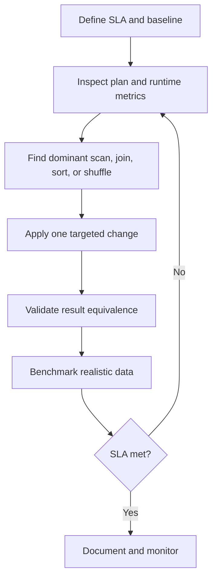
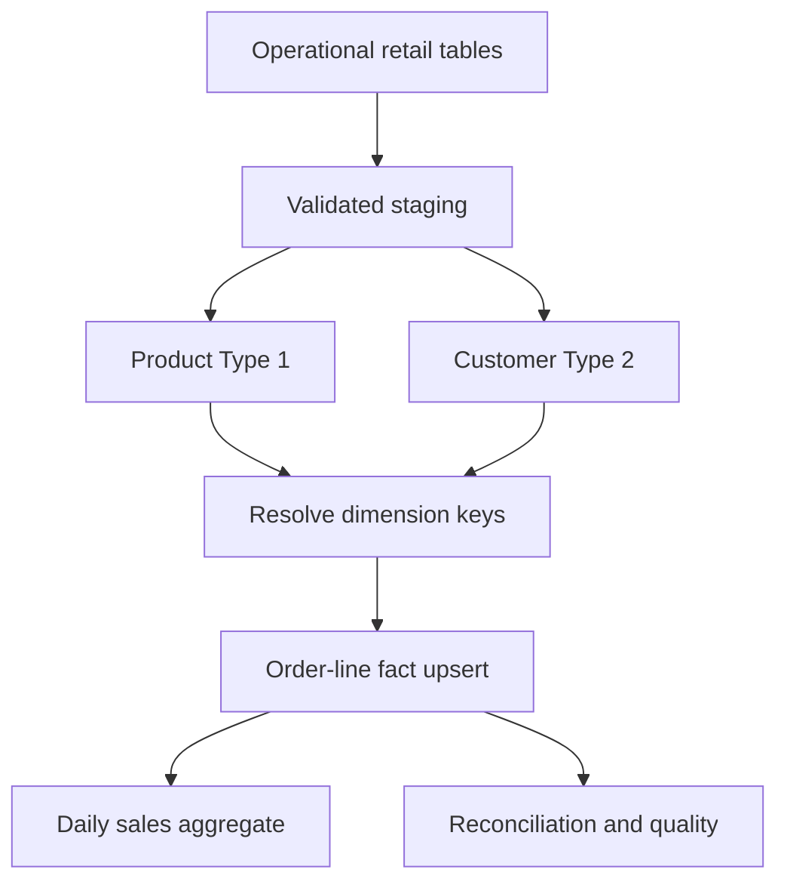
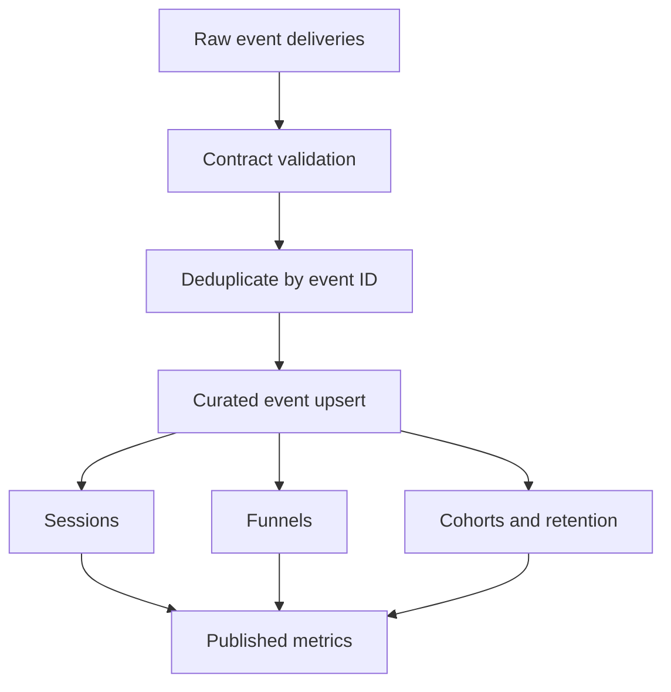

---
aliases:
  - DE SQL Week 8
  - SQL Interview Capstone Week 8
tags:
  - data-engineering
  - sql
  - interview-preparation
  - query-optimization
  - data-quality
  - window-functions
  - retail-warehouse
  - event-analytics
  - portfolio-project
  - week-8
status: active
difficulty: beginner-to-interview-ready
study_time: 7 days
created: 2026-08-16
previous: '[[Data-Engineer-SQL-Week-7-Obsidian]]'
---

# Data Engineer SQL — Week 8 Detailed Notes

> [!info] Week 8 goal
> Convert seven weeks of SQL knowledge into interview performance: understand the requirement, identify the grain, write correct SQL, test edge cases, explain trade-offs, and design reliable data pipelines.

## Obsidian navigation

- [[#Day 1 — Easy interview problems under time limits|Day 1 — Easy timed problems]]
- [[#Day 2 — Medium join and aggregation problems|Day 2 — Joins and aggregations]]
- [[#Day 3 — Window-function interview problems|Day 3 — Window functions]]
- [[#Day 4 — Data-quality and pipeline scenarios|Day 4 — Data quality]]
- [[#Day 5 — Query optimization and design interviews|Day 5 — Optimization and design]]
- [[#Day 6 — Mini-project 1: Retail warehouse transformations|Day 6 — Retail warehouse project]]
- [[#Day 7 — Mini-project 2: Event analytics and final mock interview|Day 7 — Event analytics and mock]]
- [[#Week 8 rapid-fire interview questions|Rapid-fire questions]]
- [[#Week 8 final practice set|Final practice]]
- [[#Week 8 one-page interview cheat sheet|Cheat sheet]]
- [[#Course completion checklist|Course completion]]

## Progress tracker

- [ ] Day 1 completed
- [ ] Day 2 completed
- [ ] Day 3 completed
- [ ] Day 4 completed
- [ ] Day 5 completed
- [ ] Retail warehouse project completed
- [ ] Event analytics project completed
- [ ] Final mock interview scored
- [ ] Week 8 completion test passed

> [!warning] Dialect and platform note
> Examples use PostgreSQL-style SQL. Date functions, intervals, `FILTER`, `MERGE`, `EXPLAIN`, indexes, partitions, clustering, and error-handling syntax vary across PostgreSQL, SQL Server, MySQL, Snowflake, BigQuery, Spark SQL, and Databricks SQL. Explain the logical pattern first, then adapt the syntax to the interviewer's platform.

**Level:** Beginner to interview-ready  
**Duration:** 7 study days  
**Daily time:** 90–120 minutes  
**Primary dialect:** PostgreSQL-style SQL  
**Prerequisite:** [[Data-Engineer-SQL-Week-7-Obsidian|Week 7 — Warehouse loading patterns]]

## Week 8 learning outcomes

By the end of this week, you should be able to:

- Clarify ambiguous requirements before writing SQL.
- State the input and output grain of a query.
- Solve easy SQL questions within 8–12 minutes.
- Solve medium join, aggregation, and window questions within 15–25 minutes.
- Preserve outer-join rows and avoid accidental many-to-many multiplication.
- Choose deterministic ranking and deduplication rules.
- Build SQL data-quality checks and reconciliation queries.
- Diagnose slow SQL from symptoms and execution plans.
- Explain indexes, partitioning, clustering, statistics, skew, and shuffles.
- Design incremental, idempotent, observable transformations.
- Build a small retail warehouse transformation flow.
- Build event deduplication, session, funnel, and retention queries.
- Communicate assumptions, edge cases, validation, and performance trade-offs.

---

# Interview method — use this for every SQL problem

## The GRAIN framework

| Step | Interview action | Example |
|---|---|---|
| **G — Goal** | Restate the requested metric | “Monthly completed revenue by customer.” |
| **R — Row grain** | State one row in each input and output | “One item per order-product; output one customer-month.” |
| **A — Assumptions** | Clarify status, NULLs, ties, time zone | “Should refunded orders be excluded?” |
| **I — Implementation** | Build in small CTEs | Filter → aggregate items → join → final aggregate |
| **N — Numbers and tests** | Test counts, duplicates, totals, boundaries | Compare distinct orders and revenue before/after join |

> [!tip] Strong opening sentence
> “Before I write SQL, I want to confirm the output grain and how to handle ties, NULLs, duplicate source rows, and boundary timestamps.”

## Recommended time allocation

For a 20-minute coding question:

| Minutes | Activity |
|---:|---|
| 0–2 | Clarify requirement and output columns |
| 2–4 | Identify grain, keys, and filters |
| 4–13 | Write the query in stages |
| 13–17 | Test NULLs, ties, duplicates, and empty groups |
| 17–20 | Explain performance and alternatives |

## Correctness checklist

- [ ] Does each output row have the requested grain?
- [ ] Can any join multiply rows?
- [ ] Is the outer-join filter in the correct place?
- [ ] Are `NULL` values handled deliberately?
- [ ] Are status and date boundaries explicit?
- [ ] Is ranking deterministic?
- [ ] Is integer division prevented?
- [ ] Are divide-by-zero cases protected?
- [ ] Does the query preserve customers/dates with zero activity if required?
- [ ] Can the result be reconciled to a simpler control total?

## What interviewers evaluate

Correct SQL matters, but interviewers also look for:

1. Requirement clarification
2. Data-model understanding
3. Incremental reasoning
4. Edge-case awareness
5. Readable structure and naming
6. Validation strategy
7. Performance awareness
8. Clear communication

---

# Practice setup

Use the following schema for Days 1–6. It intentionally contains cancelled orders, missing payments, duplicate-like events, and customers without orders.

## Retail tables

```sql
CREATE TABLE customers (
    customer_id       BIGINT PRIMARY KEY,
    customer_name     VARCHAR(100) NOT NULL,
    email             VARCHAR(200),
    city              VARCHAR(100),
    signup_date       DATE NOT NULL,
    updated_at        TIMESTAMP NOT NULL
);

CREATE TABLE products (
    product_id        BIGINT PRIMARY KEY,
    product_name      VARCHAR(150) NOT NULL,
    category          VARCHAR(100) NOT NULL,
    unit_price        DECIMAL(12,2) NOT NULL,
    is_active         BOOLEAN NOT NULL DEFAULT TRUE
);

CREATE TABLE orders (
    order_id          BIGINT PRIMARY KEY,
    customer_id       BIGINT NOT NULL REFERENCES customers(customer_id),
    order_timestamp   TIMESTAMP NOT NULL,
    order_status      VARCHAR(30) NOT NULL,
    updated_at        TIMESTAMP NOT NULL
);

CREATE TABLE order_items (
    order_id          BIGINT NOT NULL REFERENCES orders(order_id),
    line_number       INTEGER NOT NULL,
    product_id        BIGINT NOT NULL REFERENCES products(product_id),
    quantity          INTEGER NOT NULL,
    unit_price        DECIMAL(12,2) NOT NULL,
    discount_amount   DECIMAL(12,2) NOT NULL DEFAULT 0,
    PRIMARY KEY (order_id, line_number)
);

CREATE TABLE payments (
    payment_id        BIGINT PRIMARY KEY,
    order_id          BIGINT NOT NULL REFERENCES orders(order_id),
    payment_timestamp TIMESTAMP NOT NULL,
    payment_status    VARCHAR(30) NOT NULL,
    amount            DECIMAL(12,2) NOT NULL
);
```

## Sample data

```sql
INSERT INTO customers VALUES
(1, 'Aarav Sharma', 'aarav@example.com', 'Pune',   '2026-01-03', '2026-08-01 09:00:00'),
(2, 'Diya Patel',   'diya@example.com',  'Mumbai', '2026-01-10', '2026-08-01 09:00:00'),
(3, 'Kabir Singh',  NULL,                'Pune',   '2026-02-15', '2026-08-01 09:00:00'),
(4, 'Meera Iyer',   'meera@example.com', 'Delhi',  '2026-03-20', '2026-08-01 09:00:00'),
(5, 'Rohan Joshi',  'rohan@example.com', 'Pune',   '2026-04-05', '2026-08-01 09:00:00'),
(6, 'Sara Khan',    'sara@example.com',  'Mumbai', '2026-05-01', '2026-08-01 09:00:00');

INSERT INTO products VALUES
(101, 'Laptop',      'Electronics', 65000.00, TRUE),
(102, 'Headphones',  'Electronics',  3000.00, TRUE),
(103, 'Desk',        'Furniture',   12000.00, TRUE),
(104, 'Chair',       'Furniture',    8000.00, TRUE),
(105, 'SQL Book',    'Books',         900.00, TRUE),
(106, 'Old Charger', 'Electronics',   500.00, FALSE);

INSERT INTO orders VALUES
(1001, 1, '2026-06-01 10:00:00', 'COMPLETED', '2026-06-01 12:00:00'),
(1002, 1, '2026-06-15 11:30:00', 'COMPLETED', '2026-06-15 13:00:00'),
(1003, 2, '2026-06-20 09:15:00', 'CANCELLED', '2026-06-20 10:00:00'),
(1004, 2, '2026-07-02 14:00:00', 'COMPLETED', '2026-07-02 16:00:00'),
(1005, 3, '2026-07-05 18:30:00', 'COMPLETED', '2026-07-05 19:00:00'),
(1006, 1, '2026-07-10 08:00:00', 'REFUNDED',  '2026-07-12 08:00:00'),
(1007, 4, '2026-07-15 12:00:00', 'COMPLETED', '2026-07-15 12:30:00'),
(1008, 4, '2026-07-15 12:00:00', 'COMPLETED', '2026-07-15 12:40:00'),
(1009, 2, '2026-08-01 10:00:00', 'PENDING',   '2026-08-01 10:00:00');

INSERT INTO order_items VALUES
(1001, 1, 101, 1, 65000.00, 5000.00),
(1001, 2, 102, 1,  3000.00,    0.00),
(1002, 1, 105, 2,   900.00,  100.00),
(1003, 1, 104, 1,  8000.00,    0.00),
(1004, 1, 103, 1, 12000.00, 1000.00),
(1004, 2, 104, 2,  8000.00,  500.00),
(1005, 1, 105, 1,   900.00,    0.00),
(1006, 1, 102, 1,  3000.00,    0.00),
(1007, 1, 104, 1,  8000.00,    0.00),
(1008, 1, 105, 3,   900.00,    0.00),
(1009, 1, 101, 1, 65000.00,    0.00);

INSERT INTO payments VALUES
(9001, 1001, '2026-06-01 10:05:00', 'SUCCESS', 63000.00),
(9002, 1002, '2026-06-15 11:35:00', 'SUCCESS',  1700.00),
(9003, 1003, '2026-06-20 09:20:00', 'FAILED',   8000.00),
(9004, 1004, '2026-07-02 14:05:00', 'SUCCESS', 27000.00),
(9005, 1005, '2026-07-05 18:35:00', 'SUCCESS',   900.00),
(9006, 1006, '2026-07-10 08:05:00', 'SUCCESS',  3000.00),
(9007, 1006, '2026-07-12 08:05:00', 'REFUNDED', 3000.00),
(9008, 1007, '2026-07-15 12:05:00', 'SUCCESS',  8000.00);
```

## Standard revenue definition

Unless a problem states otherwise:

```text
line_revenue = quantity * unit_price - discount_amount
order revenue includes only COMPLETED orders
```

> [!warning] Important grain difference
> `orders` has one row per order. `order_items` has one row per order line. `payments` can have multiple rows per order. Joining items and payments directly can create item × payment multiplication.

---

# Day 1 — Easy interview problems under time limits

## Day 1 target

- Solve each question in 8–12 minutes.
- State output grain before coding.
- Write readable SQL without rushing into unnecessary CTEs.
- Spend the final two minutes checking edge cases.

## 1.1 Warm-up: completed order count by customer

**Requirement:** Return each customer who has at least one completed order and the number of completed orders.

**Output grain:** One row per customer.

```sql
SELECT c.customer_id,
       c.customer_name,
       COUNT(*) AS completed_order_count
FROM customers AS c
JOIN orders AS o
  ON o.customer_id = c.customer_id
WHERE o.order_status = 'COMPLETED'
GROUP BY c.customer_id,
         c.customer_name
ORDER BY completed_order_count DESC,
         c.customer_id;
```

Why `COUNT(*)` works: after filtering, each joined row represents one completed order. If another one-to-many table were joined, this assumption might stop being true.

## 1.2 Include customers with zero completed orders

```sql
SELECT c.customer_id,
       c.customer_name,
       COUNT(o.order_id) AS completed_order_count
FROM customers AS c
LEFT JOIN orders AS o
  ON o.customer_id = c.customer_id
 AND o.order_status = 'COMPLETED'
GROUP BY c.customer_id,
         c.customer_name
ORDER BY c.customer_id;
```

> [!danger] Common mistake
> Putting `o.order_status = 'COMPLETED'` in `WHERE` removes unmatched rows and effectively changes the `LEFT JOIN` into an inner join.

Use `COUNT(o.order_id)`, not `COUNT(*)`. The preserved customer row exists even when `o.order_id` is `NULL`.

## 1.3 Customers without any orders

```sql
SELECT c.customer_id,
       c.customer_name
FROM customers AS c
WHERE NOT EXISTS (
    SELECT 1
    FROM orders AS o
    WHERE o.customer_id = c.customer_id
)
ORDER BY c.customer_id;
```

`NOT EXISTS` expresses an anti-join and is safe when nullable values exist in the child table. Be cautious with `NOT IN` when its subquery can return `NULL`.

## 1.4 Product line revenue

```sql
SELECT oi.order_id,
       oi.line_number,
       oi.product_id,
       oi.quantity * oi.unit_price - oi.discount_amount AS line_revenue
FROM order_items AS oi
ORDER BY oi.order_id,
         oi.line_number;
```

Clarify whether the discount is per unit or per line. The schema here defines it as a line-level amount.

## 1.5 Completed revenue by month

```sql
SELECT DATE_TRUNC('month', o.order_timestamp) AS order_month,
       SUM(oi.quantity * oi.unit_price - oi.discount_amount) AS revenue
FROM orders AS o
JOIN order_items AS oi
  ON oi.order_id = o.order_id
WHERE o.order_status = 'COMPLETED'
GROUP BY DATE_TRUNC('month', o.order_timestamp)
ORDER BY order_month;
```

The output is one row per calendar month. In a global system, confirm the business time zone before deriving the month.

## 1.6 Customers whose names begin with a letter

```sql
SELECT customer_id,
       customer_name
FROM customers
WHERE customer_name LIKE 'A%'
ORDER BY customer_id;
```

Case sensitivity differs by engine and collation. PostgreSQL supports `ILIKE` for case-insensitive matching.

## 1.7 Replace missing email only in the result

```sql
SELECT customer_id,
       customer_name,
       COALESCE(email, 'EMAIL_MISSING') AS email_display
FROM customers
ORDER BY customer_id;
```

`COALESCE` does not update stored data; it creates a result value.

## 1.8 Find duplicate email addresses

```sql
SELECT LOWER(TRIM(email)) AS normalized_email,
       COUNT(*) AS row_count
FROM customers
WHERE email IS NOT NULL
GROUP BY LOWER(TRIM(email))
HAVING COUNT(*) > 1;
```

The normalization rule is part of the business definition. Decide whether case and surrounding spaces are meaningful before applying this logic.

## 1.9 Orders greater than the average order value

First calculate one value per order; then compare with the average of those order values.

```sql
WITH order_values AS (
    SELECT oi.order_id,
           SUM(oi.quantity * oi.unit_price - oi.discount_amount) AS order_value
    FROM order_items AS oi
    GROUP BY oi.order_id
)
SELECT order_id,
       order_value
FROM order_values
WHERE order_value > (
    SELECT AVG(order_value)
    FROM order_values
)
ORDER BY order_value DESC,
         order_id;
```

Do not compare each order line with the average line amount when the requirement says order value.

## 1.10 Latest order timestamp for every customer

```sql
SELECT c.customer_id,
       c.customer_name,
       MAX(o.order_timestamp) AS latest_order_timestamp
FROM customers AS c
LEFT JOIN orders AS o
  ON o.customer_id = c.customer_id
GROUP BY c.customer_id,
         c.customer_name
ORDER BY c.customer_id;
```

This returns the timestamp only. If the interviewer asks for all columns from the latest order, use a window function or a lateral/correlated lookup with a deterministic tie-breaker.

## 1.11 Conditional counts in one query

```sql
SELECT customer_id,
       COUNT(*) AS total_orders,
       SUM(CASE WHEN order_status = 'COMPLETED' THEN 1 ELSE 0 END) AS completed_orders,
       SUM(CASE WHEN order_status = 'CANCELLED' THEN 1 ELSE 0 END) AS cancelled_orders
FROM orders
GROUP BY customer_id
ORDER BY customer_id;
```

PostgreSQL alternative:

```sql
SELECT customer_id,
       COUNT(*) AS total_orders,
       COUNT(*) FILTER (WHERE order_status = 'COMPLETED') AS completed_orders,
       COUNT(*) FILTER (WHERE order_status = 'CANCELLED') AS cancelled_orders
FROM orders
GROUP BY customer_id;
```

## 1.12 Safe percentage calculation

```sql
SELECT customer_id,
       100.0 * SUM(CASE WHEN order_status = 'COMPLETED' THEN 1 ELSE 0 END)
       / NULLIF(COUNT(*), 0) AS completion_percentage
FROM orders
GROUP BY customer_id;
```

- `100.0` forces decimal arithmetic on many engines.
- `NULLIF(COUNT(*), 0)` protects against division by zero, though each returned group here has at least one row.

## Day 1 self-test

Set a 45-minute timer and solve without viewing the notes:

1. Return active product count by category.
2. Return customers with a missing email.
3. Calculate total quantity per product.
4. Return the five most expensive active products.
5. Calculate completed order revenue by city.
6. Return customers with no completed orders.

## Day 1 review checklist

- [ ] I distinguished `WHERE` from `HAVING`.
- [ ] I preserved zero-count customers correctly.
- [ ] I used `COUNT(column)` after an outer join.
- [ ] I calculated at the requested grain.
- [ ] I handled `NULL` and division deliberately.
- [ ] I finished six self-test problems in 45 minutes.

---

# Day 2 — Medium join and aggregation problems

## Day 2 target

- Solve each question in 15–25 minutes.
- Control grain before joining several one-to-many tables.
- Use pre-aggregation to prevent double counting.
- Explain why the query is correct, not only what it returns.

## 2.1 Join cardinality matrix

| Join | Expected relationship | Multiplication risk |
|---|---|---|
| `customers → orders` | One-to-many | Expected order expansion |
| `orders → order_items` | One-to-many | Expected line expansion |
| `orders → payments` | One-to-many | Expected payment expansion |
| `order_items ↔ payments` through order | Many-to-many per order | High; pre-aggregate first |

Before joining, write the grain beside each CTE:

```text
order_totals: one row per order
payment_totals: one row per order
final result: one row per order
```

## 2.2 Order value and successful payment amount

**Requirement:** Return every order, its calculated item value, and successful payment amount without multiplying either measure.

```sql
WITH order_totals AS (
    SELECT order_id,
           SUM(quantity * unit_price - discount_amount) AS order_value
    FROM order_items
    GROUP BY order_id
),
payment_totals AS (
    SELECT order_id,
           SUM(CASE WHEN payment_status = 'SUCCESS' THEN amount ELSE 0 END)
               AS successful_payment_amount
    FROM payments
    GROUP BY order_id
)
SELECT o.order_id,
       o.order_status,
       COALESCE(ot.order_value, 0) AS order_value,
       COALESCE(pt.successful_payment_amount, 0) AS successful_payment_amount
FROM orders AS o
LEFT JOIN order_totals AS ot
  ON ot.order_id = o.order_id
LEFT JOIN payment_totals AS pt
  ON pt.order_id = o.order_id
ORDER BY o.order_id;
```

> [!danger] Incorrect pattern
> Joining raw `order_items` and raw `payments`, then summing, multiplies every item by every payment for the same order.

## 2.3 Unpaid or underpaid completed orders

```sql
WITH order_totals AS (
    SELECT order_id,
           SUM(quantity * unit_price - discount_amount) AS order_value
    FROM order_items
    GROUP BY order_id
),
successful_payments AS (
    SELECT order_id,
           SUM(amount) AS paid_amount
    FROM payments
    WHERE payment_status = 'SUCCESS'
    GROUP BY order_id
)
SELECT o.order_id,
       ot.order_value,
       COALESCE(sp.paid_amount, 0) AS paid_amount,
       ot.order_value - COALESCE(sp.paid_amount, 0) AS outstanding_amount
FROM orders AS o
JOIN order_totals AS ot
  ON ot.order_id = o.order_id
LEFT JOIN successful_payments AS sp
  ON sp.order_id = o.order_id
WHERE o.order_status = 'COMPLETED'
  AND COALESCE(sp.paid_amount, 0) < ot.order_value
ORDER BY outstanding_amount DESC,
         o.order_id;
```

Clarify whether refunds reduce successful payments and whether partial payments are allowed. The query uses only `SUCCESS` records because that is the stated rule.

## 2.4 Category revenue by month

**Output grain:** One row per month-category.

```sql
SELECT DATE_TRUNC('month', o.order_timestamp) AS order_month,
       p.category,
       SUM(oi.quantity * oi.unit_price - oi.discount_amount) AS revenue
FROM orders AS o
JOIN order_items AS oi
  ON oi.order_id = o.order_id
JOIN products AS p
  ON p.product_id = oi.product_id
WHERE o.order_status = 'COMPLETED'
GROUP BY DATE_TRUNC('month', o.order_timestamp),
         p.category
ORDER BY order_month,
         p.category;
```

## 2.5 Customers above their city's average completed revenue

```sql
WITH customer_revenue AS (
    SELECT c.customer_id,
           c.customer_name,
           c.city,
           COALESCE(SUM(
               CASE
                   WHEN o.order_status = 'COMPLETED'
                   THEN oi.quantity * oi.unit_price - oi.discount_amount
                   ELSE 0
               END
           ), 0) AS completed_revenue
    FROM customers AS c
    LEFT JOIN orders AS o
      ON o.customer_id = c.customer_id
    LEFT JOIN order_items AS oi
      ON oi.order_id = o.order_id
    GROUP BY c.customer_id,
             c.customer_name,
             c.city
),
city_average AS (
    SELECT city,
           AVG(completed_revenue) AS avg_customer_revenue
    FROM customer_revenue
    GROUP BY city
)
SELECT cr.customer_id,
       cr.customer_name,
       cr.city,
       cr.completed_revenue,
       ca.avg_customer_revenue
FROM customer_revenue AS cr
JOIN city_average AS ca
  ON ca.city = cr.city
WHERE cr.completed_revenue > ca.avg_customer_revenue
ORDER BY cr.city,
         cr.completed_revenue DESC;
```

Ask whether customers with zero revenue should participate in the city average. This solution includes them.

## 2.6 Product contribution percentage within category

```sql
WITH product_revenue AS (
    SELECT p.category,
           p.product_id,
           p.product_name,
           SUM(oi.quantity * oi.unit_price - oi.discount_amount) AS revenue
    FROM products AS p
    JOIN order_items AS oi
      ON oi.product_id = p.product_id
    JOIN orders AS o
      ON o.order_id = oi.order_id
    WHERE o.order_status = 'COMPLETED'
    GROUP BY p.category,
             p.product_id,
             p.product_name
),
category_revenue AS (
    SELECT category,
           SUM(revenue) AS total_category_revenue
    FROM product_revenue
    GROUP BY category
)
SELECT pr.category,
       pr.product_id,
       pr.product_name,
       pr.revenue,
       ROUND(
           100.0 * pr.revenue / NULLIF(cr.total_category_revenue, 0),
           2
       ) AS category_revenue_percentage
FROM product_revenue AS pr
JOIN category_revenue AS cr
  ON cr.category = pr.category
ORDER BY pr.category,
         category_revenue_percentage DESC,
         pr.product_id;
```

A window-function solution will be shorter after Day 3.

## 2.7 Customers who bought from every active category

This is relational division.

```sql
SELECT c.customer_id,
       c.customer_name
FROM customers AS c
JOIN orders AS o
  ON o.customer_id = c.customer_id
 AND o.order_status = 'COMPLETED'
JOIN order_items AS oi
  ON oi.order_id = o.order_id
JOIN products AS p
  ON p.product_id = oi.product_id
 AND p.is_active = TRUE
GROUP BY c.customer_id,
         c.customer_name
HAVING COUNT(DISTINCT p.category) = (
    SELECT COUNT(DISTINCT category)
    FROM products
    WHERE is_active = TRUE
);
```

Alternative: double `NOT EXISTS`. Discuss what should happen when there are zero active categories; the two formulations can have different practical interpretations.

## 2.8 Pairs of products bought together

```sql
SELECT oi1.product_id AS product_1,
       oi2.product_id AS product_2,
       COUNT(DISTINCT oi1.order_id) AS orders_together
FROM order_items AS oi1
JOIN order_items AS oi2
  ON oi2.order_id = oi1.order_id
 AND oi1.product_id < oi2.product_id
JOIN orders AS o
  ON o.order_id = oi1.order_id
WHERE o.order_status = 'COMPLETED'
GROUP BY oi1.product_id,
         oi2.product_id
ORDER BY orders_together DESC,
         product_1,
         product_2;
```

The `<` condition removes self-pairs and reversed duplicates such as `(A,B)` and `(B,A)`.

## 2.9 Customers with activity in both June and July

```sql
SELECT customer_id
FROM orders
WHERE order_status = 'COMPLETED'
  AND order_timestamp >= TIMESTAMP '2026-06-01 00:00:00'
  AND order_timestamp <  TIMESTAMP '2026-08-01 00:00:00'
GROUP BY customer_id
HAVING COUNT(DISTINCT DATE_TRUNC('month', order_timestamp)) = 2;
```

This works because the filtered interval contains exactly the two required months.

## 2.10 Reconciliation after a join

Before trusting a multi-table result, compare controls:

```sql
-- Control count: completed orders
SELECT COUNT(*) AS completed_orders
FROM orders
WHERE order_status = 'COMPLETED';
```

```sql
-- Each completed order should appear once after order-level aggregation
WITH order_totals AS (
    SELECT order_id,
           SUM(quantity * unit_price - discount_amount) AS order_value
    FROM order_items
    GROUP BY order_id
)
SELECT COUNT(*) AS joined_orders,
       COUNT(DISTINCT o.order_id) AS distinct_joined_orders,
       SUM(ot.order_value) AS total_revenue
FROM orders AS o
JOIN order_totals AS ot
  ON ot.order_id = o.order_id
WHERE o.order_status = 'COMPLETED';
```

If `joined_orders` and `distinct_joined_orders` differ, the supposedly order-grain query contains duplicates.

## Day 2 interview prompts

Practice answering aloud:

1. Why did you aggregate payments before joining items?
2. Which customers are included in the city average?
3. Why is the date interval half-open?
4. What happens when a completed order has no items?
5. What happens when a product appears twice in one order?
6. Which totals would you reconcile before deploying this query?

## Day 2 review checklist

- [ ] I wrote down each table's grain.
- [ ] I identified one-to-many and many-to-many paths.
- [ ] I pre-aggregated independent child measures.
- [ ] I used half-open date boundaries.
- [ ] I explained inclusion and exclusion rules.
- [ ] I reconciled counts and amounts.

---

# Day 3 — Window-function interview problems

## Day 3 target

- Choose the correct `PARTITION BY` and `ORDER BY`.
- Explain the difference between filtering rows and calculating over rows.
- Handle ties and deterministic ordering.
- Solve ranking, comparison, running total, moving average, and gaps-and-islands problems.

## 3.1 Window-function mental model

```sql
window_function(...) OVER (
    PARTITION BY group_columns
    ORDER BY sequence_columns
    ROWS BETWEEN ...
)
```

Ask three questions:

1. **Which rows belong together?** → `PARTITION BY`
2. **In what sequence?** → `ORDER BY`
3. **Which neighboring rows are visible?** → window frame

Unlike `GROUP BY`, a window function normally keeps the input row grain.

## 3.2 Latest order for each customer

**Output grain:** At most one order per customer.

```sql
WITH ranked_orders AS (
    SELECT o.*,
           ROW_NUMBER() OVER (
               PARTITION BY customer_id
               ORDER BY order_timestamp DESC,
                        order_id DESC
           ) AS rn
    FROM orders AS o
)
SELECT order_id,
       customer_id,
       order_timestamp,
       order_status
FROM ranked_orders
WHERE rn = 1
ORDER BY customer_id;
```

The `order_id` tie-breaker makes the choice deterministic when two orders have the same timestamp.

If all tied latest orders must be returned, use `RANK()` or compare to `MAX(order_timestamp)` instead.

## 3.3 Top two products by completed revenue in each category

```sql
WITH product_revenue AS (
    SELECT p.category,
           p.product_id,
           p.product_name,
           SUM(oi.quantity * oi.unit_price - oi.discount_amount) AS revenue
    FROM products AS p
    JOIN order_items AS oi
      ON oi.product_id = p.product_id
    JOIN orders AS o
      ON o.order_id = oi.order_id
    WHERE o.order_status = 'COMPLETED'
    GROUP BY p.category,
             p.product_id,
             p.product_name
),
ranked AS (
    SELECT pr.*,
           DENSE_RANK() OVER (
               PARTITION BY category
               ORDER BY revenue DESC
           ) AS revenue_rank
    FROM product_revenue AS pr
)
SELECT category,
       product_id,
       product_name,
       revenue,
       revenue_rank
FROM ranked
WHERE revenue_rank <= 2
ORDER BY category,
         revenue_rank,
         product_id;
```

Tie policy:

| Function | Meaning of “top 2” |
|---|---|
| `ROW_NUMBER()` | Exactly two rows per category, using a tie-breaker |
| `RANK()` | Include ties, with rank gaps |
| `DENSE_RANK()` | Include the top two distinct revenue values |

## 3.4 Customer revenue contribution within city

```sql
WITH customer_revenue AS (
    SELECT c.customer_id,
           c.customer_name,
           c.city,
           SUM(oi.quantity * oi.unit_price - oi.discount_amount) AS revenue
    FROM customers AS c
    JOIN orders AS o
      ON o.customer_id = c.customer_id
     AND o.order_status = 'COMPLETED'
    JOIN order_items AS oi
      ON oi.order_id = o.order_id
    GROUP BY c.customer_id,
             c.customer_name,
             c.city
)
SELECT customer_id,
       customer_name,
       city,
       revenue,
       ROUND(
           100.0 * revenue
           / NULLIF(SUM(revenue) OVER (PARTITION BY city), 0),
           2
       ) AS city_revenue_percentage
FROM customer_revenue
ORDER BY city,
         city_revenue_percentage DESC,
         customer_id;
```

The first stage creates one row per customer. The window then calculates the city total without collapsing those customer rows.

## 3.5 Running monthly revenue

```sql
WITH monthly_revenue AS (
    SELECT DATE_TRUNC('month', o.order_timestamp) AS order_month,
           SUM(oi.quantity * oi.unit_price - oi.discount_amount) AS revenue
    FROM orders AS o
    JOIN order_items AS oi
      ON oi.order_id = o.order_id
    WHERE o.order_status = 'COMPLETED'
    GROUP BY DATE_TRUNC('month', o.order_timestamp)
)
SELECT order_month,
       revenue,
       SUM(revenue) OVER (
           ORDER BY order_month
           ROWS BETWEEN UNBOUNDED PRECEDING AND CURRENT ROW
       ) AS cumulative_revenue
FROM monthly_revenue
ORDER BY order_month;
```

Aggregate to month first. Running a window over raw lines would produce line-grain results.

## 3.6 Month-over-month growth

```sql
WITH monthly_revenue AS (
    SELECT DATE_TRUNC('month', o.order_timestamp) AS order_month,
           SUM(oi.quantity * oi.unit_price - oi.discount_amount) AS revenue
    FROM orders AS o
    JOIN order_items AS oi
      ON oi.order_id = o.order_id
    WHERE o.order_status = 'COMPLETED'
    GROUP BY DATE_TRUNC('month', o.order_timestamp)
),
with_previous AS (
    SELECT order_month,
           revenue,
           LAG(revenue) OVER (ORDER BY order_month) AS previous_month_revenue
    FROM monthly_revenue
)
SELECT order_month,
       revenue,
       previous_month_revenue,
       ROUND(
           100.0 * (revenue - previous_month_revenue)
           / NULLIF(previous_month_revenue, 0),
           2
       ) AS growth_percentage
FROM with_previous
ORDER BY order_month;
```

> [!warning] Missing-month issue
> `LAG` means previous returned row, not necessarily previous calendar month. Join to a calendar table and fill missing months when calendar continuity matters.

## 3.7 Three-month moving average

```sql
WITH monthly_revenue AS (
    SELECT DATE_TRUNC('month', o.order_timestamp) AS order_month,
           SUM(oi.quantity * oi.unit_price - oi.discount_amount) AS revenue
    FROM orders AS o
    JOIN order_items AS oi
      ON oi.order_id = o.order_id
    WHERE o.order_status = 'COMPLETED'
    GROUP BY DATE_TRUNC('month', o.order_timestamp)
)
SELECT order_month,
       revenue,
       AVG(revenue) OVER (
           ORDER BY order_month
           ROWS BETWEEN 2 PRECEDING AND CURRENT ROW
       ) AS moving_avg_3_rows
FROM monthly_revenue
ORDER BY order_month;
```

This is a three-row average. It is a three-calendar-month average only when the monthly dataset has one row for every month.

## 3.8 First and second order dates

```sql
WITH sequenced AS (
    SELECT customer_id,
           order_id,
           order_timestamp,
           ROW_NUMBER() OVER (
               PARTITION BY customer_id
               ORDER BY order_timestamp,
                        order_id
           ) AS order_number
    FROM orders
)
SELECT customer_id,
       MAX(CASE WHEN order_number = 1 THEN order_timestamp END) AS first_order_at,
       MAX(CASE WHEN order_number = 2 THEN order_timestamp END) AS second_order_at
FROM sequenced
GROUP BY customer_id
ORDER BY customer_id;
```

The conditional aggregation pivots two sequenced rows into one customer row.

## 3.9 Time between customer orders

```sql
WITH order_gaps AS (
    SELECT customer_id,
           order_id,
           order_timestamp,
           LAG(order_timestamp) OVER (
               PARTITION BY customer_id
               ORDER BY order_timestamp,
                        order_id
           ) AS previous_order_timestamp
    FROM orders
)
SELECT customer_id,
       order_id,
       order_timestamp,
       previous_order_timestamp,
       order_timestamp - previous_order_timestamp AS time_since_previous_order
FROM order_gaps
ORDER BY customer_id,
         order_timestamp,
         order_id;
```

Subtraction syntax varies by engine. Some platforms use `DATEDIFF` or `TIMESTAMP_DIFF`.

## 3.10 Consecutive active days: gaps and islands

Assume `customer_daily_activity(customer_id, activity_date)` may contain duplicates.

```sql
WITH distinct_days AS (
    SELECT DISTINCT customer_id,
                    activity_date
    FROM customer_daily_activity
),
numbered AS (
    SELECT customer_id,
           activity_date,
           ROW_NUMBER() OVER (
               PARTITION BY customer_id
               ORDER BY activity_date
           ) AS rn
    FROM distinct_days
),
grouped AS (
    SELECT customer_id,
           activity_date,
           activity_date - (rn * INTERVAL '1 day') AS island_key
    FROM numbered
)
SELECT customer_id,
       MIN(activity_date) AS streak_start,
       MAX(activity_date) AS streak_end,
       COUNT(*) AS streak_days
FROM grouped
GROUP BY customer_id,
         island_key
ORDER BY customer_id,
         streak_start;
```

Consecutive dates share the same shifted `island_key`.

## 3.11 Window frame trap

With duplicate sort values, the engine's default frame may group peers. Use an explicit `ROWS` frame for row-by-row accumulation:

```sql
SUM(amount) OVER (
    PARTITION BY customer_id
    ORDER BY event_timestamp,
             event_id
    ROWS BETWEEN UNBOUNDED PRECEDING AND CURRENT ROW
)
```

The unique tie-breaker also ensures repeatable sequence.

## 3.12 Filtering window results

Standard SQL cannot normally reference a window alias in the same query's `WHERE`, because `WHERE` is evaluated before window functions.

```sql
WITH ranked AS (
    SELECT o.*,
           ROW_NUMBER() OVER (
               PARTITION BY customer_id
               ORDER BY order_timestamp DESC,
                        order_id DESC
           ) AS rn
    FROM orders AS o
)
SELECT *
FROM ranked
WHERE rn = 1;
```

Some warehouses support `QUALIFY`:

```sql
SELECT o.*
FROM orders AS o
QUALIFY ROW_NUMBER() OVER (
    PARTITION BY customer_id
    ORDER BY order_timestamp DESC,
             order_id DESC
) = 1;
```

## Day 3 timed set

Give yourself 75 minutes:

1. Top three customers by revenue in each city.
2. Latest successful payment per order.
3. Running order count per customer.
4. Difference between each order value and the customer's average.
5. Month-over-month order-count change.
6. Longest customer activity streak.

## Day 3 review checklist

- [ ] I chose the correct partition.
- [ ] I used a deterministic order.
- [ ] I selected the requested tie policy.
- [ ] I aggregated to the intended grain before the window.
- [ ] I used an explicit frame when needed.
- [ ] I handled missing calendar periods.

---

# Day 4 — Data-quality and pipeline scenarios

## Day 4 target

- Translate business expectations into executable rules.
- Separate rejected records from infrastructure failures.
- Design audit, reconciliation, and observability controls.
- Explain safe incremental processing and recovery.

## 4.1 Data-quality dimensions

| Dimension | Question | Example rule |
|---|---|---|
| Completeness | Are required values present? | `order_id IS NOT NULL` |
| Uniqueness | Is each key represented correctly? | one row per `order_id` |
| Validity | Does a value follow its domain? | status in approved list |
| Accuracy | Does the value reflect reality? | payment matches provider |
| Consistency | Do related values agree? | shipped timestamp after order timestamp |
| Referential integrity | Does the referenced entity exist? | item product exists |
| Timeliness | Is data available on schedule? | source delay below 30 minutes |
| Freshness | How old is the newest data? | max event time within SLA |

## 4.2 Profiling before writing rules

```sql
SELECT COUNT(*) AS row_count,
       COUNT(DISTINCT order_id) AS distinct_order_ids,
       SUM(CASE WHEN order_id IS NULL THEN 1 ELSE 0 END) AS null_order_ids,
       MIN(order_timestamp) AS min_order_timestamp,
       MAX(order_timestamp) AS max_order_timestamp,
       COUNT(DISTINCT order_status) AS distinct_statuses
FROM staged_orders;
```

Profiling discovers actual patterns. A quality rule decides which patterns are acceptable.

## 4.3 Duplicate business keys

```sql
SELECT order_id,
       COUNT(*) AS row_count
FROM staged_orders
GROUP BY order_id
HAVING COUNT(*) > 1;
```

A duplicate query is not a deduplication rule. You still need an authoritative ordering column such as source commit sequence plus a unique ingestion ID.

## 4.4 Domain and cross-column validation

```sql
SELECT *
FROM staged_orders
WHERE order_id IS NULL
   OR customer_id IS NULL
   OR order_status NOT IN ('PENDING', 'COMPLETED', 'CANCELLED', 'REFUNDED')
   OR order_timestamp > updated_at;
```

Be explicit about `NULL`: `NULL NOT IN (...)` is unknown, not true. Add `order_status IS NULL` if it is invalid.

Corrected rule:

```sql
WHERE order_id IS NULL
   OR customer_id IS NULL
   OR order_status IS NULL
   OR order_status NOT IN ('PENDING', 'COMPLETED', 'CANCELLED', 'REFUNDED')
   OR order_timestamp IS NULL
   OR updated_at IS NULL
   OR order_timestamp > updated_at
```

## 4.5 Referential-integrity exceptions

```sql
SELECT s.*
FROM staged_order_items AS s
LEFT JOIN products AS p
  ON p.product_id = s.product_id
WHERE p.product_id IS NULL;
```

Options:

- Reject the row.
- Route it to quarantine.
- Map to an “unknown product” dimension member.
- Hold it temporarily and retry after dimension arrival.

Choose based on business criticality and expected arrival order.

## 4.6 Rule-result table

```sql
CREATE TABLE data_quality_results (
    batch_id             VARCHAR(100) NOT NULL,
    dataset_name         VARCHAR(200) NOT NULL,
    rule_name            VARCHAR(200) NOT NULL,
    severity             VARCHAR(20) NOT NULL,
    evaluated_row_count  BIGINT,
    failed_row_count     BIGINT NOT NULL,
    failure_percentage   DECIMAL(9,4),
    threshold_value      DECIMAL(18,4),
    rule_status          VARCHAR(20) NOT NULL,
    checked_at           TIMESTAMP NOT NULL,
    PRIMARY KEY (batch_id, dataset_name, rule_name)
);
```

Recommended statuses:

```text
PASS    — within threshold
WARN    — load continues, alert created
FAIL    — load is blocked or rolled back
```

## 4.7 Quarantine design

```sql
CREATE TABLE rejected_order_records (
    batch_id          VARCHAR(100) NOT NULL,
    ingestion_id      BIGINT NOT NULL,
    raw_payload       TEXT,
    rule_name         VARCHAR(200) NOT NULL,
    rejection_reason  VARCHAR(1000) NOT NULL,
    rejected_at       TIMESTAMP NOT NULL,
    source_file       VARCHAR(1000),
    source_row_number BIGINT,
    PRIMARY KEY (batch_id, ingestion_id, rule_name)
);
```

Quarantine must preserve enough lineage to correct and replay a record. Do not silently discard invalid data.

## 4.8 Source-to-target reconciliation

Counts alone are insufficient. Compare several controls:

```sql
SELECT COUNT(*) AS row_count,
       COUNT(DISTINCT order_id) AS distinct_order_count,
       SUM(order_value) AS total_order_value,
       MIN(order_date) AS min_order_date,
       MAX(order_date) AS max_order_date
FROM staged_order_totals
WHERE batch_id = :batch_id;
```

Compare the corresponding target slice using the same scope and definitions.

For exact set comparison:

```sql
SELECT order_id, order_value
FROM staged_order_totals
WHERE batch_id = :batch_id

EXCEPT

SELECT order_id, order_value
FROM fact_orders
WHERE last_batch_id = :batch_id;
```

Run both `source EXCEPT target` and `target EXCEPT source` when verifying equality.

## 4.9 Freshness monitoring

```sql
SELECT MAX(source_updated_at) AS newest_source_record,
       CURRENT_TIMESTAMP - MAX(source_updated_at) AS freshness_lag
FROM bronze_orders;
```

Distinguish:

- **Event time:** when the business event occurred
- **Source update time:** when the source changed it
- **Ingestion time:** when the pipeline received it
- **Processing time:** when a transformation handled it

Comparing these timestamps helps locate delay.

## 4.10 Scenario: duplicate files were delivered

Strong answer:

1. Identify files using immutable source file ID, path plus checksum, or delivery manifest ID.
2. Record processed file identity in a control table.
3. Skip or safely replay an already-successful file.
4. Deduplicate row-level events using an authoritative event ID.
5. Make the target write idempotent with a key and sequence guard.
6. Reconcile counts and amounts after retry.

Weak answer: “Use `DISTINCT`.” It can hide legitimate repeated business events and does not prevent a repeated file from being processed later.

## 4.11 Scenario: a job fails after writing half the target

Preferred controls:

- Use a transaction when the engine and write volume support it.
- Otherwise write to an isolated staging table or replacement partition.
- Publish atomically only after validation.
- Track batch status as `STARTED`, `SUCCEEDED`, or `FAILED`.
- Advance the watermark only after successful publication.
- Make retry converge to the same target state.

## 4.12 Scenario: source column is added

Ask:

- Is the column additive or breaking?
- Is it nullable and backward compatible?
- Must it be propagated to bronze, silver, gold, and contracts?
- Do downstream consumers select explicit columns or `*`?
- Is historical backfill required?
- Should unknown columns be rescued, rejected, or accepted automatically?

Automatic schema evolution is an operational policy, not always the safest default.

## 4.13 Scenario: record count suddenly drops by 40%

Investigation order:

1. Verify the source delivery and expected partitions.
2. Compare current count with weekday/seasonal baseline.
3. Check watermark bounds and time-zone conversion.
4. Check filters, joins, deduplication, and quarantine counts.
5. Compare counts at every pipeline layer.
6. Determine whether the change is legitimate business behavior.
7. Stop publication if the quality threshold is breached.

## 4.14 Scenario: late data arrives after a daily aggregate

Possible designs:

- Recompute a rolling lookback window.
- Incrementally subtract the old contribution and add the new contribution.
- Rebuild affected partitions.
- Use a correction stream.
- Expose preliminary and finalized metrics with a lateness SLA.

The chosen design must be idempotent and must not double-count corrections.

## 4.15 Scenario-answer template

Use this six-part structure:

```text
1. Clarify the contract and business impact.
2. Detect the problem with a measurable rule.
3. Contain bad data and stop unsafe publication.
4. Correct or replay using an idempotent design.
5. Reconcile the repaired result.
6. Prevent recurrence with monitoring, ownership, and runbooks.
```

## Day 4 hands-on tasks

1. Write eight checks for the retail schema.
2. Assign `WARN` or `FAIL` severity to each check.
3. Create a query that outputs one summary row per rule.
4. Design a rejected-record table for invalid payments.
5. Reconcile completed order totals with successful payments.
6. Write an incident response for a missing daily source partition.

## Day 4 review checklist

- [ ] My rules are executable and measurable.
- [ ] I distinguish profiling from validation.
- [ ] I preserve rejected-record lineage.
- [ ] I reconcile more than row counts.
- [ ] I do not advance state before publication succeeds.
- [ ] I can explain detection, containment, recovery, and prevention.

---

# Day 5 — Query optimization and design interviews

## Day 5 target

- Diagnose before rewriting.
- Separate logical correctness from physical performance.
- Read the important parts of an execution plan.
- Recommend engine-appropriate physical design.
- Prove that optimization did not change the answer.

## 5.1 Optimization workflow



Do not begin with “add an index.” First identify the actual bottleneck and the platform's available mechanisms.

## 5.2 Baseline measurements

Capture:

- Runtime and variance across several runs
- Rows read and rows returned
- Bytes scanned
- CPU and elapsed time
- Memory and spill volume
- Network/shuffle volume
- Join input/output row counts
- Partition/file count
- Cache state
- Query plan and statistics freshness

## 5.3 Explain-plan vocabulary

| Operator or symptom | Meaning | Question to ask |
|---|---|---|
| Sequential/full scan | Reads much or all of a table | Is the filter selective and prunable? |
| Index seek/scan | Uses an index access path | Does lookup cost beat a table scan? |
| Nested loop | Repeats inner access per outer row | Is the outer input small? |
| Hash join | Builds a hash table for equality join | Does it fit memory? |
| Merge join | Consumes sorted join inputs | Are inputs already ordered? |
| Sort | Orders rows for join/window/output | Can earlier reduction shrink it? |
| Aggregate | Groups rows | Is grouping at the right grain? |
| Spill | Writes intermediate data to disk | Is memory insufficient or input too large? |
| Shuffle/exchange | Moves data between workers | Are join keys balanced and necessary? |
| Estimate error | Estimated rows differ from actual | Are statistics stale or columns correlated? |

## 5.4 Sargable filtering

Less optimizer-friendly:

```sql
WHERE DATE(order_timestamp) = DATE '2026-07-15'
```

Usually better:

```sql
WHERE order_timestamp >= TIMESTAMP '2026-07-15 00:00:00'
  AND order_timestamp <  TIMESTAMP '2026-07-16 00:00:00'
```

The range can support index range access, partition pruning, and file skipping. The exact benefit depends on the engine and physical design.

## 5.5 Avoid casts on join keys

Problem:

```sql
ON CAST(f.customer_id AS VARCHAR) = d.customer_id
```

Better design: standardize types during ingestion and join compatible columns.

Runtime casts can:

- Increase CPU work
- Hide invalid source values
- Prevent index use or pruning
- Complicate statistics
- Produce surprising formatting behavior

## 5.6 Reduce before expensive joins

```sql
WITH recent_completed_orders AS (
    SELECT order_id,
           customer_id,
           order_timestamp
    FROM orders
    WHERE order_status = 'COMPLETED'
      AND order_timestamp >= :start_timestamp
      AND order_timestamp <  :end_timestamp
)
SELECT ...
FROM recent_completed_orders AS o
JOIN order_items AS oi
  ON oi.order_id = o.order_id;
```

Optimizers may push predicates automatically, but explicit stages make grain and intent easier to review. Do not push a filter across an outer join if it changes semantics.

## 5.7 `EXISTS` for existence tests

If only existence matters:

```sql
SELECT c.customer_id,
       c.customer_name
FROM customers AS c
WHERE EXISTS (
    SELECT 1
    FROM orders AS o
    WHERE o.customer_id = c.customer_id
      AND o.order_status = 'COMPLETED'
);
```

This avoids generating duplicate customer rows that later require `DISTINCT`. The optimizer may transform equivalent forms, so verify the plan.

## 5.8 Index interview answer

An index is useful when it helps the engine locate a selective subset or avoid expensive ordering/join work. It is not free.

Costs include:

- Additional storage
- Slower inserts, updates, and deletes
- Maintenance and fragmentation
- Memory/cache pressure
- Operational complexity

For a relational workload that often filters by customer and recent timestamp:

```sql
CREATE INDEX idx_orders_customer_time
    ON orders (customer_id, order_timestamp DESC);
```

Column order should match common equality and range predicates, ordering needs, selectivity, and engine rules. Validate with realistic queries.

## 5.9 Partitioning versus indexing versus clustering

| Technique | Best fit | Main caution |
|---|---|---|
| Index | Selective lookup and relational access path | Write and maintenance cost |
| Partitioning | Large tables with common partition filters and lifecycle needs | Too many tiny partitions |
| Clustering/layout | Data skipping and colocating similar values in warehouses/lakehouses | Requires maintenance; benefit is workload-dependent |
| Materialized aggregate | Repeated expensive stable aggregation | Freshness and refresh cost |

Partition by a commonly filtered, reasonably coarse column—not a high-cardinality identifier such as `customer_id` in most analytical tables.

## 5.10 Small files and compaction

Distributed storage can be slow when a query must open thousands of tiny files. Causes include overly frequent micro-batches and high-cardinality partitioning.

Mitigations:

- Choose sensible batch sizes.
- Avoid excessive partition columns.
- Compact small files using platform-supported operations.
- Use clustering/data layout for important filters.
- Monitor file count and average file size.

## 5.11 Join skew

Symptoms:

- Most tasks finish quickly, but a few run much longer.
- One partition processes far more rows than others.
- Spill and memory pressure concentrate on a few workers.

Causes:

- Hot key such as `'UNKNOWN'`
- Many `NULL` join keys
- Large dominant customer or tenant
- Low-cardinality repartition key

Possible mitigations:

- Filter invalid or irrelevant keys early.
- Process hot keys separately.
- Salt a skewed key when logically safe.
- Broadcast a truly small table.
- Pre-aggregate before joining.
- Enable supported adaptive execution features.

## 5.12 Broadcast join decision

Broadcasting sends a small relation to workers and avoids shuffling the large relation. Ask:

- Is the build side small after filters and projection?
- Will it fit safely in each worker's memory?
- Is the size estimate accurate?
- Is the join supported by the engine?

Never broadcast a table based only on its row count; row width and concurrency matter.

## 5.13 Optimize a double-counting query

Slow and incorrect:

```sql
SELECT o.customer_id,
       SUM(oi.quantity * oi.unit_price) AS item_amount,
       SUM(p.amount) AS paid_amount
FROM orders AS o
JOIN order_items AS oi
  ON oi.order_id = o.order_id
JOIN payments AS p
  ON p.order_id = o.order_id
GROUP BY o.customer_id;
```

Correctness-first rewrite:

```sql
WITH item_totals AS (
    SELECT order_id,
           SUM(quantity * unit_price - discount_amount) AS item_amount
    FROM order_items
    GROUP BY order_id
),
payment_totals AS (
    SELECT order_id,
           SUM(CASE WHEN payment_status = 'SUCCESS' THEN amount ELSE 0 END)
               AS paid_amount
    FROM payments
    GROUP BY order_id
)
SELECT o.customer_id,
       SUM(it.item_amount) AS item_amount,
       SUM(COALESCE(pt.paid_amount, 0)) AS paid_amount
FROM orders AS o
JOIN item_totals AS it
  ON it.order_id = o.order_id
LEFT JOIN payment_totals AS pt
  ON pt.order_id = o.order_id
GROUP BY o.customer_id;
```

Pre-aggregation fixes measure multiplication and can also reduce join volume.

## 5.14 Optimization equivalence tests

For old query result `old_result` and new result `new_result`:

```sql
SELECT * FROM old_result
EXCEPT
SELECT * FROM new_result;
```

```sql
SELECT * FROM new_result
EXCEPT
SELECT * FROM old_result;
```

Also compare:

- Row counts
- Distinct business keys
- `NULL` counts
- Sums and min/max values
- Duplicate keys
- Boundary dates
- Sample records

Handle decimal tolerance and unordered output explicitly.

## 5.15 Design question: daily fact pipeline

A strong answer covers:

1. **Source contract:** keys, event/update times, sequence, deletes, SLA.
2. **Landing:** immutable raw data with ingestion lineage.
3. **Validation:** schema, required fields, domains, quarantine.
4. **Deduplication:** business/event key plus deterministic ordering.
5. **Transformation:** conformed dimensions and declared fact grain.
6. **Incremental state:** safe watermark or source log position.
7. **Write behavior:** append/upsert/partition replacement and idempotency.
8. **Reconciliation:** counts, keys, sums, reject counts.
9. **Observability:** freshness, volume, quality, runtime, failure alerts.
10. **Recovery:** retry, replay, backfill, and rollback strategy.

## 5.16 Design question: backfill one year without breaking daily loads

Recommended plan:

- Make business date and ingestion batch separate concepts.
- Run the backfill with isolated batch IDs and bounded partitions.
- Use the same validated transformation code as daily processing.
- Prevent concurrent writes to the same target partitions.
- Rebuild or merge one manageable range at a time.
- Validate each published range.
- Do not move the daily incremental watermark backward.
- Recompute dependent aggregates for affected partitions.
- Monitor resource isolation and workload contention.

## 5.17 Performance scenario prompts

Practice answering in two minutes each:

1. A query became slow after data grew 20×.
2. Estimated rows are 1,000 but actual rows are 20 million.
3. A distributed join has one task running for 40 minutes.
4. A date-filtered query scans every partition.
5. A dashboard repeatedly computes the same daily aggregate.
6. An index speeds reads but makes ingestion miss its SLA.
7. A window query spills during a global sort.
8. A lakehouse table contains 500,000 tiny files.

## Day 5 review checklist

- [ ] I baseline before optimizing.
- [ ] I inspect actual and estimated row counts.
- [ ] I find the dominant operator or stage.
- [ ] I choose platform-appropriate physical design.
- [ ] I change one major factor at a time.
- [ ] I validate result equivalence.
- [ ] I benchmark with realistic scale and cache conditions.

---

# Day 6 — Mini-project 1: Retail warehouse transformations

## Project objective

Build interview-ready SQL that transforms operational retail data into dimensions, an order-line fact, and daily business metrics.

## Business requirements

The warehouse must support:

- Completed revenue by date, city, category, product, and customer
- Quantity and discount analysis
- Customer attributes as they were when the order occurred
- Payment reconciliation
- Repeat-customer analysis
- Incremental reruns without duplicate facts

## 6.1 Declare the grains

| Model | Grain | Key |
|---|---|---|
| `dim_date` | One calendar date | `date_key` |
| `dim_product` | One current product | `product_sk` |
| `dim_customer` | One customer history version | `customer_sk` |
| `fact_order_lines` | One source order line | `(order_id, line_number)` |
| `agg_daily_sales` | One date-category-city | composite business key |

> [!danger] Design checkpoint
> Do not call a table an “order fact” if it actually stores order lines. Grain determines keys, measures, join behavior, and which metrics can be summed.

## 6.2 Target tables

```sql
CREATE TABLE dim_product (
    product_sk       BIGINT GENERATED ALWAYS AS IDENTITY PRIMARY KEY,
    source_product_id BIGINT NOT NULL UNIQUE,
    product_name     VARCHAR(150) NOT NULL,
    category         VARCHAR(100) NOT NULL,
    is_active        BOOLEAN NOT NULL,
    created_at       TIMESTAMP NOT NULL DEFAULT CURRENT_TIMESTAMP,
    updated_at       TIMESTAMP NOT NULL DEFAULT CURRENT_TIMESTAMP
);

CREATE TABLE dim_customer (
    customer_sk       BIGINT GENERATED ALWAYS AS IDENTITY PRIMARY KEY,
    source_customer_id BIGINT NOT NULL,
    customer_name     VARCHAR(100) NOT NULL,
    email             VARCHAR(200),
    city              VARCHAR(100),
    effective_from    TIMESTAMP NOT NULL,
    effective_to      TIMESTAMP NOT NULL,
    is_current        BOOLEAN NOT NULL,
    CONSTRAINT uq_dim_customer_version
        UNIQUE (source_customer_id, effective_from),
    CONSTRAINT ck_dim_customer_interval
        CHECK (effective_from < effective_to)
);

CREATE TABLE fact_order_lines (
    order_id           BIGINT NOT NULL,
    line_number        INTEGER NOT NULL,
    order_date_key     INTEGER NOT NULL,
    customer_sk        BIGINT NOT NULL REFERENCES dim_customer(customer_sk),
    product_sk         BIGINT NOT NULL REFERENCES dim_product(product_sk),
    order_timestamp    TIMESTAMP NOT NULL,
    order_status       VARCHAR(30) NOT NULL,
    quantity           INTEGER NOT NULL,
    unit_price         DECIMAL(12,2) NOT NULL,
    gross_amount       DECIMAL(14,2) NOT NULL,
    discount_amount    DECIMAL(12,2) NOT NULL,
    net_amount         DECIMAL(14,2) NOT NULL,
    source_updated_at  TIMESTAMP NOT NULL,
    last_batch_id      VARCHAR(100) NOT NULL,
    PRIMARY KEY (order_id, line_number)
);
```

For a portable practice project, `order_date_key` uses `YYYYMMDD` as an integer. Production teams may prefer a separate generated surrogate key.

## 6.3 Seed an unknown customer and product

Facts can arrive before dimensions. Reserve stable unknown members:

```sql
INSERT INTO dim_product (
    source_product_id,
    product_name,
    category,
    is_active
)
VALUES (-1, 'Unknown Product', 'Unknown', FALSE);
```

```sql
INSERT INTO dim_customer (
    source_customer_id,
    customer_name,
    email,
    city,
    effective_from,
    effective_to,
    is_current
)
VALUES (
    -1,
    'Unknown Customer',
    NULL,
    'Unknown',
    TIMESTAMP '1900-01-01 00:00:00',
    TIMESTAMP '9999-12-31 00:00:00',
    TRUE
);
```

Document whether unknown members should be corrected later when the real dimension arrives.

## 6.4 Stage and validate source rows

```sql
CREATE TEMP TABLE valid_order_lines AS
SELECT o.order_id,
       oi.line_number,
       o.customer_id,
       oi.product_id,
       o.order_timestamp,
       o.order_status,
       oi.quantity,
       oi.unit_price,
       oi.discount_amount,
       o.updated_at AS source_updated_at
FROM orders AS o
JOIN order_items AS oi
  ON oi.order_id = o.order_id
WHERE o.updated_at >= :lower_bound
  AND o.updated_at <  :upper_bound
  AND o.customer_id IS NOT NULL
  AND oi.product_id IS NOT NULL
  AND oi.quantity > 0
  AND oi.unit_price >= 0
  AND oi.discount_amount >= 0
  AND oi.discount_amount <= oi.quantity * oi.unit_price;
```

In a real pipeline, rejected records should be inserted into a quarantine table with batch and source lineage before valid records continue.

The incremental cursor uses the source update timestamp, while the warehouse date key still uses the business `order_timestamp`. This practice schema assumes an order's `updated_at` changes whenever one of its lines changes; a production source should expose a line-level change sequence or CDC position instead of relying on that assumption.

## 6.5 Load product dimension with Type 1 behavior

Generic `MERGE` pattern:

```sql
MERGE INTO dim_product AS target
USING (
    SELECT product_id,
           product_name,
           category,
           is_active
    FROM products
) AS source
ON target.source_product_id = source.product_id
WHEN MATCHED AND (
       target.product_name <> source.product_name
    OR target.category     <> source.category
    OR target.is_active    <> source.is_active
) THEN
    UPDATE SET
        product_name = source.product_name,
        category     = source.category,
        is_active    = source.is_active,
        updated_at   = CURRENT_TIMESTAMP
WHEN NOT MATCHED THEN
    INSERT (
        source_product_id,
        product_name,
        category,
        is_active
    )
    VALUES (
        source.product_id,
        source.product_name,
        source.category,
        source.is_active
    );
```

Use null-safe comparison when tracked attributes can be `NULL`.

## 6.6 Load customer dimension with Type 2 behavior

For the initial snapshot:

```sql
INSERT INTO dim_customer (
    source_customer_id,
    customer_name,
    email,
    city,
    effective_from,
    effective_to,
    is_current
)
SELECT c.customer_id,
       c.customer_name,
       c.email,
       c.city,
       TIMESTAMP '1900-01-01 00:00:00',
       TIMESTAMP '9999-12-31 00:00:00',
       TRUE
FROM customers AS c
WHERE NOT EXISTS (
    SELECT 1
    FROM dim_customer AS d
    WHERE d.source_customer_id = c.customer_id
);
```

An initial current-state snapshot does not reveal when each attribute truly became valid. The sentinel start covers historical facts while documenting that earlier history is unknown. If the source supplies authoritative effective history, load that history instead. Later Type 2 versions should begin at their actual source change time.

For later batches:

1. Deduplicate source changes by customer and source sequence.
2. Compare tracked attributes with the current version.
3. Expire changed current rows at the change timestamp.
4. Insert a new current version.
5. Perform both write steps atomically.
6. Validate one current row and no overlapping intervals.

Review the complete implementation in [[Data-Engineer-SQL-Week-7-Obsidian#Day 6 — Slowly Changing Dimension Type 2|Week 7 Day 6]].

## 6.7 Resolve dimension keys for each fact

Product is Type 1:

```sql
LEFT JOIN dim_product AS dp
  ON dp.source_product_id = s.product_id
```

Customer is Type 2:

```sql
LEFT JOIN dim_customer AS dc
  ON dc.source_customer_id = s.customer_id
 AND s.order_timestamp >= dc.effective_from
 AND s.order_timestamp <  dc.effective_to
```

The fact must join to the customer version valid at business event time—not automatically to `is_current = TRUE`.

## 6.8 Build the prepared fact rows

```sql
CREATE TEMP TABLE prepared_fact_order_lines AS
SELECT s.order_id,
       s.line_number,
       CAST(TO_CHAR(CAST(s.order_timestamp AS DATE), 'YYYYMMDD') AS INTEGER)
           AS order_date_key,
       COALESCE(dc.customer_sk, unknown_customer.customer_sk) AS customer_sk,
       COALESCE(dp.product_sk, unknown_product.product_sk) AS product_sk,
       s.order_timestamp,
       s.order_status,
       s.quantity,
       s.unit_price,
       s.quantity * s.unit_price AS gross_amount,
       s.discount_amount,
       s.quantity * s.unit_price - s.discount_amount AS net_amount,
       s.source_updated_at,
       :batch_id AS last_batch_id
FROM valid_order_lines AS s
LEFT JOIN dim_product AS dp
  ON dp.source_product_id = s.product_id
LEFT JOIN dim_customer AS dc
  ON dc.source_customer_id = s.customer_id
 AND s.order_timestamp >= dc.effective_from
 AND s.order_timestamp <  dc.effective_to
CROSS JOIN (
    SELECT customer_sk
    FROM dim_customer
    WHERE source_customer_id = -1
      AND is_current = TRUE
) AS unknown_customer
CROSS JOIN (
    SELECT product_sk
    FROM dim_product
    WHERE source_product_id = -1
) AS unknown_product;
```

`TO_CHAR` is PostgreSQL-style. Use the platform's date-key expression where required.

## 6.9 Idempotent fact upsert

```sql
MERGE INTO fact_order_lines AS target
USING prepared_fact_order_lines AS source
ON target.order_id = source.order_id
AND target.line_number = source.line_number
WHEN MATCHED
 AND source.source_updated_at >= target.source_updated_at
 AND (
       target.order_status    <> source.order_status
    OR target.customer_sk     <> source.customer_sk
    OR target.product_sk      <> source.product_sk
    OR target.quantity        <> source.quantity
    OR target.unit_price      <> source.unit_price
    OR target.discount_amount <> source.discount_amount
 )
THEN UPDATE SET
    order_date_key    = source.order_date_key,
    customer_sk       = source.customer_sk,
    product_sk        = source.product_sk,
    order_timestamp   = source.order_timestamp,
    order_status      = source.order_status,
    quantity          = source.quantity,
    unit_price        = source.unit_price,
    gross_amount      = source.gross_amount,
    discount_amount   = source.discount_amount,
    net_amount        = source.net_amount,
    source_updated_at = source.source_updated_at,
    last_batch_id     = source.last_batch_id
WHEN NOT MATCHED THEN
    INSERT (
        order_id,
        line_number,
        order_date_key,
        customer_sk,
        product_sk,
        order_timestamp,
        order_status,
        quantity,
        unit_price,
        gross_amount,
        discount_amount,
        net_amount,
        source_updated_at,
        last_batch_id
    )
    VALUES (
        source.order_id,
        source.line_number,
        source.order_date_key,
        source.customer_sk,
        source.product_sk,
        source.order_timestamp,
        source.order_status,
        source.quantity,
        source.unit_price,
        source.gross_amount,
        source.discount_amount,
        source.net_amount,
        source.source_updated_at,
        source.last_batch_id
    );
```

If line deletions are possible, the source must communicate them through CDC or an authoritative snapshot comparison. Absence from an incremental batch does not prove deletion.

## 6.10 Build daily aggregate

```sql
CREATE TABLE agg_daily_sales AS
SELECT f.order_date_key,
       dc.city,
       dp.category,
       COUNT(DISTINCT f.order_id) AS order_count,
       COUNT(*) AS line_count,
       SUM(f.quantity) AS units_sold,
       SUM(f.gross_amount) AS gross_amount,
       SUM(f.discount_amount) AS discount_amount,
       SUM(f.net_amount) AS net_revenue
FROM fact_order_lines AS f
JOIN dim_customer AS dc
  ON dc.customer_sk = f.customer_sk
JOIN dim_product AS dp
  ON dp.product_sk = f.product_sk
WHERE f.order_status = 'COMPLETED'
GROUP BY f.order_date_key,
         dc.city,
         dp.category;
```

Because the fact stores the historical `customer_sk`, `dc.city` reflects the customer's city at order time.

For incremental production loads, rebuild or merge only affected dates and make repeated processing safe.

## 6.11 Repeat-customer metric

**Definition:** A repeat customer has at least two completed orders over all history.

```sql
WITH customer_orders AS (
    SELECT customer_sk,
           COUNT(DISTINCT order_id) AS completed_order_count
    FROM fact_order_lines
    WHERE order_status = 'COMPLETED'
    GROUP BY customer_sk
)
SELECT COUNT(*) AS customers_with_orders,
       SUM(CASE WHEN completed_order_count >= 2 THEN 1 ELSE 0 END)
           AS repeat_customers,
       100.0 * SUM(CASE WHEN completed_order_count >= 2 THEN 1 ELSE 0 END)
       / NULLIF(COUNT(*), 0) AS repeat_customer_percentage
FROM customer_orders;
```

If customer history has multiple SCD surrogate keys, group by durable source customer ID through the dimension rather than by `customer_sk`.

Corrected business-customer version:

```sql
WITH customer_orders AS (
    SELECT dc.source_customer_id,
           COUNT(DISTINCT f.order_id) AS completed_order_count
    FROM fact_order_lines AS f
    JOIN dim_customer AS dc
      ON dc.customer_sk = f.customer_sk
    WHERE f.order_status = 'COMPLETED'
    GROUP BY dc.source_customer_id
)
SELECT COUNT(*) AS customers_with_orders,
       SUM(CASE WHEN completed_order_count >= 2 THEN 1 ELSE 0 END)
           AS repeat_customers
FROM customer_orders;
```

## 6.12 Payment reconciliation

Aggregate both sides to order grain:

```sql
WITH fact_orders AS (
    SELECT order_id,
           SUM(net_amount) AS order_amount
    FROM fact_order_lines
    WHERE order_status = 'COMPLETED'
    GROUP BY order_id
),
successful_payments AS (
    SELECT order_id,
           SUM(amount) AS paid_amount
    FROM payments
    WHERE payment_status = 'SUCCESS'
    GROUP BY order_id
)
SELECT f.order_id,
       f.order_amount,
       COALESCE(p.paid_amount, 0) AS paid_amount,
       f.order_amount - COALESCE(p.paid_amount, 0) AS difference
FROM fact_orders AS f
LEFT JOIN successful_payments AS p
  ON p.order_id = f.order_id
WHERE ABS(f.order_amount - COALESCE(p.paid_amount, 0)) > 0.01
ORDER BY ABS(f.order_amount - COALESCE(p.paid_amount, 0)) DESC;
```

Confirm tax, shipping, gift cards, refunds, partial capture, and currency rules before interpreting a difference as an error.

## 6.13 Warehouse validation queries

### Duplicate fact grain

```sql
SELECT order_id,
       line_number,
       COUNT(*) AS row_count
FROM fact_order_lines
GROUP BY order_id,
         line_number
HAVING COUNT(*) > 1;
```

### Invalid amounts

```sql
SELECT *
FROM fact_order_lines
WHERE quantity <= 0
   OR unit_price < 0
   OR discount_amount < 0
   OR net_amount <> gross_amount - discount_amount;
```

### Missing dimension lookups

```sql
SELECT SUM(CASE WHEN dc.source_customer_id = -1 THEN 1 ELSE 0 END)
           AS unknown_customer_lines,
       SUM(CASE WHEN dp.source_product_id = -1 THEN 1 ELSE 0 END)
           AS unknown_product_lines
FROM fact_order_lines AS f
JOIN dim_customer AS dc
  ON dc.customer_sk = f.customer_sk
JOIN dim_product AS dp
  ON dp.product_sk = f.product_sk;
```

### One current customer version

```sql
SELECT source_customer_id,
       COUNT(*) AS current_count
FROM dim_customer
WHERE is_current = TRUE
  AND source_customer_id <> -1
GROUP BY source_customer_id
HAVING COUNT(*) <> 1;
```

### Overlapping customer intervals

```sql
SELECT a.source_customer_id,
       a.customer_sk AS version_1,
       b.customer_sk AS version_2
FROM dim_customer AS a
JOIN dim_customer AS b
  ON b.source_customer_id = a.source_customer_id
 AND b.customer_sk > a.customer_sk
 AND a.effective_from < b.effective_to
 AND b.effective_from < a.effective_to;
```

## 6.14 Project architecture



## 6.15 Project deliverables

- [ ] Data model with declared grain and keys
- [ ] Source-to-target mapping
- [ ] Valid and rejected record logic
- [ ] Product Type 1 transformation
- [ ] Customer Type 2 transformation
- [ ] Historical dimension lookup
- [ ] Idempotent fact load
- [ ] Daily sales aggregate
- [ ] Payment reconciliation
- [ ] At least eight quality tests
- [ ] README with assumptions and retry behavior

## 6.16 Project interview explanation

Use this two-minute summary:

> “I modeled sales at order-line grain because category and product metrics require line detail. I loaded product as Type 1 and customer as Type 2, then resolved the customer version using the order timestamp. The fact key is the source order and line number, so retries upsert rather than duplicate data. I validate key uniqueness, amount equations, dimension lookups, SCD intervals, source-to-target counts, and payment differences. Incremental bounds and batch IDs are recorded, and the watermark advances only after target publication and reconciliation succeed.”

## Day 6 review checklist

- [ ] I can explain why the fact is at line grain.
- [ ] I distinguish business keys from surrogate keys.
- [ ] I join facts to historical dimension versions.
- [ ] I make reruns idempotent.
- [ ] I account for deletes and late dimensions.
- [ ] I reconcile metrics at compatible grains.

---

# Day 7 — Mini-project 2: Event analytics and final mock interview

## Project objective

Build an event analytics pipeline that deduplicates delivery retries, orders events deterministically, creates user sessions, measures a signup funnel, calculates retention, and handles late events safely.

## 7.1 Raw event contract

```sql
CREATE TABLE raw_events (
    ingestion_id       BIGINT PRIMARY KEY,
    event_id           VARCHAR(100) NOT NULL,
    user_id            BIGINT,
    anonymous_id       VARCHAR(100),
    event_name         VARCHAR(100) NOT NULL,
    event_timestamp    TIMESTAMP NOT NULL,
    source_sequence    BIGINT NOT NULL,
    received_at        TIMESTAMP NOT NULL,
    page_name          VARCHAR(200),
    device_type        VARCHAR(50),
    properties_json    TEXT,
    source_file        VARCHAR(1000) NOT NULL
);
```

Contract assumptions:

- `event_id` identifies one logical event.
- The same event may be delivered more than once.
- `source_sequence` plus `ingestion_id` provides a deterministic delivery order.
- `event_timestamp` is event time and may arrive late.
- `received_at` is ingestion time.
- Either `user_id` or `anonymous_id` identifies the actor.

## 7.2 Sample event data

```sql
INSERT INTO raw_events VALUES
(1,  'e001', 1, NULL, 'page_view',       '2026-08-01 09:00:00', 1001, '2026-08-01 09:00:02', 'home',     'mobile',  '{}', 'events-01.json'),
(2,  'e002', 1, NULL, 'product_view',    '2026-08-01 09:05:00', 1002, '2026-08-01 09:05:01', 'laptop',   'mobile',  '{}', 'events-01.json'),
(3,  'e003', 1, NULL, 'add_to_cart',     '2026-08-01 09:10:00', 1003, '2026-08-01 09:10:01', 'laptop',   'mobile',  '{}', 'events-01.json'),
(4,  'e004', 1, NULL, 'purchase',        '2026-08-01 09:20:00', 1004, '2026-08-01 09:20:02', 'checkout', 'mobile',  '{}', 'events-01.json'),
(5,  'e004', 1, NULL, 'purchase',        '2026-08-01 09:20:00', 1004, '2026-08-01 09:21:00', 'checkout', 'mobile',  '{}', 'events-02.json'),
(6,  'e005', 2, NULL, 'page_view',       '2026-08-01 10:00:00', 1005, '2026-08-01 10:00:01', 'home',     'desktop', '{}', 'events-01.json'),
(7,  'e006', 2, NULL, 'product_view',    '2026-08-01 10:10:00', 1006, '2026-08-01 10:10:01', 'chair',    'desktop', '{}', 'events-01.json'),
(8,  'e007', 2, NULL, 'page_view',       '2026-08-01 11:00:00', 1007, '2026-08-01 11:00:02', 'home',     'desktop', '{}', 'events-01.json'),
(9,  'e008', 3, NULL, 'signup_started',  '2026-08-02 12:00:00', 1008, '2026-08-02 12:00:01', 'signup',   'mobile',  '{}', 'events-02.json'),
(10, 'e009', 3, NULL, 'email_verified',  '2026-08-02 12:05:00', 1009, '2026-08-02 12:05:01', 'verify',   'mobile',  '{}', 'events-02.json'),
(11, 'e010', 3, NULL, 'signup_completed','2026-08-02 12:07:00', 1010, '2026-08-02 12:07:01', 'welcome',  'mobile',  '{}', 'events-02.json'),
(12, 'e011', 3, NULL, 'page_view',       '2026-08-09 08:00:00', 1011, '2026-08-09 08:00:01', 'home',     'mobile',  '{}', 'events-09.json'),
(13, 'e012', 4, NULL, 'signup_started',  '2026-08-03 09:00:00', 1012, '2026-08-03 09:00:01', 'signup',   'desktop', '{}', 'events-03.json'),
(14, 'e013', 4, NULL, 'signup_completed','2026-08-03 09:04:00', 1013, '2026-08-03 09:04:01', 'welcome',  'desktop', '{}', 'events-03.json'),
(15, 'e014', 4, NULL, 'email_verified',  '2026-08-03 09:06:00', 1014, '2026-08-03 09:06:01', 'verify',   'desktop', '{}', 'events-03.json');
```

User 4 completed events out of the expected funnel order. Your metric must decide whether that counts as successful conversion.

## 7.3 Deduplicate event delivery

```sql
WITH ranked AS (
    SELECT r.*,
           ROW_NUMBER() OVER (
               PARTITION BY event_id
               ORDER BY source_sequence DESC,
                        received_at DESC,
                        ingestion_id DESC
           ) AS rn
    FROM raw_events AS r
)
SELECT *
FROM ranked
WHERE rn = 1;
```

Do not use `SELECT DISTINCT` as a substitute. Duplicate deliveries may differ in ingestion metadata while representing the same logical event.

## 7.4 Create a curated event table

```sql
CREATE TABLE curated_events (
    event_id           VARCHAR(100) PRIMARY KEY,
    actor_id           VARCHAR(120) NOT NULL,
    user_id            BIGINT,
    anonymous_id       VARCHAR(100),
    event_name         VARCHAR(100) NOT NULL,
    event_timestamp    TIMESTAMP NOT NULL,
    event_date         DATE NOT NULL,
    source_sequence    BIGINT NOT NULL,
    received_at        TIMESTAMP NOT NULL,
    page_name          VARCHAR(200),
    device_type        VARCHAR(50),
    source_file        VARCHAR(1000) NOT NULL,
    last_batch_id      VARCHAR(100) NOT NULL
);
```

Create a namespaced actor ID so numeric users and anonymous identifiers cannot collide:

```sql
CASE
    WHEN user_id IS NOT NULL THEN 'user:' || CAST(user_id AS VARCHAR)
    WHEN anonymous_id IS NOT NULL THEN 'anon:' || anonymous_id
END
```

Reject rows where both identifiers are missing. Identity stitching between anonymous and known users is a separate governed problem.

## 7.5 Idempotent curated upsert

```sql
MERGE INTO curated_events AS target
USING deduplicated_staged_events AS source
ON target.event_id = source.event_id
WHEN MATCHED
 AND source.source_sequence > target.source_sequence
THEN UPDATE SET
    actor_id        = source.actor_id,
    user_id         = source.user_id,
    anonymous_id    = source.anonymous_id,
    event_name      = source.event_name,
    event_timestamp = source.event_timestamp,
    event_date      = CAST(source.event_timestamp AS DATE),
    source_sequence = source.source_sequence,
    received_at     = source.received_at,
    page_name       = source.page_name,
    device_type     = source.device_type,
    source_file     = source.source_file,
    last_batch_id   = source.batch_id
WHEN NOT MATCHED THEN
    INSERT (
        event_id,
        actor_id,
        user_id,
        anonymous_id,
        event_name,
        event_timestamp,
        event_date,
        source_sequence,
        received_at,
        page_name,
        device_type,
        source_file,
        last_batch_id
    )
    VALUES (
        source.event_id,
        source.actor_id,
        source.user_id,
        source.anonymous_id,
        source.event_name,
        source.event_timestamp,
        CAST(source.event_timestamp AS DATE),
        source.source_sequence,
        source.received_at,
        source.page_name,
        source.device_type,
        source.source_file,
        source.batch_id
    );
```

## 7.6 Sessionization with a 30-minute inactivity rule

Definition: a new session starts when the actor has no prior event or when the gap from the previous event is greater than 30 minutes.

```sql
WITH event_gaps AS (
    SELECT event_id,
           actor_id,
           event_name,
           event_timestamp,
           LAG(event_timestamp) OVER (
               PARTITION BY actor_id
               ORDER BY event_timestamp,
                        source_sequence,
                        event_id
           ) AS previous_event_timestamp
    FROM curated_events
),
session_flags AS (
    SELECT *,
           CASE
               WHEN previous_event_timestamp IS NULL THEN 1
               WHEN event_timestamp > previous_event_timestamp + INTERVAL '30 minutes' THEN 1
               ELSE 0
           END AS is_new_session
    FROM event_gaps
),
session_numbers AS (
    SELECT *,
           SUM(is_new_session) OVER (
               PARTITION BY actor_id
               ORDER BY event_timestamp,
                        event_id
               ROWS BETWEEN UNBOUNDED PRECEDING AND CURRENT ROW
           ) AS session_number
    FROM session_flags
)
SELECT actor_id,
       session_number,
       MIN(event_timestamp) AS session_start,
       MAX(event_timestamp) AS session_end,
       COUNT(*) AS event_count
FROM session_numbers
GROUP BY actor_id,
         session_number
ORDER BY actor_id,
         session_start;
```

Clarify whether exactly 30 minutes begins a new session. This solution uses “greater than 30 minutes,” so exactly 30 minutes remains in the same session.

## 7.7 Session duration and bounce definition

```sql
WITH sessions AS (
    -- Use the sessionization query above through session_numbers.
    SELECT actor_id,
           session_number,
           MIN(event_timestamp) AS session_start,
           MAX(event_timestamp) AS session_end,
           COUNT(*) AS event_count
    FROM session_numbers
    GROUP BY actor_id,
             session_number
)
SELECT actor_id,
       session_number,
       session_start,
       session_end,
       session_end - session_start AS session_duration,
       CASE WHEN event_count = 1 THEN TRUE ELSE FALSE END AS is_bounce
FROM sessions;
```

A single-event session has calculated duration zero, not necessarily real duration zero. Bounce definitions vary by product.

## 7.8 Ordered signup funnel

Required sequence:

```text
signup_started → email_verified → signup_completed
```

```sql
WITH starts AS (
    SELECT actor_id,
           MIN(event_timestamp) AS started_at
    FROM curated_events
    WHERE event_name = 'signup_started'
    GROUP BY actor_id
),
verified AS (
    SELECT s.actor_id,
           s.started_at,
           MIN(e.event_timestamp) AS verified_at
    FROM starts AS s
    LEFT JOIN curated_events AS e
      ON e.actor_id = s.actor_id
     AND e.event_name = 'email_verified'
     AND e.event_timestamp >= s.started_at
    GROUP BY s.actor_id,
             s.started_at
),
completed AS (
    SELECT v.actor_id,
           v.started_at,
           v.verified_at,
           MIN(e.event_timestamp) AS completed_at
    FROM verified AS v
    LEFT JOIN curated_events AS e
      ON e.actor_id = v.actor_id
     AND e.event_name = 'signup_completed'
     AND e.event_timestamp >= v.verified_at
    GROUP BY v.actor_id,
             v.started_at,
             v.verified_at
)
SELECT COUNT(*) AS started_users,
       COUNT(verified_at) AS verified_users,
       COUNT(completed_at) AS completed_users,
       100.0 * COUNT(verified_at) / NULLIF(COUNT(*), 0) AS start_to_verify_pct,
       100.0 * COUNT(completed_at) / NULLIF(COUNT(*), 0) AS start_to_complete_pct
FROM completed;
```

Because `e.event_timestamp >= v.verified_at` cannot be true when `verified_at` is `NULL`, a completion cannot count without a prior verification. User 4 does not complete this ordered funnel.

This query measures one lifetime funnel beginning at each actor's first start. If actors can make several signup attempts, create an attempt identifier or session-based sequence so steps from separate attempts are not combined.

## 7.9 Funnel within a time limit

If completion must occur within 24 hours of start, add:

```sql
AND e.event_timestamp < v.started_at + INTERVAL '24 hours'
```

Clarify whether the boundary is inclusive and whether the funnel may cross sessions or devices.

## 7.10 Daily active users

```sql
SELECT event_date,
       COUNT(DISTINCT actor_id) AS daily_active_users
FROM curated_events
GROUP BY event_date
ORDER BY event_date;
```

“Active” must be defined. Some businesses exclude passive events, bots, employees, or anonymous actors.

## 7.11 Cohort retention

Definition:

- Cohort date = actor's first event date.
- Day N retention = actor has at least one event exactly N calendar days after cohort date.

```sql
WITH first_activity AS (
    SELECT actor_id,
           MIN(event_date) AS cohort_date
    FROM curated_events
    GROUP BY actor_id
),
activity_days AS (
    SELECT DISTINCT actor_id,
                    event_date
    FROM curated_events
),
cohort_activity AS (
    SELECT f.cohort_date,
           f.actor_id,
           a.event_date,
           a.event_date - f.cohort_date AS day_number
    FROM first_activity AS f
    JOIN activity_days AS a
      ON a.actor_id = f.actor_id
     AND a.event_date >= f.cohort_date
),
cohort_sizes AS (
    SELECT cohort_date,
           COUNT(*) AS cohort_size
    FROM first_activity
    GROUP BY cohort_date
)
SELECT ca.cohort_date,
       ca.day_number,
       cs.cohort_size,
       COUNT(DISTINCT ca.actor_id) AS retained_actors,
       ROUND(
           100.0 * COUNT(DISTINCT ca.actor_id) / NULLIF(cs.cohort_size, 0),
           2
       ) AS retention_percentage
FROM cohort_activity AS ca
JOIN cohort_sizes AS cs
  ON cs.cohort_date = ca.cohort_date
GROUP BY ca.cohort_date,
         ca.day_number,
         cs.cohort_size
ORDER BY ca.cohort_date,
         ca.day_number;
```

Date subtraction syntax varies. For weekly retention, define week boundaries and time zone explicitly.

## 7.12 Late-event problem

A late event can:

- Move an actor's cohort date earlier.
- Split or merge previously calculated sessions.
- Change funnel ordering.
- Change historical daily active users.

Therefore downstream aggregates cannot always be updated using only the event's arrival date.

## 7.13 Late-event strategy

For every processed batch:

1. Track minimum and maximum `event_timestamp` in the arriving data.
2. Identify affected actors and event dates.
3. Upsert curated events by `event_id` and source sequence.
4. Recompute sessions for affected actors with enough boundary context.
5. Recompute funnel/cohort outputs for affected actors or cohorts.
6. Rebuild affected aggregate partitions.
7. Reconcile before publication.

A fixed lookback window is simpler but must exceed the accepted lateness SLA. Extremely late corrections may require a targeted backfill.

## 7.14 Incremental session boundary

If recomputing sessions for events arriving in `[lower, upper)`, include the actor's last earlier event. Otherwise the first event in the batch will incorrectly start a new session.

Conceptual query:

```sql
WITH affected_actors AS (
    SELECT DISTINCT actor_id
    FROM curated_events
    WHERE last_batch_id = :batch_id
),
context_events AS (
    SELECT e.*
    FROM curated_events AS e
    JOIN affected_actors AS a
      ON a.actor_id = e.actor_id
    WHERE e.event_timestamp >= :recompute_start
      AND e.event_timestamp <  :recompute_end
)
SELECT ...
FROM context_events;
```

The exact recompute boundary must account for the inactivity threshold and arbitrarily late data.

## 7.15 Event quality checks

```sql
-- Duplicate logical events
SELECT event_id, COUNT(*)
FROM curated_events
GROUP BY event_id
HAVING COUNT(*) > 1;
```

```sql
-- Invalid actors or future timestamps beyond allowed clock skew
SELECT *
FROM curated_events
WHERE actor_id IS NULL
   OR event_timestamp > CURRENT_TIMESTAMP + INTERVAL '5 minutes';
```

```sql
-- Excessive ingestion lag
SELECT event_id,
       received_at - event_timestamp AS ingestion_lag
FROM curated_events
WHERE received_at - event_timestamp > INTERVAL '24 hours';
```

```sql
-- Unexpected event names
SELECT event_name,
       COUNT(*) AS row_count
FROM curated_events
GROUP BY event_name
HAVING event_name NOT IN (
    'page_view',
    'product_view',
    'add_to_cart',
    'purchase',
    'signup_started',
    'email_verified',
    'signup_completed'
);
```

## 7.16 Event project architecture



## 7.17 Event project deliverables

- [ ] Event contract and business definitions
- [ ] Duplicate-delivery handling
- [ ] Curated event table and idempotent load
- [ ] Sessionization query
- [ ] Ordered funnel query
- [ ] Daily active user query
- [ ] Cohort retention query
- [ ] Late-event recomputation strategy
- [ ] At least eight data-quality rules
- [ ] README with boundary and identity assumptions

---

# Final mock interview

## Mock format

**Total time:** 90 minutes  
**Rule:** Do not view the answers until the timer ends.

| Section | Time | Points |
|---|---:|---:|
| Requirement clarification | 5 min | 10 |
| Easy SQL | 15 min | 15 |
| Medium SQL | 20 min | 20 |
| Window SQL | 20 min | 20 |
| Pipeline scenario | 15 min | 20 |
| Optimization explanation | 10 min | 10 |
| Final validation summary | 5 min | 5 |
| **Total** | **90 min** | **100** |

## Mock question 1 — Easy SQL

Return every city, number of customers, number of customers who placed a completed order, and completed revenue. Cities with no completed orders must still appear.

Expected output grain: one row per city.

## Mock question 2 — Medium SQL

Return completed orders where successful payment amount differs from calculated order-line value by more than ₹0.01. Avoid multiplication caused by multiple lines and payments.

Expected output grain: one row per order.

## Mock question 3 — Window SQL

For every month and product category, return revenue, previous month's revenue for that category, growth percentage, and rank of the category within the current month. Include deterministic presentation order.

Expected output grain: one row per month-category.

## Mock question 4 — Pipeline scenario

A daily order pipeline uses `updated_at > last_watermark`. A source update has exactly the same timestamp as the saved watermark and is missed. The job can also fail after target writes but before recording success. Redesign extraction, write, retry, and audit behavior.

## Mock question 5 — Optimization scenario

A query joining a 2-billion-row event table to a 5-million-row user table scans every event file, shuffles both tables, and spills during a global window sort. Explain how you would investigate and improve it without changing results.

## Mock answer 1

```sql
WITH city_customers AS (
    SELECT city,
           COUNT(*) AS customer_count
    FROM customers
    GROUP BY city
),
customer_completed_revenue AS (
    SELECT c.customer_id,
           c.city,
           SUM(oi.quantity * oi.unit_price - oi.discount_amount) AS revenue
    FROM customers AS c
    JOIN orders AS o
      ON o.customer_id = c.customer_id
     AND o.order_status = 'COMPLETED'
    JOIN order_items AS oi
      ON oi.order_id = o.order_id
    GROUP BY c.customer_id,
             c.city
),
city_completed AS (
    SELECT city,
           COUNT(*) AS customers_with_completed_orders,
           SUM(revenue) AS completed_revenue
    FROM customer_completed_revenue
    GROUP BY city
)
SELECT cc.city,
       cc.customer_count,
       COALESCE(ch.customers_with_completed_orders, 0)
           AS customers_with_completed_orders,
       COALESCE(ch.completed_revenue, 0) AS completed_revenue
FROM city_customers AS cc
LEFT JOIN city_completed AS ch
  ON ch.city = cc.city
ORDER BY cc.city;
```

The customer-level stage ensures a customer is counted once even when they have many completed order lines.

## Mock answer 2

```sql
WITH order_values AS (
    SELECT order_id,
           SUM(quantity * unit_price - discount_amount) AS order_value
    FROM order_items
    GROUP BY order_id
),
payment_values AS (
    SELECT order_id,
           SUM(amount) AS successful_payment_value
    FROM payments
    WHERE payment_status = 'SUCCESS'
    GROUP BY order_id
)
SELECT o.order_id,
       ov.order_value,
       COALESCE(pv.successful_payment_value, 0) AS successful_payment_value,
       ov.order_value - COALESCE(pv.successful_payment_value, 0) AS difference
FROM orders AS o
JOIN order_values AS ov
  ON ov.order_id = o.order_id
LEFT JOIN payment_values AS pv
  ON pv.order_id = o.order_id
WHERE o.order_status = 'COMPLETED'
  AND ABS(ov.order_value - COALESCE(pv.successful_payment_value, 0)) > 0.01
ORDER BY ABS(ov.order_value - COALESCE(pv.successful_payment_value, 0)) DESC,
         o.order_id;
```

## Mock answer 3

```sql
WITH monthly_category AS (
    SELECT DATE_TRUNC('month', o.order_timestamp) AS order_month,
           p.category,
           SUM(oi.quantity * oi.unit_price - oi.discount_amount) AS revenue
    FROM orders AS o
    JOIN order_items AS oi
      ON oi.order_id = o.order_id
    JOIN products AS p
      ON p.product_id = oi.product_id
    WHERE o.order_status = 'COMPLETED'
    GROUP BY DATE_TRUNC('month', o.order_timestamp),
             p.category
),
with_previous AS (
    SELECT order_month,
           category,
           revenue,
           LAG(revenue) OVER (
               PARTITION BY category
               ORDER BY order_month
           ) AS previous_month_revenue
    FROM monthly_category
),
with_growth AS (
    SELECT order_month,
           category,
           revenue,
           previous_month_revenue,
           100.0 * (revenue - previous_month_revenue)
           / NULLIF(previous_month_revenue, 0) AS growth_percentage
    FROM with_previous
)
SELECT order_month,
       category,
       revenue,
       previous_month_revenue,
       growth_percentage,
       DENSE_RANK() OVER (
           PARTITION BY order_month
           ORDER BY revenue DESC
       ) AS category_rank
FROM with_growth
ORDER BY order_month,
         category_rank,
         category;
```

Mention that missing months require a calendar-category scaffold before `LAG` if “previous month” means the previous calendar month.

## Mock answer 4

A strong redesign includes:

1. Prefer a source commit sequence or CDC log position.
2. If using timestamps, capture a stable upper bound and process a half-open interval such as `[lower, upper)`.
3. Use a lookback window if updates can arrive late or tie at boundaries.
4. Deduplicate the lookback result by business key, source sequence, update time, and unique ingestion ID.
5. Use an idempotent upsert protected against stale source versions.
6. Record `batch_id`, bounds, start time, status, counts, and errors.
7. Commit target changes and successful batch state atomically when possible.
8. Advance the successful watermark only after validation and publication.
9. On retry, reuse stable bounds or safely re-extract with the same idempotent semantics.
10. Reconcile source candidates, rejects, inserts, updates, stale rows, and target totals.

## Mock answer 5

Investigation and improvement sequence:

1. Capture the actual plan, runtime, scan bytes, row counts, shuffle, skew, and spill.
2. Confirm filters are sargable and use event-time partitions or supported data skipping.
3. Project only required columns before exchange.
4. Verify join-key types and quality, including `NULL` and hot keys.
5. Check table statistics and estimate accuracy.
6. Filter and, where valid, pre-aggregate events before the join.
7. Determine whether the filtered user table is small enough to broadcast; do not assume.
8. If skew exists, isolate hot keys, salt safely, or use adaptive skew handling.
9. Reduce window input at the correct grain and partition the window by the required entity instead of performing a global sort when semantics permit.
10. Improve event table layout, partitioning/clustering, and small-file compaction using platform-supported features.
11. Apply one targeted change at a time.
12. Compare old and new outputs in both directions and benchmark realistic workloads.

## Mock scoring rubric

| Score | Interpretation | Next action |
|---:|---|---|
| 85–100 | Interview-ready | Schedule real mocks and applications |
| 70–84 | Nearly ready | Repeat weak section within three days |
| 55–69 | Knowledge present, execution inconsistent | Practice timed sets for one more week |
| Below 55 | Foundations need reinforcement | Revisit Weeks 2–7 by topic |

Give partial credit for correct reasoning even if syntax is incomplete. Deduct heavily for wrong grain, double counting, non-idempotent recovery, or silently changed requirements.

## Final mock reflection

After scoring, write:

```text
Strongest section:
Weakest section:
Most frequent mistake:
One concept to revise:
One communication habit to improve:
Retake date:
Target score:
```

---

# Week 8 rapid-fire interview questions

## SQL correctness

### 1. What is table grain?

Grain defines exactly what one row represents. State it before joins and aggregations because it determines valid keys and measures.

### 2. Why can a correct-looking join produce wrong sums?

One-to-many or many-to-many joins can multiply rows. Compare input/output grain and pre-aggregate independent child tables before joining.

### 3. What is the difference between `WHERE` and `HAVING`?

`WHERE` filters input rows before grouping. `HAVING` filters groups after aggregation.

### 4. Why use `COUNT(child_id)` after a `LEFT JOIN`?

The preserved parent row exists even without a match. `COUNT(*)` counts it, while `COUNT(child_id)` ignores the `NULL` child key.

### 5. Why can a filter in `WHERE` break a `LEFT JOIN`?

A predicate requiring a right-table value removes unmatched rows whose right columns are `NULL`. Put match-specific filters in `ON` when unmatched left rows must remain.

### 6. `UNION` versus `UNION ALL`?

`UNION` removes duplicates and normally requires extra work. `UNION ALL` retains every row and is preferable when deduplication is not required.

### 7. Why is `NOT EXISTS` often safer than `NOT IN`?

If the `NOT IN` subquery contains `NULL`, SQL's three-valued logic can make every comparison unknown. `NOT EXISTS` expresses an anti-join without that trap.

### 8. How do aggregate functions treat `NULL`?

Most aggregates ignore `NULL`. `COUNT(*)` counts rows, while `COUNT(column)` counts non-null values.

### 9. Why use `NULLIF` in ratios?

`value / NULLIF(denominator, 0)` prevents division by zero and returns `NULL` when the ratio is undefined.

### 10. Why use half-open time intervals?

`timestamp >= start AND timestamp < end` prevents overlap between adjacent intervals and works for any timestamp precision.

## Joins, aggregations, and windows

### 11. `ROW_NUMBER`, `RANK`, and `DENSE_RANK`?

- `ROW_NUMBER`: unique sequence, even for ties
- `RANK`: ties share rank and create gaps
- `DENSE_RANK`: ties share rank without gaps

### 12. How do you make ranking deterministic?

Add stable tie-breakers such as source sequence and unique ID to the window `ORDER BY`.

### 13. Why aggregate before applying a window?

If the metric is monthly, first produce one row per month. Otherwise the window operates at raw-row grain and answers a different question.

### 14. What does `LAG` return?

It returns a value from a preceding row in the window order without a self-join. “Previous row” is not automatically “previous calendar period.”

### 15. What is a window frame?

It specifies which rows around the current row participate in a window aggregate, such as all preceding rows or the last three rows.

### 16. Why specify `ROWS` for a running total?

Default frames vary and may treat equal sort values as peers. An explicit `ROWS` frame makes row-by-row accumulation clear.

### 17. How do you return the latest complete row per key?

Rank rows with `ROW_NUMBER()` partitioned by key and ordered by authoritative update sequence descending, then filter to row 1.

### 18. What is conditional aggregation?

It aggregates only values meeting a condition, commonly using `SUM(CASE WHEN ... THEN ... END)` or an engine's filtered aggregates.

### 19. What is relational division?

It answers “which entities relate to every required member,” often using `COUNT(DISTINCT ...)` compared with the required count or double `NOT EXISTS`.

### 20. How do you find consecutive-date streaks?

Deduplicate dates, assign ordered row numbers, subtract row-number days from each date, then group equal shifted values into islands.

## Data engineering

### 21. What makes a pipeline idempotent?

Reprocessing the same logical input produces the same target state rather than additional duplicates or repeated effects.

### 22. What is a watermark?

A stored source progress position used to identify new or changed data, such as a commit sequence, log offset, or timestamp.

### 23. Why are timestamp watermarks risky?

Ties, limited precision, clock differences, late commits, and mutable timestamps can cause missed or duplicated rows.

### 24. Why capture an upper watermark at batch start?

It creates a stable extraction boundary so a batch processes a reproducible slice while new source changes continue arriving.

### 25. What is a lookback window?

It intentionally re-reads a recent interval to catch late updates. It must be paired with deterministic deduplication and idempotent target writes.

### 26. When should a watermark advance?

Only after target publication, quality checks, and reconciliation succeed.

### 27. What is CDC?

Change Data Capture records inserts, updates, and deletes, often with an ordered log position or source sequence.

### 28. Why deduplicate before `MERGE`?

Multiple source rows for the same target key can cause errors or ambiguous updates. Choose one authoritative source state or process the ordered history intentionally.

### 29. SCD Type 1 versus Type 2?

Type 1 overwrites attributes and does not preserve history. Type 2 expires the old version and inserts a new surrogate-key version.

### 30. How does a fact find the correct Type 2 dimension row?

Join on the business key and event time within the half-open effective interval: `event_time >= effective_from AND event_time < effective_to`.

### 31. What is a late-arriving fact?

A fact received after its business event time. It must still map to the dimension version valid at that historical time.

### 32. What is an unknown dimension member?

A stable surrogate row used when a fact's dimension cannot yet be resolved. Unknown usage should be monitored and corrected according to policy.

### 33. What should batch audit capture?

Batch ID, pipeline, bounds, status, timestamps, source/stage/target counts, action counts, rejects, validation result, and error details.

### 34. Why are row counts insufficient for reconciliation?

Rows can match while keys or amounts differ. Also compare distinct keys, sums, min/max, hashes or set differences, duplicates, and reject counts.

### 35. How do you handle source deletes?

Use explicit CDC delete events, tombstones, soft-delete flags, or authoritative snapshot comparison. Absence from an incremental extract is not evidence of deletion.

## Optimization and design

### 36. What is a sargable predicate?

A predicate the engine can use efficiently with an access path or pruning mechanism, often by comparing an unmodified column to bounded values.

### 37. Why might an optimizer choose a full scan despite an index?

The filter may be unselective, the table small, statistics inaccurate, the index non-covering, or random lookups more expensive than sequential scanning.

### 38. What is join skew?

A small number of join keys contain a disproportionate share of rows, causing uneven distributed work, stragglers, spill, and memory pressure.

### 39. When is broadcast join useful?

When one filtered/projected relation is small enough to copy safely to every worker, avoiding a shuffle of the large side.

### 40. Why are small files harmful in a lakehouse?

File discovery, opening, metadata, and scheduling overhead can dominate useful scanning. Compaction and better write/layout choices reduce the problem.

### 41. Indexing versus partitioning?

Indexes support selective relational access paths. Partitioning physically separates large data ranges for pruning and lifecycle management. They solve different problems.

### 42. What does stale statistics cause?

Bad cardinality estimates can lead to poor join order, wrong join strategy, inappropriate memory decisions, and avoidable scans.

### 43. How do you optimize a query safely?

Baseline, inspect the actual plan and metrics, identify the dominant cost, apply one targeted change, prove result equivalence, and benchmark realistic data.

### 44. How do you design for backfills?

Use bounded ranges, isolated batch identity, idempotent writes, partition-level publication, concurrency control, reconciliation, and recomputation of dependent aggregates.

### 45. What makes an interview answer production-ready?

It covers assumptions, grain, correctness, edge cases, idempotency, validation, observability, performance, recovery, and clear trade-offs.

---

# Week 8 final practice set

## Easy SQL — target 8–12 minutes each

1. Return all customers in Pune, sorted by signup date and customer ID.
2. Count active and inactive products by category.
3. Return completed orders in July 2026 using a half-open time range.
4. Calculate gross, discount, and net amount for every order line.
5. Return customers whose email is missing.
6. Return customers with no orders using `NOT EXISTS`.
7. Count completed orders per customer, including zero.
8. Return categories whose average active-product price exceeds ₹5,000.
9. Find normalized duplicate email addresses.
10. Return order statuses representing more than one order.

## Join and aggregation — target 15–25 minutes each

11. Calculate completed revenue by customer and month.
12. Return the highest-revenue city for each month.
13. Find orders containing products from more than one category.
14. Return product pairs bought together in at least three completed orders.
15. Find customers whose completed revenue exceeds their city's average.
16. Return orders with no successful payment.
17. Compare order-line value and successful payment amount at order grain.
18. Calculate average completed basket value by city.
19. Return products never included in a completed order.
20. Find customers who bought from every active category.

## Window functions — target 15–25 minutes each

21. Return the latest order row for each customer.
22. Return the first and second completed order for each customer.
23. Rank products by revenue within category.
24. Return the top three customers by completed revenue in each city.
25. Calculate cumulative completed revenue by date.
26. Calculate a seven-row moving average of daily revenue.
27. Calculate month-over-month revenue growth by product category.
28. Return the time gap between consecutive customer orders.
29. Find the longest daily activity streak for each customer.
30. Return each customer's percentage contribution to city revenue.

## Data-quality and pipeline SQL

31. Find duplicate staged order keys and retain the latest authoritative version.
32. Write one query returning null-key, invalid-status, and invalid-amount counts.
33. Find order items whose order or product does not exist.
34. Compare source and target key sets in both directions.
35. Create a daily freshness report containing max event time and ingestion lag.
36. Design a rejection table with rule and source lineage.
37. Write an idempotent event insert using a unique event ID.
38. Design a half-open sequence-watermark extraction.
39. Reconcile inserted, updated, deleted, rejected, and unchanged rows to source candidates.
40. Detect multiple current or overlapping Type 2 dimension versions.

## Optimization and system design

41. Rewrite a date function filter as a timestamp range and explain the benefit.
42. Diagnose item × payment multiplication and produce a corrected query.
43. Recommend a relational index for customer recent-order lookup and explain its write cost.
44. Recommend a large fact-table partition strategy for five years of daily queries.
45. Diagnose a distributed join where one worker processes most rows.
46. Design a retry-safe daily partition replacement.
47. Design a one-year backfill that runs beside daily ingestion.
48. List metrics to collect before and after query optimization.
49. Prove two query implementations return equivalent results.
50. Design an observable incremental pipeline from source contract through publication.

## Event analytics bonus set

51. Deduplicate event delivery by `event_id`.
52. Create 30-minute inactivity sessions.
53. Calculate daily active actors by device type.
54. Calculate bounce rate using a documented definition.
55. Build an ordered three-step funnel.
56. Enforce a 24-hour conversion window.
57. Calculate Day 1, Day 7, and Day 30 cohort retention.
58. Find actors whose first event arrived more than a day late.
59. Identify sessions changed by a late event.
60. Design incremental recomputation for affected actors and cohorts.

## Practice evidence template

For every solved problem, store:

````markdown
### Problem N — Title

**Time used:**
**Output grain:**
**Assumptions:**

```sql
-- My solution
```

**Edge cases tested:**
-

**Performance note:**
-

**What I would improve:**
-
````

> [!tip] Obsidian workflow
> Create a `Week 8 Solutions` note, copy the template for every problem, and link difficult problems back to the relevant day heading.

---

# Week 8 one-page interview cheat sheet

## Clarify before coding

```text
Output grain?
Required columns?
Status and time-zone rules?
Include zero-activity entities?
Tie behavior?
NULL behavior?
Duplicate policy?
Boundary inclusivity?
```

## Latest row per key

```sql
ROW_NUMBER() OVER (
    PARTITION BY business_key
    ORDER BY source_sequence DESC,
             updated_at DESC,
             unique_id DESC
)
```

## Preserve zero-count parents

```sql
FROM parent AS p
LEFT JOIN child AS c
  ON c.parent_id = p.parent_id
 AND c.status = 'VALID'
GROUP BY ...
```

Use `COUNT(c.child_id)`, not `COUNT(*)`.

## Safe time range

```sql
WHERE event_timestamp >= :start_timestamp
  AND event_timestamp <  :end_timestamp
```

## Safe ratio

```sql
100.0 * numerator / NULLIF(denominator, 0)
```

## Avoid measure multiplication

```text
Aggregate child A to parent grain
Aggregate child B to parent grain
Join the two aggregates to parent
```

## Running total

```sql
SUM(metric) OVER (
    PARTITION BY entity
    ORDER BY period
    ROWS BETWEEN UNBOUNDED PRECEDING AND CURRENT ROW
)
```

## Previous value

```sql
LAG(metric) OVER (
    PARTITION BY entity
    ORDER BY period
)
```

## SCD Type 2 fact join

```sql
ON fact.business_key = dimension.business_key
AND fact.event_time >= dimension.effective_from
AND fact.event_time <  dimension.effective_to
```

## Incremental pipeline safety

```text
Stable bounds
Deterministic deduplication
Idempotent writes
Batch audit
Quality checks
Reconciliation
Publish atomically
Advance state only after success
Replay/backfill plan
```

## Optimization answer

```text
1. Define SLA and baseline.
2. Inspect actual plan and metrics.
3. Find dominant scan/join/sort/shuffle.
4. Check estimates, statistics, skew, spill, and pruning.
5. Apply one targeted change.
6. Prove output equivalence.
7. Benchmark realistic scale.
8. Monitor after deployment.
```

## Data-quality response

```text
Define → Detect → Contain → Correct → Reconcile → Prevent
```

## Final five-minute SQL check

- [ ] Correct output grain
- [ ] No join multiplication
- [ ] Correct outer-join filters
- [ ] Deterministic ties
- [ ] Deliberate `NULL` handling
- [ ] Safe time boundaries
- [ ] No integer division or divide by zero
- [ ] Readable aliases and CTE names
- [ ] Validation query described
- [ ] Performance trade-off explained

---

# Course completion checklist

You have completed Week 8 when you can:

- Solve easy SQL questions within 12 minutes.
- Solve medium SQL questions within 25 minutes.
- Explain every join's cardinality.
- Use ranking, running totals, `LAG`, moving windows, and gaps-and-islands.
- Translate a quality expectation into SQL and a severity threshold.
- Design safe incremental extraction, retry, reconciliation, and recovery.
- Diagnose performance from evidence rather than guessing.
- Explain indexes, partitions, clustering, broadcast, skew, and small files.
- Present the retail warehouse project in two minutes.
- Present the event analytics project in two minutes.
- Score at least 75 on the mock interview twice.

## Eight-week course review

| Week | Core capability | Confidence 1–5 |
|---:|---|---:|
| 1 | SQL foundations and filtering | |
| 2 | Aggregation and business metrics | |
| 3 | Joins and set operations | |
| 4 | Subqueries, CTEs, and reusable transformations | |
| 5 | Advanced analytics and window functions | |
| 6 | Database engineering and optimization | |
| 7 | Incremental loads, CDC, and SCD | |
| 8 | Interview execution and projects | |

Any topic scored 1 or 2 becomes next week's targeted revision—not a full restart.

## Portfolio README outline

```markdown
# Project name

## Business problem
## Source contract
## Data model and grain
## Transformation flow
## Incremental and retry behavior
## Data-quality rules
## Reconciliation
## Performance decisions
## How to run
## Example outputs
## Limitations and future improvements
```

## Interview story structure

Use **Situation → Constraint → Decision → Validation → Result**:

```text
Situation: What pipeline or metric was needed?
Constraint: What scale, latency, quality, or platform limits existed?
Decision: What SQL/data-model pattern did you choose and why?
Validation: How did you prove correctness and reliability?
Result: What measurable outcome improved?
```

## Final reminder

> [!success] SQL interview principle
> A strong data engineer does not only produce a result. They define its meaning, preserve its grain, handle failures, prove its correctness, and explain how it will behave at scale.

## Next step

Repeat the 90-minute mock after three days. Compare time, correctness, explanations, and score. Then practice only the weakest two categories before beginning real interviews.
